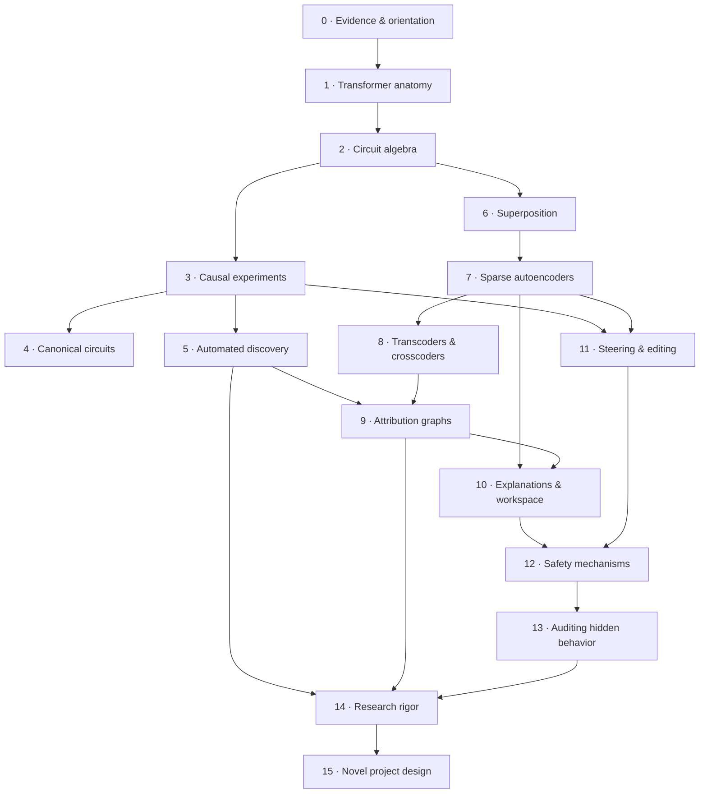
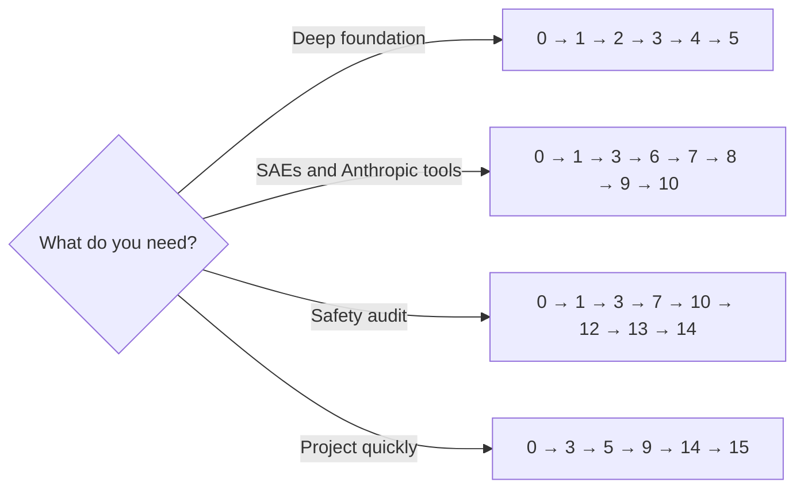

# Course map

The default route takes roughly **24–32 hours of reading and exercises**, plus **18–30 hours of labs**. Depth matters more than speed: a reproduced result is worth more than ten papers skimmed without a model of their evidence.

## Dependency map

## Modules and proof of learning

| Module | Core question | Est. | Produce |
| --- | --- | ---: | --- |
| [0 · How to think mechanistically](modules/00-orientation.md) | What counts as an explanation? | 60m | An evidence ladder for one claim |
| [1 · Transformer anatomy](modules/01-transformer-anatomy.md) | Where can information live and move? | 90m | A labeled forward-pass diagram |
| [2 · Circuit algebra](modules/02-circuit-algebra.md) | How do residual paths compose? | 120m | A QK/OV and logit-attribution derivation |
| [3 · Causal experiments](modules/03-causal-experiments.md) | What intervention tests the claim? | 120m | A clean/corrupt experiment design |
| [4 · Canonical circuits](modules/04-canonical-circuits.md) | What did successful reverse engineering look like? | 120m | A circuit comparison table |
| [5 · Automated discovery](modules/05-automated-circuit-discovery.md) | How do we search huge graphs? | 120m | A method decision memo |
| [6 · Superposition](modules/06-superposition.md) | Why are neurons often the wrong unit? | 90m | A geometric toy example |
| [7 · Sparse autoencoders](modules/07-sparse-autoencoders.md) | Do learned latents recover useful features? | 150m | An SAE quality card |
| [8 · Transcoders & crosscoders](modules/08-transcoders-crosscoders.md) | Can we expose computation and model differences? | 120m | A surrogate-fidelity checklist |
| [9 · Attribution graphs](modules/09-attribution-graphs.md) | How do feature interactions form local computations? | 150m | Two graph-derived causal predictions |
| [10 · Explanations & workspace](modules/10-explanations-workspace.md) | Can model states be translated into words? | 150m | A cross-method disagreement analysis |
| [11 · Steering & editing](modules/11-steering.md) | Does control reveal a mechanism? | 90m | A specificity/collateral-effects plan |
| [12 · Safety mechanisms](modules/12-safety-mechanisms.md) | What have internal methods revealed about risk? | 150m | A safety-evidence matrix |
| [13 · Auditing hidden behavior](modules/13-auditing.md) | Can tools uncover objectives models conceal? | 120m | An audit strategy and threat model |
| [14 · Research rigor](modules/14-research-rigor.md) | What would make the claim survive replication? | 120m | A falsification and robustness suite |
| [15 · Novel project design](modules/15-project-design.md) | What small question is actually new and answerable? | 120m | A preregistered capstone protocol |

## Choose a route

!!! tip "The recommended route"
    Complete modules in order and pair each conceptual part with its lab block. The shortcuts are for returning learners, not a way to bypass causal foundations.

## Lab pairing

| Course part | Labs | Default compute |
| --- | --- | --- |
| Foundations | [0–2](labs/index.md) | CPU or free 15 GB GPU |
| Features and graphs | [3–5](labs/index.md) | 15–24 GB GPU; some hosted demos |
| Safety and capstone | [6–8](labs/index.md) | 16–48 GB depending on chosen model |

## Mastery checkpoints

- **Checkpoint A:** You can predict tensor shapes and intervention sites without running code.
- **Checkpoint B:** You can explain why a patching heatmap is a localization result, not yet a circuit.
- **Checkpoint C:** You can critique an SAE with more than reconstruction loss and sparsity.
- **Checkpoint D:** You can turn an attribution graph into a held-out causal prediction.
- **Checkpoint E:** You can separate detection, control, understanding, and safety impact.
- **Checkpoint F:** Your capstone has a result that would matter whether positive or negative.

[Begin module 0 →](modules/00-orientation.md){ .md-button .md-button--primary }

