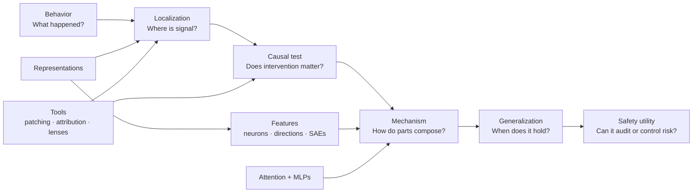

A VISUAL, EVIDENCE-FIRST COURSE

# Inside the Model

## Mechanistic interpretability, transformer circuits, and AI safety—from tensors to research questions.

Learn to move from *a model behaved this way* to a precise, falsifiable account of **which internal variables mattered, how they interacted, and what the evidence does not yet establish**.

[Start the course :material-arrow-right:](modules/00-orientation.md){ .md-button .md-button--primary }
[Explore the map](course-map.md){ .md-button }

  

    <strong>Your local progress</strong>
    0 / 25 lessons complete
  

  

    
  

  <button class="course-reset" type="button" data-course-reset>Reset progress</button>

## The whole field in one picture

The course repeatedly returns to this chain. Interpretability work becomes misleading when it jumps from localization directly to a story about mechanism—or from an attractive feature label directly to a safety claim.

## Three passes through the problem

### Ⅰ · Circuits

Understand the transformer as a residual computation graph. Learn QK/OV analysis, activation and path patching, causal scrubbing, and automated circuit discovery.

**Modules 0–5 · Labs 0–2**

[Enter foundations →](modules/00-orientation.md)

### Ⅱ · Features

Confront superposition. Learn sparse autoencoders, transcoders, crosscoders, attribution graphs, model diffing, Jacobian lenses, and natural-language explanations.

**Modules 6–10 · Labs 3–5**

[Enter feature methods →](modules/06-superposition.md)

### Ⅲ · Safety research

Apply internal methods to refusal, deception, hidden objectives, evaluation awareness, hallucination, and persona drift—without confusing control with understanding.

**Modules 11–15 · Labs 6–8**

[Enter safety research →](modules/11-steering.md)

## What you will be able to do

By the capstone, you should be able to:

- trace the transformer forward pass and identify intervention sites;
- design clean/corrupt counterfactual datasets without leaking shortcuts;
- distinguish correlation, attribution, intervention, sufficiency, and mechanistic explanation;
- compare ACDC, EAP, AtP*, EAP-IG, CEAP, and exact patching on their assumptions;
- explain why superposition motivates SAEs—and why an SAE latent is not automatically a real concept;
- use released SAEs/transcoders and interpret reconstruction-error nodes;
- read and challenge attribution graphs, feature labels, lenses, NLAs, and activation oracles;
- evaluate steering specificity and collateral damage;
- audit a harmless model organism for concealed behavior;
- write a preregistered, falsifiable small-project protocol with a one-day kill test.

!!! warning "The course does not promise a solved science"
    Mechanistic interpretability remains young. Many methods produce useful hypotheses, but feature identifiability, circuit completeness, replacement-model faithfulness, prompt stability, adversarial robustness, and frontier-scale replication are open problems. You will learn the strongest results **and** their failure modes.

## How to study

=== "Concept-first"

    Read one module, close the page, and redraw its central diagram from memory. Then answer the knowledge check before revealing the solutions.

=== "Code-first"

    Pair each part with its labs. Start with GPT-2 Small or another model that fits comfortably; scale only after your measurement pipeline is trustworthy.

=== "Research-first"

    For every method, maintain two columns: **what it measures** and **what people are tempted to conclude**. Most research mistakes live in the gap.

## Scope and currency

This course is distilled from the repository's living systematic review, including Anthropic's Transformer Circuits program and research-grade open-source work through **2026-07-12**. Every module ends with primary-source anchors; the full catalog remains separate so the course can teach a coherent argument rather than reproduce a bibliography.

[See the complete route :material-map:](course-map.md){ .md-button .md-button--primary }

