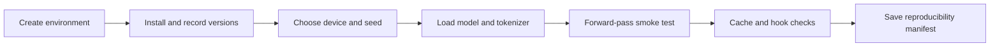
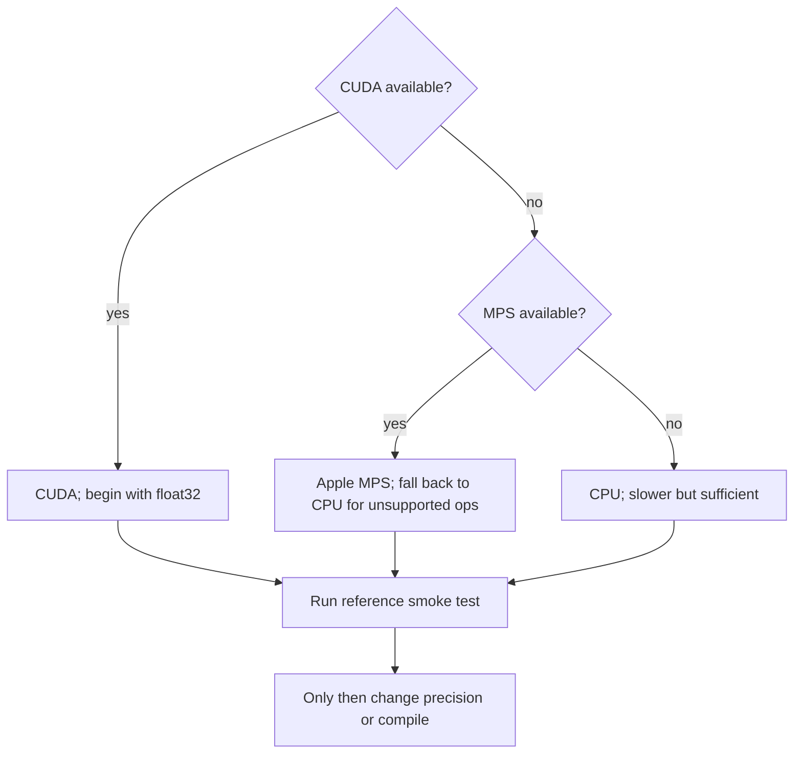

# Lab 0 — Reproducible interpretability environment

**Thesis:** Before interpreting a model, prove that you can reproduce its forward pass, identify every tensor axis, and rerun the experiment from a recorded environment.

## What you will build

By the end of this lab you will have:

1. an isolated Python 3.11 environment;
2. a pinned, recorded package and hardware manifest;
3. GPT-2 Small loaded through TransformerLens;
4. tokenization, logits, cache, and hook smoke tests;
5. numerical checks for attention normalization and residual updates;
6. a small `run_manifest.json` specification you can reproduce later.

## Objectives

- Create an isolated environment whose exact state can be recorded.
- Verify model, tokenizer, cache, and hook behavior before intervening.
- Numerically reconstruct core transformer identities on the chosen device.
- Produce a reproducibility manifest for later labs.

## Procedure map

Follow Sections 1–8 in order. Do not optimize precision, compilation, or cache
size until the reference smoke tests pass.



**Estimated time:** 30–60 minutes  
**Compute:** CPU, Apple Silicon, or any CUDA GPU; approximately 2 GB free RAM

!!! warning
    Package APIs and model revisions change. The commands below deliberately
    constrain major versions, but your final report must record the exact
    resolved versions and model revision. Never rely only on “latest.”

## 1. Create an isolated environment

Run these commands from the repository root.

=== "venv + pip"

    ```bash
    python3.11 -m venv .venv
    source .venv/bin/activate
    python -m pip install --upgrade pip
    python -m pip install \
      "torch>=2.4,<3" \
      "transformer-lens>=3,<4" \
      "transformers>=4.51,<6" \
      einops jaxtyping \
      numpy pandas matplotlib seaborn plotly \
      jupyterlab ipykernel pytest
    ```

=== "uv"

    ```bash
    uv venv --python 3.11
    source .venv/bin/activate
    uv pip install \
      "torch>=2.4,<3" \
      "transformer-lens>=3,<4" \
      "transformers>=4.51,<6" \
      einops jaxtyping \
      numpy pandas matplotlib seaborn plotly \
      jupyterlab ipykernel pytest
    ```

Register an optional notebook kernel:

```bash
python -m ipykernel install --user \
  --name mech-interp-course \
  --display-name "Python (mech-interp-course)"
```

Check the interpreter and capture a lock-style snapshot:

```bash
python --version
python -m pip freeze > environment-freeze.txt
```

`environment-freeze.txt` is a local experiment artifact. Do not add it to the
repository unless the project later adopts a shared lock file.

## 2. Choose a device deliberately

Create a notebook or Python script and run:

```python
import os
import platform
import random
from importlib.metadata import version

import numpy as np
import torch

SEED = 1729
random.seed(SEED)
np.random.seed(SEED)
torch.manual_seed(SEED)
if torch.cuda.is_available():
    torch.cuda.manual_seed_all(SEED)

if torch.cuda.is_available():
    DEVICE = "cuda"
elif torch.backends.mps.is_available():
    DEVICE = "mps"
else:
    DEVICE = "cpu"

print({
    "python": platform.python_version(),
    "platform": platform.platform(),
    "torch": torch.__version__,
    "transformer_lens": version("transformer-lens"),
    "transformers": version("transformers"),
    "device": DEVICE,
    "cuda_device": (
        torch.cuda.get_device_name(0) if torch.cuda.is_available() else None
    ),
})
```

For these labs, prefer float32 on CPU/MPS and float32 or bfloat16 on a modern
GPU. Float32 makes reconstruction checks easier. Only optimize precision after
the reference run works.

!!! intuition
    Reproducibility has layers: identical code, identical package versions,
    identical model weights, identical input tokens, and sufficiently close
    numerics. Record all five before investigating a discrepancy.



## 3. Load an instrumented model

TransformerLens exposes named activation hooks while preserving the model's
input-output function to numerical tolerance.

!!! note "TransformerLens 3 compatibility path"
    TransformerLens 3 recommends `TransformerBridge` for new architectures and
    deprecates `HookedTransformer` for eventual removal in the next major
    version. These foundation labs intentionally pin the 3.x branch and use the
    compatibility API because GPT-2 and the mature `ActivationCache` helpers are
    the teaching target. For a new-model project, follow the official
    [v3 migration guide](https://transformerlensorg.github.io/TransformerLens/content/migrating_to_v3.html)
    and revalidate every hook identity.

```python
import torch
from transformer_lens import HookedTransformer

torch.set_grad_enabled(False)

model = HookedTransformer.from_pretrained(
    "openai-community/gpt2",
    device=DEVICE,
    fold_ln=True,
    center_writing_weights=True,
    center_unembed=True,
)
model.eval()

# Cache separate per-head residual writes in later labs.
model.set_use_attn_result(True)

print({
    "layers": model.cfg.n_layers,
    "heads": model.cfg.n_heads,
    "d_model": model.cfg.d_model,
    "d_head": model.cfg.d_head,
    "d_mlp": model.cfg.d_mlp,
    "vocab": model.cfg.d_vocab,
    "device": str(model.cfg.device),
})
```

The folding and centering transformations simplify residual decomposition while
preserving model logits up to floating-point tolerance. They change the
parameter representation. If your future question concerns raw normalization
weights or weight-space geometry, reload without them and document that choice.

## 4. Audit tokenization

```python
prompt = "The capital of France is"
tokens = model.to_tokens(prompt)
token_strings = model.to_str_tokens(prompt)

print("text:", prompt)
print("token ids:", tokens.tolist())
print("token strings:", token_strings)
print("shape:", tuple(tokens.shape))

assert tokens.ndim == 2
assert tokens.shape[0] == 1
assert len(token_strings) == tokens.shape[1]
```

The beginning-of-sequence token may be added automatically. Preserve it across
clean and corrupted examples unless you have a specific reason not to.

Check answer tokens independently:

```python
def require_single_token(text: str) -> int:
    ids = model.to_tokens(text, prepend_bos=False).squeeze(0)
    if ids.numel() != 1:
        raise ValueError(f"Expected one token for {text!r}, got {ids.tolist()}")
    return int(ids.item())

paris_id = require_single_token(" Paris")
rome_id = require_single_token(" Rome")
print(paris_id, model.to_string(paris_id))
print(rome_id, model.to_string(rome_id))
```

Leading spaces are part of GPT-2 token strings. `"Paris"` and `" Paris"` need
not have the same ID.

## 5. Forward-pass smoke test

```python
with torch.inference_mode():
    logits = model(tokens)

assert logits.shape == (
    1,
    tokens.shape[1],
    model.cfg.d_vocab,
)
assert torch.isfinite(logits).all()

next_id = int(logits[0, -1].argmax())
print("top next token:", repr(model.to_string(next_id)))
print(
    "Paris-minus-Rome logit difference:",
    float(logits[0, -1, paris_id] - logits[0, -1, rome_id]),
)
```

This validates execution, not model quality. A negative Paris-minus-Rome gap
would mean the chosen behavioral example is unsuitable for later causal work;
it would not mean the environment is broken.

## 6. Cache smoke test

```python
from transformer_lens import utils

with torch.inference_mode():
    cached_logits, cache = model.run_with_cache(tokens)

torch.testing.assert_close(logits, cached_logits, rtol=1e-5, atol=1e-5)

layer = 0
resid_pre = cache[utils.get_act_name("resid_pre", layer)]
attn_out = cache[utils.get_act_name("attn_out", layer)]
resid_mid = cache[utils.get_act_name("resid_mid", layer)]
mlp_out = cache[utils.get_act_name("mlp_out", layer)]
resid_post = cache[utils.get_act_name("resid_post", layer)]
pattern = cache[utils.get_act_name("pattern", layer)]
head_result = cache[utils.get_act_name("result", layer)]

print("resid_pre", tuple(resid_pre.shape))
print("pattern", tuple(pattern.shape))
print("head_result", tuple(head_result.shape))
```

Expected conceptual shapes are:

| Tensor | Shape |
| --- | --- |
| residual states | `[batch, position, d_model]` |
| attention pattern | `[batch, head, query_position, key_position]` |
| per-head result | `[batch, position, head, d_model]` |
| logits | `[batch, position, vocabulary]` |

Verify identities numerically:

```python
torch.testing.assert_close(
    resid_mid,
    resid_pre + attn_out,
    rtol=2e-4,
    atol=2e-4,
)
torch.testing.assert_close(
    resid_post,
    resid_mid + mlp_out,
    rtol=2e-4,
    atol=2e-4,
)
torch.testing.assert_close(
    attn_out,
    head_result.sum(dim=2) + model.b_O[layer],
    rtol=2e-4,
    atol=2e-4,
)

row_sums = pattern.sum(dim=-1)
torch.testing.assert_close(
    row_sums,
    torch.ones_like(row_sums),
    rtol=1e-5,
    atol=1e-5,
)
```

Small tolerance differences across device and dtype are expected. Large or
structured discrepancies usually indicate the wrong hook, axis, or transformed
model configuration.

## 7. No-op hook test

An intervention framework should preserve logits when a hook returns its input
unchanged.

```python
hook_name = utils.get_act_name("resid_pre", 3)

def identity_hook(activation, hook):
    assert hook.name == hook_name
    return activation

with torch.inference_mode():
    noop_logits = model.run_with_hooks(
        tokens,
        fwd_hooks=[(hook_name, identity_hook)],
    )

torch.testing.assert_close(logits, noop_logits, rtol=1e-5, atol=1e-5)
```

!!! example
    This test looks trivial, but it catches hooks that modify tensors in-place,
    return the wrong object, run at an unexpected site, or silently change dtype.

## 8. Record a run manifest

The following code constructs a manifest. Saving it is optional during the
course; for a real experiment, write it beside the outputs.

```python
import json
from datetime import datetime, timezone
from importlib.metadata import version

manifest = {
    "created_utc": datetime.now(timezone.utc).isoformat(),
    "seed": SEED,
    "model_name": "openai-community/gpt2",
    "model_class": type(model).__name__,
    "transformer_lens": version("transformer-lens"),
    "transformers": version("transformers"),
    "torch": torch.__version__,
    "device": DEVICE,
    "dtype": str(next(model.parameters()).dtype),
    "fold_ln": True,
    "center_writing_weights": True,
    "center_unembed": True,
    "prompt": prompt,
    "token_ids": tokens.cpu().tolist(),
}

print(json.dumps(manifest, indent=2))

# For a research run, uncomment:
# from pathlib import Path
# Path("run_manifest.json").write_text(
#     json.dumps(manifest, indent=2) + "\n",
#     encoding="utf-8",
# )
```

Model repositories may update mutable branches. For publication-quality work,
also record the Hugging Face commit hash or pin a `revision=` when loading.

## 9. Troubleshooting

| Symptom | Likely cause | First check |
| --- | --- | --- |
| Out-of-memory | Cached every activation or used long input | Shorten prompt; filter cache names; use CPU |
| Missing `hook_result` | Per-head result caching disabled | Call `model.set_use_attn_result(True)` before the run |
| Different sequence lengths | Tokenization mismatch | Print token strings for every clean/corrupt prompt |
| Reconstruction mismatch | Wrong axis/hook or architecture transform | Print shapes and reconstruct one layer only |
| MPS unsupported operation | Backend gap | Rerun the reference test on CPU |
| Download/authentication error | No network/cache or gated model | GPT-2 Small is ungated; inspect Hugging Face cache/network |
| Tiny nondeterministic changes | GPU kernels or reduced precision | Use float32 and deterministic settings for debugging |
| Hook changes logits | In-place mutation or wrong return | Clone before editing and run the identity-hook test |

## 10. Deliverable and completion criteria

Your environment is ready when:

- the model loads from a fresh Python process;
- token IDs and answer tokens are recorded;
- cached and ordinary logits match;
- attention rows sum to one;
- attention and MLP residual identities pass;
- an identity hook leaves logits unchanged;
- package, device, dtype, seed, and model configuration are captured.

<details>
<summary>Why not begin with a larger instruction-tuned model?</summary>

The first two labs test instrumentation and causal logic, not scale. GPT-2 Small
fits comfortably on CPU, has mature TransformerLens support, and permits dense
layer-by-position sweeps. Once the tests pass, transferring the experimental
design to Gemma or Qwen is valuable—but architecture and hook assumptions must
be revalidated.

</details>

## Canonical resources

- TransformerLens authors, [official repository](https://github.com/TransformerLensOrg/TransformerLens)
- PyTorch authors, [Reproducibility notes](https://pytorch.org/docs/stable/notes/randomness.html)
- Hugging Face, [GPT-2 model card](https://huggingface.co/openai-community/gpt2)
- Elhage et al., [A Mathematical Framework for Transformer Circuits](https://transformer-circuits.pub/2021/framework/index.html)
