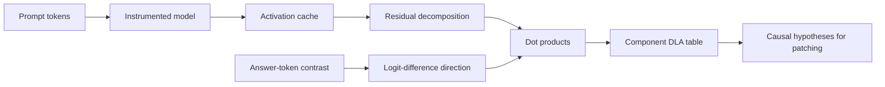
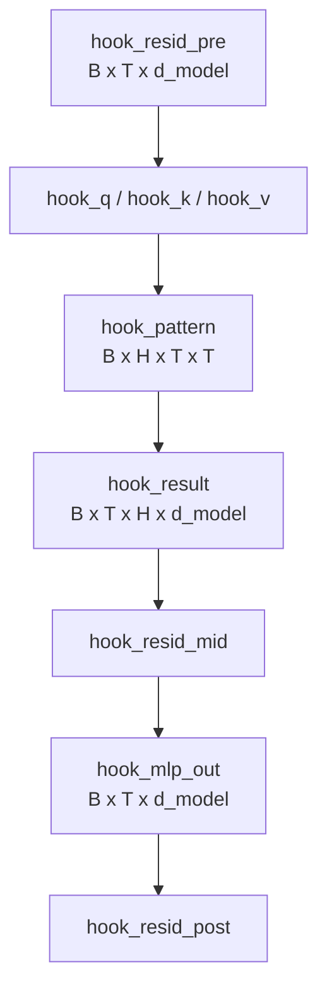
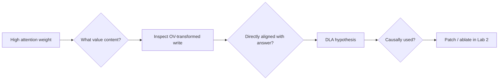

# Lab 1 — Activation cache and direct logit attribution

**Thesis:** A cache becomes interpretable only after its axes and additive identities are verified, and DLA is a hypothesis generator about residual writes rather than a causal importance score.

## What you will build

You will:

1. run a prompt with a filtered, named activation cache;
2. inspect tensor shapes and memory costs;
3. reconstruct the final residual state from component writes;
4. define a Paris-minus-Rome logit-difference direction;
5. compute layer-, head-, and MLP-level direct logit attribution (DLA);
6. inspect the attention pattern of a high-DLA head;
7. produce a ranked table of hypotheses for Lab 2.

## Objectives

- Navigate a named activation cache using verified axes and hook semantics.
- Reconstruct an answer logit difference from additive residual contributions.
- Use accumulated-residual and component DLA to generate causal hypotheses.
- State clearly what DLA does and does not establish.

## Procedure map

Sections 1–4 establish the prompt, cache, and output direction. Sections 5–8
perform the decompositions and visual analysis. Sections 9–12 turn the ranking
into pre-registered intervention candidates and a generality test.



**Estimated time:** 60–90 minutes  
**Compute:** CPU or any GPU; GPT-2 Small

## 1. Setup

Complete [Lab 0](00-environment.md) first. Start a fresh process so the notebook
is independently runnable.

```python
import re
import random

import matplotlib.pyplot as plt
import numpy as np
import pandas as pd
import seaborn as sns
import torch
from einops import einsum
from transformer_lens import HookedTransformer, utils

SEED = 1729
random.seed(SEED)
np.random.seed(SEED)
torch.manual_seed(SEED)

if torch.cuda.is_available():
    DEVICE = "cuda"
elif torch.backends.mps.is_available():
    DEVICE = "mps"
else:
    DEVICE = "cpu"

torch.set_grad_enabled(False)

model = HookedTransformer.from_pretrained(
    "openai-community/gpt2",
    device=DEVICE,
    fold_ln=True,
    center_writing_weights=True,
    center_unembed=True,
)
model.eval()
model.set_use_attn_result(True)
```

!!! warning
    `model.set_use_attn_result(True)` must run before caching if you want separate
    residual writes for each attention head. The combined attention output is
    not enough to compute head-level DLA.

## 2. Define the behavioral contrast

```python
prompt = "The capital of France is"
tokens = model.to_tokens(prompt)

def single_token_id(text: str) -> int:
    ids = model.to_tokens(text, prepend_bos=False).squeeze(0)
    if ids.numel() != 1:
        raise ValueError(f"{text!r} is not one token: {ids.tolist()}")
    return int(ids.item())

correct_id = single_token_id(" Paris")
contrast_id = single_token_id(" Rome")

print(list(enumerate(model.to_str_tokens(prompt))))
print("correct:", correct_id, repr(model.to_string(correct_id)))
print("contrast:", contrast_id, repr(model.to_string(contrast_id)))
```

The primary metric is

$$
M=z_{\text{Paris}}-z_{\text{Rome}}.
$$

This contrast asks why the model favors Paris over one plausible alternative;
it does not summarize the whole vocabulary distribution.

## 3. Run with a cache

For the first pass, cache everything so you can inspect the available names.

```python
with torch.inference_mode():
    logits, cache = model.run_with_cache(tokens)

metric = logits[0, -1, correct_id] - logits[0, -1, contrast_id]
print("Paris-minus-Rome logit difference:", float(metric))

rows = []
for name, value in cache.cache_dict.items():
    rows.append({
        "name": name,
        "shape": tuple(value.shape),
        "dtype": str(value.dtype).replace("torch.", ""),
        "MiB": value.numel() * value.element_size() / 2**20,
    })

cache_table = pd.DataFrame(rows).sort_values("name")
print(cache_table.head(20).to_string(index=False))
print("total cache MiB:", cache_table["MiB"].sum())
```

Common names include `hook_resid_pre`, `hook_q`, `hook_k`, `hook_v`,
`hook_pattern`, `hook_result`, `hook_mlp_out`, and `hook_resid_post`, prefixed by
their block path.



### Filter caches for larger experiments

Attention patterns dominate memory at long context because they scale as
$O(T^2)$. Cache only what the question needs:

```python
def dla_cache_filter(name: str) -> bool:
    return any(fragment in name for fragment in (
        "hook_embed",
        "hook_pos_embed",
        "hook_result",
        "hook_mlp_out",
        "hook_resid_post",
        "hook_pattern",
        "ln_final.hook_scale",
    ))

with torch.inference_mode():
    filtered_logits, filtered_cache = model.run_with_cache(
        tokens,
        names_filter=dla_cache_filter,
    )

torch.testing.assert_close(logits, filtered_logits, rtol=1e-5, atol=1e-5)
```

For this lab, continue using the full `cache` because the convenience
decomposition methods may require normalization and bias entries.

## 4. Derive the logit-difference direction

The unembedding columns for the two answer tokens define a residual direction:

$$
d=W_U[:,\text{Paris}]-W_U[:,\text{Rome}].
$$

TransformerLens exposes this through `tokens_to_residual_directions`, which also
handles models with tied or transformed embedding conventions.

```python
answer_ids = torch.tensor(
    [correct_id, contrast_id],
    device=DEVICE,
    dtype=torch.long,
)
answer_dirs = model.tokens_to_residual_directions(answer_ids)
logit_diff_dir = answer_dirs[0] - answer_dirs[1]

assert logit_diff_dir.shape == (model.cfg.d_model,)
```

For a normalized component write $x_c$, direct logit attribution is

$$
\operatorname{DLA}_c=x_c^\top d.
$$

`apply_ln=True` below holds the observed final-normalization scaling fixed and
applies it consistently to each additive component.

## 5. Accumulated residual DLA

First ask how readable the answer contrast is as the residual stream develops.

```python
accumulated, accumulated_labels = cache.accumulated_resid(
    layer=model.cfg.n_layers,
    incl_mid=True,
    pos_slice=-1,
    apply_ln=True,
    return_labels=True,
)

# accumulated: [component checkpoint, batch, d_model]
accumulated_dla = einsum(
    accumulated[:, 0, :],
    logit_diff_dir,
    "checkpoint d_model, d_model -> checkpoint",
).detach().cpu()

plt.figure(figsize=(11, 4))
plt.plot(accumulated_dla.numpy(), marker="o", markersize=3)
plt.axhline(0, color="black", linewidth=0.8)
plt.xticks(
    range(len(accumulated_labels)),
    accumulated_labels,
    rotation=90,
)
plt.ylabel("Paris − Rome DLA")
plt.title("Answer contrast readable from accumulated residual")
plt.tight_layout()
plt.show()
```

This plot shows when the contrast becomes decodable through the final output
basis. It does not show which earlier state caused each later increase.

## 6. Full additive residual decomposition

TransformerLens can stack embeddings, individual head results, MLP outputs, and
bias terms contributing to the final residual state.

```python
component_stack, component_labels = cache.get_full_resid_decomposition(
    layer=model.cfg.n_layers,
    pos_slice=-1,
    expand_neurons=False,
    apply_ln=True,
    return_labels=True,
)

# Expected: [component, batch, d_model]
assert component_stack.ndim == 3
assert component_stack.shape[1] == 1
assert component_stack.shape[2] == model.cfg.d_model

component_dla = einsum(
    component_stack[:, 0, :],
    logit_diff_dir,
    "component d_model, d_model -> component",
).detach().cpu()

dla_table = pd.DataFrame({
    "component": component_labels,
    "dla": component_dla.numpy(),
})
dla_table["abs_dla"] = dla_table["dla"].abs()

print(
    dla_table.sort_values("abs_dla", ascending=False)
    .head(20)
    .to_string(index=False)
)
```

Check additive reconstruction of the chosen metric:

```python
reconstructed_metric = component_dla.sum()
print("actual metric:", float(metric))
print("sum of component DLA:", float(reconstructed_metric))
print("absolute error:", float((reconstructed_metric - metric.cpu()).abs()))
```

Depending on the architecture, transformations, and library version, a small
bias or normalization remainder may appear. Investigate it rather than silently
renormalizing the bars. The decomposition is useful only if its sum is audited.

!!! intuition
    DLA is a ledger: each residual writer gets credit or blame according to its
    dot product with the selected output direction. A ledger records direct
    alignment, not who caused later writers to act.

## 7. Head-level DLA heatmap

For a direct head matrix, use the dedicated helper. `incl_remainder=False`
returns only head writes.

```python
head_stack, head_labels = cache.stack_head_results(
    layer=model.cfg.n_layers,
    pos_slice=-1,
    apply_ln=True,
    return_labels=True,
    incl_remainder=False,
)

head_dla = einsum(
    head_stack[:, 0, :],
    logit_diff_dir,
    "head d_model, d_model -> head",
).detach().cpu()

assert head_dla.numel() == model.cfg.n_layers * model.cfg.n_heads
head_matrix = head_dla.reshape(model.cfg.n_layers, model.cfg.n_heads)

plt.figure(figsize=(10, 7))
sns.heatmap(
    head_matrix.numpy(),
    center=0,
    cmap="RdBu_r",
    xticklabels=[f"H{h}" for h in range(model.cfg.n_heads)],
    yticklabels=[f"L{l}" for l in range(model.cfg.n_layers)],
)
plt.xlabel("Head")
plt.ylabel("Layer")
plt.title("Direct head attribution to Paris − Rome")
plt.tight_layout()
plt.show()
```

Select the largest positive and negative direct writers:

```python
max_flat = int(head_dla.argmax())
min_flat = int(head_dla.argmin())

top_positive = divmod(max_flat, model.cfg.n_heads)
top_negative = divmod(min_flat, model.cfg.n_heads)

print("top positive (layer, head):", top_positive, float(head_dla[max_flat]))
print("top negative (layer, head):", top_negative, float(head_dla[min_flat]))
```

## 8. Inspect—but do not overinterpret—the attention pattern

```python
layer, head = top_positive
pattern = cache[utils.get_act_name("pattern", layer)][0, head]
final_pattern = pattern[-1].detach().cpu()
token_labels = model.to_str_tokens(prompt)

plt.figure(figsize=(9, 2.6))
sns.heatmap(
    final_pattern[None, :].numpy(),
    cmap="Blues",
    annot=True,
    fmt=".2f",
    xticklabels=token_labels,
    yticklabels=[f"L{layer}H{head} final query"],
)
plt.xlabel("Source/key position")
plt.tight_layout()
plt.show()
```

Write three competing hypotheses for this head. For example:

1. it retrieves subject information from `France`;
2. it routes relation/template information from `capital`;
3. its positive write is unrelated to the attended token and arises from a
   broader contextual feature.

The attention pattern helps distinguish routing hypotheses, but the OV write
and interventions are needed to choose among them.



## 9. Compare DLA with simple ablation candidates

Do not run a full sweep yet. Freeze the following candidate list for Lab 2:

```python
candidate_heads = [top_positive, top_negative]

head_ranked = pd.DataFrame({
    "label": head_labels,
    "dla": head_dla.numpy(),
})
head_ranked["abs_dla"] = head_ranked["dla"].abs()
print(head_ranked.sort_values("abs_dla", ascending=False).head(10))
```

For each candidate, record:

- predicted sign of zero-ablation on the Paris-minus-Rome metric;
- source positions attended at the final query;
- whether the hypothesis concerns QK routing, OV content, or both;
- one negative-control head with similar attention entropy but near-zero DLA.

Pre-registering these predictions makes the next lab more than a post-hoc tour
of another heatmap.

## 10. Failure modes and debugging

- **Wrong answer token:** `Paris` without a leading space may tokenize
  differently.
- **Wrong prediction position:** logits at position $t$ predict token $t+1$.
- **Missing head results:** `set_use_attn_result(True)` was called after caching.
- **Unverified decomposition:** component bars are interpreted even though they
  do not sum to the chosen logit difference.
- **Normalization mismatch:** raw writes are compared with final logits without
  consistent final-normalization scaling.
- **DLA-as-causality:** a direct positive writer may be redundant or trigger a
  later negative response when intervened on.
- **Attention-as-content:** a head attends to `France`, but its value/output map
  may write punctuation, syntax, suppression, or another contextual feature.
- **Single contrast:** Paris-minus-Rome findings may not generalize to other
  capitals or alternative tokens.
- **Full-cache scaling:** long prompts and all attention patterns exhaust memory.
- **Transformed-weight confusion:** folded/centered weights are treated as the
  raw Hugging Face parameterization.

## 11. Knowledge check

1. What does `apply_ln=True` accomplish in the DLA helpers?
2. Why should component DLA approximately sum to the selected logit difference?
3. What can positive DLA establish about a head?
4. Why can accumulated-residual decoding rise at a layer without that layer
   directly writing the answer direction?
5. What experiment should follow a high-DLA head ranking?

<details>
<summary>Answers</summary>

1. It applies the observed final-normalization transformation/scaling
   consistently to each additive component so their projections are comparable
   with final logits under a frozen-normalization view.
2. The final residual is the sum of its component writes, and projection onto a
   fixed logit-difference direction is linear. Bias/remainder and numerical
   details must be accounted for.
3. Its residual write is directly aligned with the chosen output contrast on
   this prompt. Necessity, semantic meaning, and downstream causal use are not
   established.
4. The layer can transform the state so that existing information becomes
   readable, or normalization and prior writes can interact; accumulated
   readability is not the same as that component's direct write.
5. A pre-specified patch or ablation on held-out matched examples, ideally with
   a near-zero-DLA control and separate tests of routing and value content.

</details>

## 12. Extension: test generality across facts

Create at least 20 country/capital prompts with single-token answer contrasts.
For each prompt:

1. require a positive clean logit gap;
2. compute the full head DLA vector;
3. measure whether the same heads rank highly;
4. cluster prompts by head-DLA profile;
5. compare attention sources for stable and unstable heads.

Report median ranks and distributions rather than selecting one photogenic
prompt. A head that contributes to Paris but not other capitals may encode a
specific association rather than a general factual-recall operation.

## Deliverable

Save or display:

- the cache shape/memory table;
- the accumulated-residual plot;
- the head DLA heatmap;
- the top-positive attention plot;
- a ranked component table;
- two candidate heads, one negative control, and predicted ablation signs for
  Lab 2;
- the reconstruction error between summed DLA and the actual logit difference.

## Canonical resources

- TransformerLens authors, [official repository](https://github.com/TransformerLensOrg/TransformerLens)
- Elhage et al., [A Mathematical Framework for Transformer Circuits](https://transformer-circuits.pub/2021/framework/index.html)
- Wang et al., [Interpretability in the Wild](https://arxiv.org/abs/2211.00593)
- Belrose et al., [Eliciting Latent Predictions from Transformers with the Tuned Lens](https://arxiv.org/abs/2303.08112)
