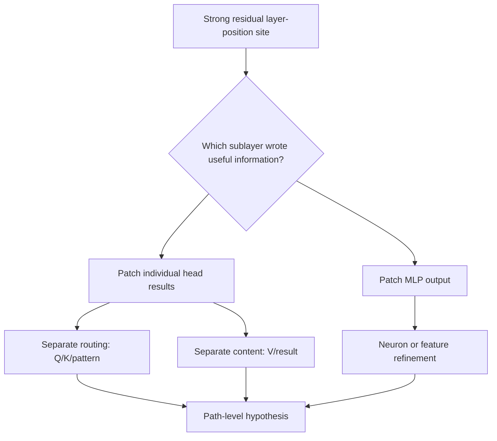
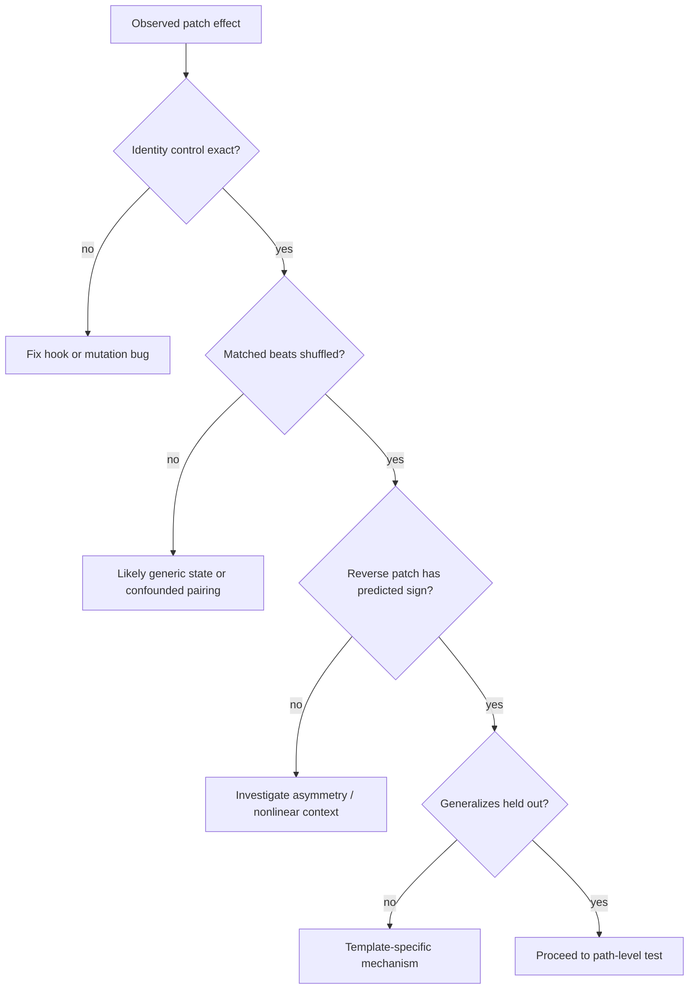

# Lab 2 — Activation patching

**Thesis:** A patching heatmap is credible only when the clean/corrupt contrast works behaviorally, token positions are aligned, controls are quiet, and component-level follow-ups make held-out predictions.

## What you will build

You will create a compact indirect-object identification experiment:

1. generate matched clean and corrupted prompts;
2. verify token alignment and the clean/corrupt logit gap;
3. patch the residual stream across every layer and token position;
4. refine the strongest region to individual attention heads;
5. run identity, wrong-position, shuffled-source, and reverse-direction controls;
6. compare patching with ablation;
7. freeze a path-level hypothesis for a follow-up experiment.

## Objectives

- Construct token-aligned clean/corrupt counterfactuals with a verified logit
  gap.
- Implement layer-position and head-result activation patches safely.
- Distinguish restoration, necessity, and reverse-direction damage.
- Use pairing, position, identity, ablation, and held-out controls to calibrate
  a causal claim.

## Procedure map

Sections 1–4 create and validate the causal contrast. Sections 5–10 move from a
coarse residual sweep to a candidate head and directional tests. Sections
11–14 stress-test the result and freeze a path-level follow-up.


**Estimated time:** 90–150 minutes  
**Compute:** CPU is possible; a small CUDA/MPS device is convenient

## 1. Setup

```python
from dataclasses import dataclass
from functools import partial
import random

import matplotlib.pyplot as plt
import numpy as np
import pandas as pd
import seaborn as sns
import torch
from transformer_lens import HookedTransformer, utils

SEED = 1729
random.seed(SEED)
np.random.seed(SEED)
torch.manual_seed(SEED)

if torch.cuda.is_available():
    DEVICE = "cuda"
elif torch.backends.mps.is_available():
    DEVICE = "mps"
else:
    DEVICE = "cpu"

torch.set_grad_enabled(False)

model = HookedTransformer.from_pretrained(
    "openai-community/gpt2",
    device=DEVICE,
    fold_ln=True,
    center_writing_weights=True,
    center_unembed=True,
)
model.eval()
model.set_use_attn_result(True)
```

## 2. Construct matched counterfactuals

The clean prompt repeats the subject name, so the non-repeated name is the
indirect object. The corrupted prompt repeats the other name.

```text
Clean:   When Mary and John went to the store, John gave a drink to
Answer:  Mary

Corrupt: When Mary and John went to the store, Mary gave a drink to
Answer:  John
```

The primary metric is always defined in the clean direction:

$$
M=z_{IO}-z_S,
$$

so a successful corruption should lower or reverse it.

```python
@dataclass(frozen=True)
class IOIPair:
    io_name: str
    subject_name: str

    @property
    def clean(self) -> str:
        return (
            f"When {self.io_name} and {self.subject_name} went to the store, "
            f"{self.subject_name} gave a drink to"
        )

    @property
    def corrupt(self) -> str:
        return (
            f"When {self.io_name} and {self.subject_name} went to the store, "
            f"{self.io_name} gave a drink to"
        )

pairs = [
    IOIPair("Mary", "John"),
    IOIPair("Alice", "Bob"),
    IOIPair("Sarah", "Tom"),
    IOIPair("Lisa", "Mark"),
    IOIPair("Emily", "David"),
    IOIPair("Laura", "James"),
    IOIPair("Anna", "Robert"),
    IOIPair("Rachel", "Michael"),
]

def single_token_id(text: str) -> int:
    ids = model.to_tokens(text, prepend_bos=False).squeeze(0)
    if ids.numel() != 1:
        raise ValueError(f"Expected one token for {text!r}: {ids.tolist()}")
    return int(ids.item())

# Filter out any name that is not one leading-space token for this tokenizer.
usable_pairs = []
for pair in pairs:
    try:
        single_token_id(" " + pair.io_name)
        single_token_id(" " + pair.subject_name)
        usable_pairs.append(pair)
    except ValueError as exc:
        print("Skipping:", exc)

assert len(usable_pairs) >= 4, "Add more single-token names for this tokenizer"

clean_prompts = [pair.clean for pair in usable_pairs]
corrupt_prompts = [pair.corrupt for pair in usable_pairs]

clean_rows = [model.to_tokens(p) for p in clean_prompts]
corrupt_rows = [model.to_tokens(p) for p in corrupt_prompts]

all_lengths = {row.shape[1] for row in clean_rows + corrupt_rows}
assert len(all_lengths) == 1, f"Token lengths are not aligned: {all_lengths}"

clean_tokens = torch.cat(clean_rows, dim=0).to(DEVICE)
corrupt_tokens = torch.cat(corrupt_rows, dim=0).to(DEVICE)

answer_ids = torch.tensor(
    [
        [
            single_token_id(" " + pair.io_name),
            single_token_id(" " + pair.subject_name),
        ]
        for pair in usable_pairs
    ],
    device=DEVICE,
    dtype=torch.long,
)

print(list(enumerate(model.to_str_tokens(clean_prompts[0]))))
print("batch shape:", tuple(clean_tokens.shape))
```

!!! warning
    Equal sequence length is necessary but not sufficient for alignment. Print
    token strings and verify that semantic positions—first name, second name,
    repeated subject, and final prediction site—have the same indices.

## 3. Verify the behavioral contrast

```python
def per_example_logit_diff(logits: torch.Tensor, answers: torch.Tensor) -> torch.Tensor:
    """Correct-minus-contrast logits at the final prompt position."""
    final_logits = logits[:, -1, :]
    correct = final_logits.gather(1, answers[:, 0, None]).squeeze(1)
    contrast = final_logits.gather(1, answers[:, 1, None]).squeeze(1)
    return correct - contrast

with torch.inference_mode():
    clean_logits = model(clean_tokens)
    corrupt_logits = model(corrupt_tokens)

clean_diff = per_example_logit_diff(clean_logits, answer_ids)
corrupt_diff = per_example_logit_diff(corrupt_logits, answer_ids)
gap = clean_diff - corrupt_diff

baseline_table = pd.DataFrame({
    "clean_prompt": clean_prompts,
    "clean_diff": clean_diff.cpu().numpy(),
    "corrupt_diff": corrupt_diff.cpu().numpy(),
    "clean_minus_corrupt": gap.cpu().numpy(),
})
print(baseline_table.to_string(index=False))
```

Filter using a rule chosen before inspecting internal heatmaps. Here we require
the corruption to reduce the clean-direction metric by at least 0.5 logits:

```python
keep = gap > 0.5
print(f"keeping {int(keep.sum())} / {len(keep)} examples")
assert int(keep.sum()) >= 3, (
    "The behavioral contrast is too weak. Revise the template or name set "
    "before doing interpretability."
)

keep_list = keep.detach().cpu().tolist()
kept_clean_prompts = [
    prompt for prompt, is_kept in zip(clean_prompts, keep_list) if is_kept
]

clean_tokens = clean_tokens[keep]
corrupt_tokens = corrupt_tokens[keep]
answer_ids = answer_ids[keep]
clean_diff = clean_diff[keep]
corrupt_diff = corrupt_diff[keep]

clean_score = clean_diff.mean()
corrupt_score = corrupt_diff.mean()
denominator = clean_score - corrupt_score

print("mean clean:", float(clean_score))
print("mean corrupt:", float(corrupt_score))
print("mean gap:", float(denominator))
```

The filter is part of the task definition and must be reported. For a stronger
study, define it on a pilot split and evaluate the frozen rule on held-out names.

## 4. Cache source and destination runs

```python
with torch.inference_mode():
    clean_logits, clean_cache = model.run_with_cache(clean_tokens)
    corrupt_logits, corrupt_cache = model.run_with_cache(corrupt_tokens)

torch.testing.assert_close(
    per_example_logit_diff(clean_logits, answer_ids),
    clean_diff,
    rtol=1e-5,
    atol=1e-5,
)

def normalized_recovery(patched_logits: torch.Tensor) -> float:
    patched_score = per_example_logit_diff(patched_logits, answer_ids).mean()
    return float((patched_score - corrupt_score) / denominator)
```

We use a ratio of batch-aggregated effects. This avoids averaging unstable
per-example ratios, but raw clean, corrupt, patched, and gap values should still
be reported.

## 5. Residual-stream patching sweep

For each layer and token position, replace the corrupt residual-pre activation
with its clean counterpart.

```python
def patch_resid_position(
    activation: torch.Tensor,
    hook,
    *,
    clean_activation: torch.Tensor,
    position: int,
) -> torch.Tensor:
    patched = activation.clone()
    patched[:, position, :] = clean_activation[:, position, :]
    return patched

n_layers = model.cfg.n_layers
n_positions = clean_tokens.shape[1]
resid_recovery = torch.empty(n_layers, n_positions)

for layer in range(n_layers):
    hook_name = utils.get_act_name("resid_pre", layer)
    clean_activation = clean_cache[hook_name]

    for position in range(n_positions):
        hook_fn = partial(
            patch_resid_position,
            clean_activation=clean_activation,
            position=position,
        )
        with torch.inference_mode():
            patched_logits = model.run_with_hooks(
                corrupt_tokens,
                fwd_hooks=[(hook_name, hook_fn)],
            )
        resid_recovery[layer, position] = normalized_recovery(patched_logits)
```

Plot the result:

```python
token_labels = model.to_str_tokens(kept_clean_prompts[0])

plt.figure(figsize=(max(10, n_positions * 0.55), 7))
sns.heatmap(
    resid_recovery.numpy(),
    center=0,
    cmap="RdBu_r",
    xticklabels=token_labels,
    yticklabels=[f"L{layer} resid_pre" for layer in range(n_layers)],
)
plt.xlabel("Patched token position")
plt.ylabel("Layer")
plt.title("Clean → corrupt residual patching: normalized recovery")
plt.tight_layout()
plt.show()
```

Interpret broad bands as localization, not components. Residual patching imports
every direction at the selected site, including nuisance information.



## 6. Identity and shuffled-source controls

### Corrupt-to-corrupt identity patch

```python
best_flat = int(resid_recovery.argmax())
best_layer, best_position = divmod(best_flat, n_positions)
best_hook = utils.get_act_name("resid_pre", best_layer)

identity_hook = partial(
    patch_resid_position,
    clean_activation=corrupt_cache[best_hook],
    position=best_position,
)

with torch.inference_mode():
    identity_logits = model.run_with_hooks(
        corrupt_tokens,
        fwd_hooks=[(best_hook, identity_hook)],
    )

torch.testing.assert_close(corrupt_logits, identity_logits, rtol=1e-5, atol=1e-5)
print("identity recovery:", normalized_recovery(identity_logits))
```

### Shuffled clean source

```python
shuffled_source = clean_cache[best_hook].roll(shifts=1, dims=0)
shuffled_hook = partial(
    patch_resid_position,
    clean_activation=shuffled_source,
    position=best_position,
)

with torch.inference_mode():
    shuffled_logits = model.run_with_hooks(
        corrupt_tokens,
        fwd_hooks=[(best_hook, shuffled_hook)],
    )

print("matched clean recovery:", float(resid_recovery[best_layer, best_position]))
print("shuffled-source recovery:", normalized_recovery(shuffled_logits))
```

The shuffled source is not guaranteed to have zero effect: it imports another
valid name state. The prediction is that matched source pairing should better
restore each example's intended answer.

!!! example
    A control is strongest when the mechanism predicts a quantitative
    difference, not merely “no effect.” Here the paired patch should outperform
    the shuffled patch because answer identity is example-specific.

## 7. Refine to individual heads

IOI circuits often write name information at the final position. Patch one
head result at that position while leaving other heads untouched.

```python
def patch_one_head(
    activation: torch.Tensor,
    hook,
    *,
    clean_activation: torch.Tensor,
    head: int,
    position: int,
) -> torch.Tensor:
    # hook_result: [batch, position, head, d_model]
    patched = activation.clone()
    patched[:, position, head, :] = clean_activation[:, position, head, :]
    return patched

head_recovery = torch.empty(model.cfg.n_layers, model.cfg.n_heads)
destination_position = -1

for layer in range(model.cfg.n_layers):
    hook_name = utils.get_act_name("result", layer)
    clean_activation = clean_cache[hook_name]

    for head in range(model.cfg.n_heads):
        hook_fn = partial(
            patch_one_head,
            clean_activation=clean_activation,
            head=head,
            position=destination_position,
        )
        with torch.inference_mode():
            patched_logits = model.run_with_hooks(
                corrupt_tokens,
                fwd_hooks=[(hook_name, hook_fn)],
            )
        head_recovery[layer, head] = normalized_recovery(patched_logits)
```

```python
plt.figure(figsize=(10, 7))
sns.heatmap(
    head_recovery.numpy(),
    center=0,
    cmap="RdBu_r",
    xticklabels=[f"H{h}" for h in range(model.cfg.n_heads)],
    yticklabels=[f"L{l}" for l in range(model.cfg.n_layers)],
)
plt.xlabel("Head")
plt.ylabel("Layer")
plt.title("Clean → corrupt final-position head-result patching")
plt.tight_layout()
plt.show()

best_head_flat = int(head_recovery.argmax())
best_head = divmod(best_head_flat, model.cfg.n_heads)
print("largest recovery head:", best_head)
print("recovery:", float(head_recovery[best_head]))
```

This sweep imports the complete clean head write. It does not distinguish
whether the causal difference arose from QK routing, source values, or the OV
map applied to those values.

## 8. Compare patching and ablation

Patch effects answer whether clean information can repair the corrupt run.
Zero-ablation asks whether the head's write is necessary in the clean run.

```python
def zero_one_head(
    activation: torch.Tensor,
    hook,
    *,
    head: int,
    position: int,
) -> torch.Tensor:
    ablated = activation.clone()
    ablated[:, position, head, :] = 0
    return ablated

layer, head = best_head
head_hook = utils.get_act_name("result", layer)

with torch.inference_mode():
    ablated_clean_logits = model.run_with_hooks(
        clean_tokens,
        fwd_hooks=[(
            head_hook,
            partial(zero_one_head, head=head, position=-1),
        )],
    )

ablated_clean_diff = per_example_logit_diff(
    ablated_clean_logits,
    answer_ids,
).mean()

print("clean metric:", float(clean_score))
print("zero-ablated clean metric:", float(ablated_clean_diff))
print("necessity drop:", float(clean_score - ablated_clean_diff))
```

A head can have high patch recovery but a small ablation drop if backup paths
compensate in the clean context or if the patched write creates an especially
effective hybrid state. Conversely, an essential general-purpose head may have
a large ablation effect but little clean/corrupt specificity.

## 9. Reverse-direction patching

Patch the corrupt head result into the clean run. The clean-direction metric
should fall if the same site carries answer-specific information.

```python
corrupt_source = corrupt_cache[head_hook]
reverse_hook = partial(
    patch_one_head,
    clean_activation=corrupt_source,
    head=head,
    position=-1,
)

with torch.inference_mode():
    reverse_logits = model.run_with_hooks(
        clean_tokens,
        fwd_hooks=[(head_hook, reverse_hook)],
    )

reverse_diff = per_example_logit_diff(reverse_logits, answer_ids).mean()
print("clean metric:", float(clean_score))
print("corrupt → clean metric:", float(reverse_diff))
print("damage:", float(clean_score - reverse_diff))
```

Do not expect exact symmetry with clean-to-corrupt recovery. The imported write
interacts with a different surrounding residual state.

## 10. Inspect the candidate's routing

```python
layer, head = best_head
clean_pattern = clean_cache[utils.get_act_name("pattern", layer)]
mean_final_pattern = clean_pattern[:, head, -1, :].mean(dim=0).cpu()

plt.figure(figsize=(10, 2.8))
sns.heatmap(
    mean_final_pattern[None, :].numpy(),
    cmap="Blues",
    annot=True,
    fmt=".2f",
    xticklabels=token_labels,
    yticklabels=[f"L{layer}H{head}"],
)
plt.xlabel("Source/key position")
plt.title("Mean clean attention from the final query position")
plt.tight_layout()
plt.show()
```

If the head attends to the indirect-object name, a concrete next hypothesis is:

> At the final position, this head's QK circuit selects the non-repeated name,
> and its OV circuit writes that name toward the output; subject/duplicate
> information from earlier heads changes its routing.

This predicts separate pattern, value/result, and upstream-to-query/key path
effects. If attention instead concentrates on punctuation or the repeated
subject, revise the functional story rather than forcing a “name mover” label.

## 11. A control matrix

Run and report at least the following:

| Test | Intervention | Mechanistic prediction |
| --- | --- | --- |
| Identity | corrupt activation into corrupt run | No numerical change |
| Matched source | paired clean activation into corrupt | Positive recovery |
| Shuffled source | another example's clean activation | Lower or wrong-answer recovery |
| Wrong position | matched activation at punctuation/control position | Lower recovery |
| Reverse direction | corrupt activation into clean | Damage clean-direction metric |
| Zero ablation | remove candidate write in clean | Predicted sign, possibly reduced by redundancy |
| Near-zero candidate | patch a low-score matched head | Small effect |
| Held-out template | repeat frozen candidate test | Same qualitative mechanism if general |



## 12. Common failure modes

- **Weak baseline behavior:** the clean/corrupt gap is near zero or inconsistent.
- **Post-hoc filtering:** examples are selected after inspecting patch scores.
- **Token misalignment:** equal-length prompts have semantic variables at
  different subtoken positions.
- **In-place mutation:** a hook corrupts cached tensors or later runs.
- **Wrong hook semantics:** `resid_pre`, head `result`, attention `pattern`, and
  value states are treated as interchangeable.
- **Ratio instability:** per-example recovery divides by tiny gaps.
- **Full-state import:** residual patching transfers many nuisance variables and
  is narrated as one feature.
- **Patching equals necessity:** restoration in a corrupt run is assumed to mean
  ablation must damage the clean run.
- **No source-pairing control:** any clean state can appear to help.
- **Attention storytelling:** a causal head is assigned a role solely from its
  attention pattern.
- **Single-site ranking:** jointly causal, redundant, inhibitory, and backup
  components are missed.
- **No held-out template:** the circuit may exploit fixed word order.

## 13. Knowledge check

1. Why is the clean-minus-corrupt baseline gap checked before caching?
2. What does residual-stream patching localize more coarsely than head-result
   patching?
3. Why might matched clean patching help while zero-ablation has little effect?
4. What does the shuffled-source control test?
5. Why can clean-to-corrupt and corrupt-to-clean effects differ?
6. What further evidence is needed before calling a candidate a name mover?

<details>
<summary>Answers</summary>

1. Without a reliable behavioral contrast, recovery has no stable target and
   internal differences need not reflect the intended task variable. Filtering
   after inspecting internals would bias discovery.
2. It imports the complete residual state at a layer-position site, combining
   all earlier head, MLP, embedding, and nuisance contributions. Head patching
   isolates one writer more closely.
3. The clean write may be sufficient to repair a corrupt state but redundant in
   the clean state, or the patch may create a particularly effective hybrid
   activation.
4. Whether recovery depends on importing the *matched answer-specific* state
   rather than any state from the clean distribution.
5. The model is nonlinear; the imported activation interacts with different
   residual states, normalization scales, attention patterns, and downstream
   responses.
6. Show that its QK circuit selects the relevant name, its OV/result writes
   name-aligned content, intervening on it changes the answer as predicted, and
   the behavior generalizes across names/templates. Path evidence should connect
   the selection to upstream role/duplicate information.

</details>

## 14. Practical extension: freeze a path hypothesis

Reserve a new IOI template, for example replacing “went to the store” and “gave
a drink” with a token-length-matched scenario. Before running it:

1. freeze the candidate head and final destination position;
2. predict which source-name position it will attend;
3. select one earlier head or residual site hypothesized to affect its Q or K;
4. predict the sign of patching that upstream-to-candidate path;
5. define a negative-control path;
6. evaluate the frozen tests on held-out names and the new template.

Your report should clearly separate:

- **localized:** the site carries causally useful clean/corrupt information;
- **component-supported:** a particular head mediates part of the effect;
- **computationally interpreted:** QK and OV evidence supports a role;
- **path-supported:** an upstream-to-downstream route is causally isolated;
- **generalized:** the same predictions hold outside the discovery template.

## Deliverable

Produce:

- baseline clean/corrupt distributions and filtering rule;
- a token-alignment table;
- residual layer-position recovery heatmap;
- final-position head recovery heatmap;
- identity, shuffled, reverse, wrong-position, and ablation controls;
- an attention plot for the candidate head;
- a one-sentence path hypothesis with a negative control and held-out test.

## Canonical resources

- Wang et al., [Interpretability in the Wild: a Circuit for Indirect Object Identification](https://arxiv.org/abs/2211.00593)
- Goldowsky-Dill et al., [Localizing Model Behavior with Path Patching](https://arxiv.org/abs/2304.05969)
- Meng et al., [Locating and Editing Factual Associations in GPT](https://arxiv.org/abs/2202.05262)
- TransformerLens authors, [official repository](https://github.com/TransformerLensOrg/TransformerLens)
- Conmy et al., [Towards Automated Circuit Discovery for Mechanistic Interpretability](https://arxiv.org/abs/2304.14997)
