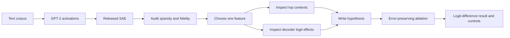
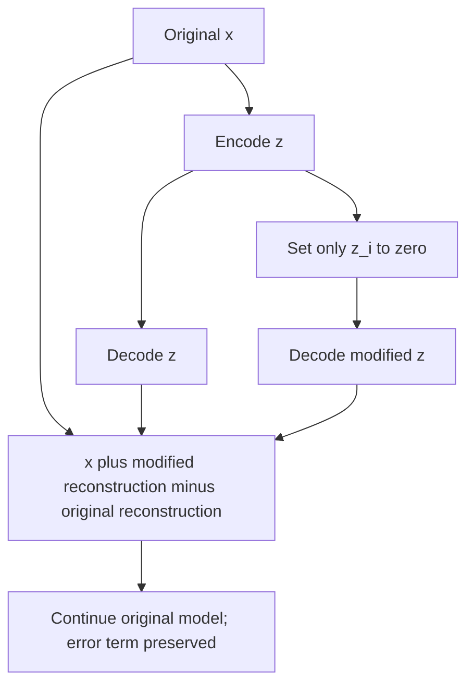

# Lab 03 — Explore and Causally Test a Released SAE

**Thesis:** This lab treats a released SAE feature as a testable hypothesis: first audit the dictionary, then interpret one feature, then ask whether its natural activation changes a specified logit difference.

**Estimated time:** 2–3 hours  
**Compute:** CPU works for a small sample; a free notebook GPU is faster  
**Software target:** SAELens 6.x and TransformerLens 3.x  
**Model:** GPT-2 small  
**SAE:** `gpt2-small-res-jb`, residual stream before block 8

!!! warning "APIs and checkpoints are versioned research artifacts"
    Record package versions and the exact SAE release/ID in your report. SAELens 6 changed loading APIs: `SAE.from_pretrained()` now returns the SAE object, not the historical three-item tuple.

## Objectives

You will:

1. load a public model and matching SAE;
2. measure $L_0$, FVE, and language-model loss recovered;
3. select a moderately sparse feature without choosing its label first;
4. inspect top activation contexts and decoder vocabulary effects;
5. perform an error-preserving feature ablation;
6. compare the signed logit-difference change with the decoder-based prediction;
7. document at least one alternative explanation or failure mode.



## Procedure

## 0. Reproducible setup

In a fresh Python 3.11 notebook environment:

```ipython
%pip install -q "sae-lens>=6,<7" "transformer-lens>=3,<4" \
    "datasets>=3" plotly pandas
```

Restart the notebook runtime after installation if imports fail, then record versions and seeds:

```python
import importlib.metadata as md
import random
import numpy as np
import torch

SEED = 17
random.seed(SEED)
np.random.seed(SEED)
torch.manual_seed(SEED)

for package in ["sae-lens", "transformer-lens", "torch", "datasets"]:
    print(package, md.version(package))

device = (
    "mps" if torch.backends.mps.is_available()
    else "cuda" if torch.cuda.is_available()
    else "cpu"
)
print("device:", device)
torch.set_grad_enabled(False)
```

## 1. Load the matched model and SAE

```python
from transformer_lens import HookedTransformer
from sae_lens import SAE

model = HookedTransformer.from_pretrained("gpt2-small", device=device)
sae = SAE.from_pretrained(
    release="gpt2-small-res-jb",
    sae_id="blocks.8.hook_resid_pre",
    device=device,
)
sae.eval()

hook_name = sae.cfg.metadata.hook_name
print("hook:", hook_name)
print("context size:", sae.cfg.metadata.context_size)
print("prepend BOS:", sae.cfg.metadata.prepend_bos)
print("dictionary width:", sae.W_dec.shape[0])
```

Sanity checks:

```python
assert hook_name == "blocks.8.hook_resid_pre"
assert sae.W_dec.shape[1] == model.cfg.d_model
assert torch.isfinite(sae.W_dec).all()
```

!!! intuition
    The model and SAE are matched at one exact site. Feeding `hook_resid_post`, another layer, or another GPT-2 revision into this SAE produces numbers but not a valid decomposition.

## 2. Build a small activation corpus

The official SAELens tutorial uses `NeelNanda/pile-10k`. Start with 32 sequences; increase to 128–512 for more reliable feature examples.

```python
from datasets import load_dataset
from transformer_lens.utils import tokenize_and_concatenate

raw = load_dataset("NeelNanda/pile-10k", split="train")
tokenized = tokenize_and_concatenate(
    dataset=raw,
    tokenizer=model.tokenizer,
    streaming=True,
    max_length=sae.cfg.metadata.context_size,
    add_bos_token=sae.cfg.metadata.prepend_bos,
)

batch_tokens = tokenized[:32]["tokens"].to(device)
print(batch_tokens.shape)
```

Run the model once, then encode and decode the exact cached site:

```python
with torch.inference_mode():
    _, cache = model.run_with_cache(
        batch_tokens,
        names_filter=lambda name: name == hook_name,
    )
    x = cache[hook_name]
    z = sae.encode(x)
    x_hat = sae.decode(z)

print("x:", x.shape, "z:", z.shape, "x_hat:", x_hat.shape)
```

## 3. Audit sparsity and geometric fidelity

Ignore BOS positions in activation-frequency summaries:

```python
z_eval = z[:, 1:] if sae.cfg.metadata.prepend_bos else z
x_eval = x[:, 1:] if sae.cfg.metadata.prepend_bos else x
x_hat_eval = x_hat[:, 1:] if sae.cfg.metadata.prepend_bos else x_hat

l0_per_token = (z_eval > 0).float().sum(dim=-1)
density = (z_eval > 0).float().mean(dim=(0, 1))

x_centered = x_eval - x_eval.mean(dim=(0, 1), keepdim=True)
fve = 1 - (x_eval - x_hat_eval).pow(2).sum() / x_centered.pow(2).sum()

print("mean L0:", l0_per_token.mean().item())
print("L0 quantiles:", torch.quantile(
    l0_per_token.float(),
    torch.tensor([0.05, 0.50, 0.95], device=device),
).tolist())
print("FVE:", fve.item())
print("dead-on-this-sample fraction:", (density == 0).float().mean().item())
```

“Dead on this sample” is not the training-time dead-feature rate. A rare feature may simply not occur in 32 sequences.

## 4. Measure model-behavior fidelity

Define hooks for reconstructed and zero activations:

```python
from functools import partial

def replace_hook(activation, hook, replacement):
    return replacement

def zero_hook(activation, hook):
    return torch.zeros_like(activation)

with torch.inference_mode():
    ce_clean = model(batch_tokens, return_type="loss")
    ce_recon = model.run_with_hooks(
        batch_tokens,
        fwd_hooks=[(hook_name, partial(replace_hook, replacement=x_hat))],
        return_type="loss",
    )
    ce_zero = model.run_with_hooks(
        batch_tokens,
        fwd_hooks=[(hook_name, zero_hook)],
        return_type="loss",
    )

loss_recovered = (ce_zero - ce_recon) / (ce_zero - ce_clean)
print({
    "CE clean": ce_clean.item(),
    "CE reconstructed": ce_recon.item(),
    "CE zero": ce_zero.item(),
    "loss recovered": loss_recovered.item(),
})
```

Stop and debug if reconstructed CE is close to zero-ablated CE, FVE is negative, or dimensions do not match.

## 5. Select a feature before interpreting it

Avoid picking the prettiest feature from a dashboard. Choose from a prespecified density band, then rank by maximum observed activation:

```python
candidate_mask = (density > 1e-4) & (density < 2e-2)
candidate_ids = candidate_mask.nonzero(as_tuple=False).squeeze(-1)
assert len(candidate_ids) > 0, "Increase the corpus or relax the fixed density band."

candidate_max = z_eval[..., candidate_ids].amax(dim=(0, 1))
feature_idx = candidate_ids[candidate_max.argmax()].item()

print("feature:", feature_idx)
print("sample density:", density[feature_idx].item())
print("decoder norm:", sae.W_dec[feature_idx].norm().item())
```

Record the density band and rule. Do not change them after seeing the feature semantics without labeling the analysis exploratory.

## 6. Inspect top activation contexts

```python
def top_feature_locations(feature_acts, feature, k=12):
    values = feature_acts[..., feature].flatten()
    values, flat_indices = values.topk(k)
    seq_len = feature_acts.shape[1]
    batch_indices = flat_indices // seq_len
    positions = flat_indices % seq_len
    return values, batch_indices, positions

values, batch_idx, positions = top_feature_locations(z, feature_idx)

for value, b, p in zip(values.tolist(), batch_idx.tolist(), positions.tolist()):
    toks = model.to_str_tokens(batch_tokens[b])
    left, right = max(0, p - 8), min(len(toks), p + 9)
    window = toks[left:p] + [f"{toks[p]}"] + toks[p + 1:right]
    print(f"activation={value:8.3f}  batch={b:2d} pos={p:3d}  {''.join(window)}")
```

Write a one-sentence hypothesis and two plausible alternatives. Then inspect random positives and near-threshold negatives, not just maxima:

```python
positive_locations = (z[..., feature_idx] > 0).nonzero(as_tuple=False)
perm = torch.randperm(len(positive_locations), device=positive_locations.device)
for b, p in positive_locations[perm[:10]].tolist():
    toks = model.to_str_tokens(batch_tokens[b])
    left, right = max(0, p - 6), min(len(toks), p + 7)
    print(z[b, p, feature_idx].item(), "".join(toks[left:right]))
```

## 7. Derive a vocabulary-level prediction

Because this SAE is at a residual-stream site, the decoder direction can be projected through the unembedding:

```python
decoder_direction = sae.W_dec[feature_idx]            # [d_model]
direct_logit_effect = decoder_direction @ model.W_U   # [vocab]

top_values, top_ids = direct_logit_effect.topk(10)
bottom_values, bottom_ids = direct_logit_effect.topk(10, largest=False)

print("most promoted:")
for value, token_id in zip(top_values.tolist(), top_ids.tolist()):
    print(f"{value:8.3f}", repr(model.tokenizer.decode([token_id])))

print("most suppressed:")
for value, token_id in zip(bottom_values.tolist(), bottom_ids.tolist()):
    print(f"{value:8.3f}", repr(model.tokenizer.decode([token_id])))
```

Choose the strongest promoted token as $y^+$ and strongest suppressed token as $y^-$ **for this exploratory test**:

```python
desired_id = top_ids[0].item()
contrast_id = bottom_ids[0].item()
predicted_sign = torch.sign(
    direct_logit_effect[desired_id] - direct_logit_effect[contrast_id]
).item()
assert predicted_sign > 0
```

This is a weights-based direct-effect prediction, not a semantic label and not a preregistered confirmatory test.

## 8. Run an error-preserving feature ablation

If the SAE decomposition is $x=\hat x+e$, preserve $e$ by modifying only the decoded feature contribution:

```python
def ablate_one_sae_feature(activation, hook, sae, feature):
    acts = sae.encode(activation)
    reconstruction = sae.decode(acts)
    acts_ablated = acts.clone()
    acts_ablated[..., feature] = 0
    reconstruction_ablated = sae.decode(acts_ablated)
    return activation + reconstruction_ablated - reconstruction
```

Use the highest-activation corpus location and score the model's next-token logits at that same position:

```python
b = batch_idx[0].item()
p = positions[0].item()
test_tokens = batch_tokens[b:b+1]

with torch.inference_mode():
    clean_logits = model(test_tokens)
    ablated_logits = model.run_with_hooks(
        test_tokens,
        fwd_hooks=[(
            hook_name,
            partial(
                ablate_one_sae_feature,
                sae=sae,
                feature=feature_idx,
            ),
        )],
    )

def logit_diff_at(logits, position, positive_id, negative_id):
    return logits[0, position, positive_id] - logits[0, position, negative_id]

ld_clean = logit_diff_at(clean_logits, p, desired_id, contrast_id)
ld_ablated = logit_diff_at(ablated_logits, p, desired_id, contrast_id)

print("clean logit difference:", ld_clean.item())
print("ablated logit difference:", ld_ablated.item())
print("ablation effect (ablated - clean):", (ld_ablated - ld_clean).item())
```

The decoder prediction is that removing the feature decreases this logit difference. A result with the opposite sign falsifies the simplest direct-effect story for this context.



## 9. Controls and replication

Your main result is exploratory until it passes controls. Implement at least three:

1. **Activation-matched features:** ablate 20 features with similar activation magnitude at the same token.
2. **Density-matched features:** sample features from the same density band.
3. **Position control:** ablate the focal feature where it is inactive or weakly active.
4. **Prompt replication:** collect five held-out contexts matching your semantic hypothesis.
5. **Scale curve:** clamp $z_i$ to 0%, 25%, 50%, 75%, and 100% of its natural value.
6. **Error test:** zero the SAE error separately and compare its logit-difference effect.

Report the focal effect as a percentile of the matched-control distribution, not only as a raw number.

## Failure modes to diagnose

| Symptom | Likely cause | Response |
|---|---|---|
| Feature fires on unrelated contexts | Polysemanticity, token artifact, or overly broad hypothesis | Add random positives and hard negatives |
| Good FVE, bad CE recovered | Error aligns with sensitive model directions | Measure error logits and use another SAE |
| Decoder predicts token but ablation has no effect | Downstream cancellation or redundant paths | Inspect dose response and downstream attributions |
| Huge effect only under strong steering | Off-distribution intervention | Stay within natural activation quantiles |
| Result disappears on chat/code data | SAE distribution shift | Recompute density/fidelity on target domain |
| “Dead” feature appears in Neuronpedia | Corpus too small | Increase sample size; distinguish sample-dead from globally dead |

## Knowledge check

1. Why does the ablation add `decode(z_ablated) - decode(z)` to the original activation instead of replacing the activation with `decode(z_ablated)`?

    <details>
    <summary>Answer</summary>

    Adding the decoded difference preserves the original SAE reconstruction error. Direct replacement would remove both the target feature and all error content, confounding the causal test.
    </details>

2. Why is the decoder-logit analysis not enough to establish the feature's function?

    <details>
    <summary>Answer</summary>

    It measures a direct linear write through the unembedding. Later layers can amplify, cancel, reroute, or ignore it, and the feature may be correlated with rather than necessary for the behavior.
    </details>

## Deliverables

Submit:

- a version/provenance block;
- a table with mean/quantile $L_0$, FVE, three CE values, and loss recovered;
- 12 top contexts, 10 random positives, and at least 10 hard negatives;
- your feature hypothesis and two alternatives written before intervention;
- decoder top/bottom token tables;
- focal logit-difference ablation plus matched controls and a dose curve;
- one paragraph calibrating the strongest defensible claim.

## Primary sources and reference implementations

- [SAELens documentation](https://decoderesearch.github.io/SAELens/latest/) and [official analysis notebook](https://github.com/decoderesearch/SAELens/blob/main/tutorials/basic_loading_and_analysing.ipynb).
- Cunningham et al., [*Sparse Autoencoders Find Highly Interpretable Features in Language Models*](https://arxiv.org/abs/2309.08600).
- Gao et al., [*Scaling and Evaluating Sparse Autoencoders*](https://arxiv.org/abs/2406.04093).
- Karvonen et al., [*SAEBench*](https://arxiv.org/abs/2503.09532) and [code](https://github.com/adamkarvonen/SAEBench).
- [Neuronpedia](https://www.neuronpedia.org/) for public feature dashboards; use it after fixing your own feature-selection rule.
