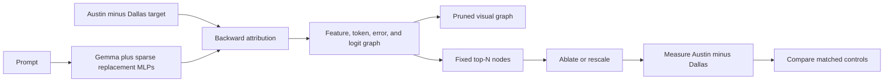
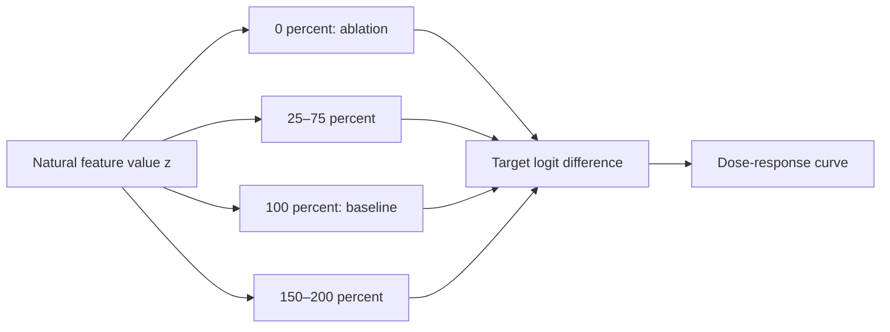

# Lab 04 — Build a Circuit Tracer Graph and Test It Causally

**Thesis:** This lab turns a Circuit Tracer visualization into a falsifiable claim by targeting one logit difference, selecting nodes by a fixed rule, and comparing their ablation with matched controls.

**Estimated time:** 3–5 hours  
**Compute:** approximately 15 GB GPU memory with disk/CPU offload; attribution may take tens of minutes  
**Model:** `google/gemma-2-2b`  
**Transcoders:** Circuit Tracer's `gemma` shortcut for released Gemma Scope PLTs

!!! warning "Access and version requirements"
    Accept Google's Gemma license on Hugging Face and authenticate before loading. Circuit Tracer is actively evolving; record the Git commit or release. The NNsight backend is experimental—this lab uses the default TransformerLens backend.

## Objectives

You will:

1. load a replacement model with released transcoders;
2. define the target $\operatorname{logit}(\text{Austin})-\operatorname{logit}(\text{Dallas})$;
3. construct, prune, save, and inspect a feature attribution graph;
4. select the top attributed feature nodes without semantic cherry-picking;
5. ablate and amplify those features at their observed prompt positions;
6. compare against random active-feature controls;
7. report graph threshold sensitivity and reconstruction/error caveats.



## Procedure

## 0. Install and authenticate

Use a fresh Python 3.11 notebook. Installing from a tagged release is best for archival work; installing `main` gives the current attribution-target API.

```ipython
%pip install -q "git+https://github.com/decoderesearch/circuit-tracer.git"
```

Restart the runtime, authenticate, and record provenance:

```python
from huggingface_hub import notebook_login
notebook_login()

import importlib.metadata as md
import random
import torch

SEED = 23
random.seed(SEED)
torch.manual_seed(SEED)

print("circuit-tracer", md.version("circuit-tracer"))
print("torch", torch.__version__)
assert torch.cuda.is_available(), "Use a CUDA runtime for the full attribution run."
```

If you cloned the repository, also save:

```bash
git -C circuit-tracer rev-parse HEAD
```

## 1. Load Gemma with released transcoders

```python
from circuit_tracer import ReplacementModel, attribute

backend = "transformerlens"
model = ReplacementModel.from_pretrained(
    "google/gemma-2-2b",
    "gemma",
    dtype=torch.bfloat16,
    backend=backend,
)
tokenizer = model.tokenizer
```

On a 15 GB notebook GPU, use disk offload and a conservative attribution batch size. On a larger GPU, CPU offload or no offload will be faster.

## 2. Define the prompt and behavior metric

Use the same prompt family as the official attribution-target demo:

```python
prompt = "Fact: the capital of the state containing Dallas is"
token_x = "▁Austin"
token_y = "▁Dallas"

idx_x = tokenizer.encode(token_x, add_special_tokens=False)[-1]
idx_y = tokenizer.encode(token_y, add_special_tokens=False)[-1]

assert tokenizer.decode([idx_x]).strip() == "Austin"
assert tokenizer.decode([idx_y]).strip() == "Dallas"
```

Get baseline logits and verify that the task is meaningful:

```python
input_ids = model.ensure_tokenized(prompt)
with torch.inference_mode():
    baseline_logits, baseline_activations = model.get_activations(
        input_ids, sparse=True
    )

def last_logit_diff(logits):
    final = logits.squeeze(0)[-1]
    return final[idx_x] - final[idx_y]

baseline_ld = last_logit_diff(baseline_logits)
baseline_probs = baseline_logits.squeeze(0)[-1].float().softmax(dim=-1)
print("P(Austin):", baseline_probs[idx_x].item())
print("P(Dallas):", baseline_probs[idx_y].item())
print("Austin - Dallas logit difference:", baseline_ld.item())
```

Do not continue if tokenization is wrong or the model does not prefer Austin. Changing the prompt after graph inspection creates target leakage.

## 3. Construct an explicit logit-difference target

Circuit Tracer can target strings directly, but that creates separate output nodes. A `CustomTarget` makes the contrast itself the attributed direction.

```python
from circuit_tracer.attribution.targets import CustomTarget
from circuit_tracer.utils.demo_utils import get_unembed_vecs

vec_x, vec_y = get_unembed_vecs(model, [idx_x, idx_y], backend)
diff_vec = vec_x - vec_y

target_weight = max(
    abs(baseline_probs[idx_x].item() - baseline_probs[idx_y].item()),
    1e-6,
)
target = CustomTarget(
    token_str="logit(Austin)-logit(Dallas)",
    prob=target_weight,
    vec=diff_vec,
)
```

`prob` weights the target in graph bookkeeping; `vec` is the actual unembedding-space contrast.

## 4. Attribute the graph

```python
import sys

IN_COLAB = "google.colab" in sys.modules

graph = attribute(
    prompt=prompt,
    model=model,
    attribution_targets=[target],
    batch_size=128,
    max_feature_nodes=8192,
    offload="disk" if IN_COLAB else "cpu",
    verbose=True,
)

print("output targets:", len(graph.logit_targets))
print("active features retained for attribution:", graph.active_features.shape[0])
```

Record runtime, peak GPU memory, and whether offloading was used:

```python
print("peak allocated GB:", torch.cuda.max_memory_allocated() / 1e9)
```

Save the unpruned graph immediately:

```python
from pathlib import Path

out_dir = Path("circuit_tracer_lab")
out_dir.mkdir(exist_ok=True)
raw_graph_path = out_dir / "austin_minus_dallas.pt"
graph.to_pt(raw_graph_path)
print(raw_graph_path)
```

## 5. Create two pruning views

Graph pruning is an analysis choice. Generate a main and a stricter view before reading feature labels:

```python
from circuit_tracer.utils import create_graph_files

create_graph_files(
    graph_or_path=raw_graph_path,
    slug="austin-main",
    output_path=out_dir / "main_view",
    node_threshold=0.80,
    edge_threshold=0.98,
)

create_graph_files(
    graph_or_path=raw_graph_path,
    slug="austin-strict",
    output_path=out_dir / "strict_view",
    node_threshold=0.65,
    edge_threshold=0.90,
)
```

Serve the main view:

```python
from circuit_tracer.frontend.local_server import serve

server = serve(data_dir=str(out_dir / "main_view"), port=8046)
print("Open http://localhost:8046/index.html")
```

In Colab, expose the port:

```python
# Colab only
from google.colab import output
output.serve_kernel_port_as_iframe(
    8046, path="/index.html", height="800px", cache_in_notebook=True
)
```

### Graph-reading worksheet

Before intervening, record:

| Item | Main view | Strict view |
|---|---|---|
| Number of visible feature nodes | | |
| Number of error nodes | | |
| Strongest input-token path | | |
| Three recurring feature groups | | |
| Important negative edge/path | | |
| Story that changes across thresholds | | |

For every label, distinguish its source: top-activating examples, automated label, token context, downstream connections, or your own guess.

!!! warning "Do not choose causal-test nodes by how compelling their labels sound"
    The causal test below uses the top $N$ nodes under the target attribution. Semantic inspection is for forming the mechanism narrative, not selecting a better-looking result.

## 6. Select top nodes by a fixed rule

```python
from circuit_tracer.utils.demo_utils import get_top_features

N = 10
top_nodes, top_scores = get_top_features(graph, n=N)

print("layer, position, feature, score")
for node, score in zip(top_nodes, top_scores):
    print(tuple(int(v) for v in node), float(score))
```

`top_nodes` contains `(layer, position, feature_idx)` tuples. Save them before running any intervention.

## 7. Causal test 1: top-node ablation

Reload prompt-specific sparse activations if the attribution run released them:

```python
with torch.inference_mode():
    original_logits, activations = model.get_activations(input_ids, sparse=True)

ablate_top = [
    (int(layer), int(pos), int(feature_idx), 0.0)
    for layer, pos, feature_idx in top_nodes
]

with torch.inference_mode():
    ablated_logits, _ = model.feature_intervention(input_ids, ablate_top)

top_ablation_effect = last_logit_diff(ablated_logits) - last_logit_diff(original_logits)
print("baseline LD:", last_logit_diff(original_logits).item())
print("top-N ablated LD:", last_logit_diff(ablated_logits).item())
print("effect (ablated - baseline):", top_ablation_effect.item())
```

For positively attributed nodes, the preregistered prediction is a negative effect. Also test progressive sets $N\in\{1,3,10,30\}$; non-additivity is informative.

## 8. Causal test 2: natural-scale dose response

Set selected nodes to fractions of their observed activation rather than using an arbitrary huge steering value:

```python
def rescale_interventions(nodes, sparse_acts, scale):
    return [
        (
            int(layer),
            int(pos),
            int(feature_idx),
            scale * sparse_acts[int(layer), int(pos), int(feature_idx)],
        )
        for layer, pos, feature_idx in nodes
    ]

dose_results = []
for scale in [0.0, 0.25, 0.5, 0.75, 1.0, 1.5, 2.0]:
    with torch.inference_mode():
        logits, _ = model.feature_intervention(
            input_ids,
            rescale_interventions(top_nodes, activations, scale),
        )
    dose_results.append((scale, last_logit_diff(logits).item()))

print(dose_results)
```

Scale 1.0 should approximately reproduce the unmodified feature values. A smooth monotonic response strengthens the local attribution story; a discontinuity or reversed sign reveals interaction or saturation.



## 9. Random active-feature controls

Sample active nodes from the attributed graph, excluding the focal set. This is a minimal control; layer- and activation-matched sampling is stronger.

```python
focal = {tuple(int(v) for v in node) for node in top_nodes}
pool = [
    tuple(int(v) for v in row.tolist())
    for row in graph.active_features
    if tuple(int(v) for v in row.tolist()) not in focal
]

control_effects = []
for control_seed in range(30):
    rng = random.Random(SEED + control_seed)
    sampled = rng.sample(pool, N)
    interventions = [(layer, pos, feature_idx, 0.0)
                     for layer, pos, feature_idx in sampled]
    with torch.inference_mode():
        logits, _ = model.feature_intervention(input_ids, interventions)
    effect = last_logit_diff(logits) - last_logit_diff(original_logits)
    control_effects.append(effect.item())

focal_effect = top_ablation_effect.item()
percentile = sum(v <= focal_effect for v in control_effects) / len(control_effects)
print("focal effect:", focal_effect)
print("control mean:", sum(control_effects) / len(control_effects))
print("fraction of controls <= focal effect:", percentile)
```

Improve this by matching each control node on layer, token position, activation magnitude, and feature density. Report both versions.

## 10. Robustness and error accounting

Complete at least two of the following:

1. Recompute the graph with `max_feature_nodes=4096` and compare the top-10 overlap.
2. Sweep node thresholds $\{0.6,0.7,0.8,0.9\}$ and edge thresholds $\{0.9,0.95,0.98\}$.
3. Repeat on two held-out paraphrases, keeping the Austin–Dallas contrast fixed.
4. Compare a graph targeting separate Austin/Dallas logits with the custom difference graph.
5. Quantify attribution routed through error nodes in each pruning view.
6. Compare interventions with attention free to respond against any frozen-attention analysis.

Use weighted edge overlap or top-node Jaccard only after aligning layer, position, and feature IDs. A low overlap can coexist with similar grouped mechanisms; report both node-level and group-level stability.

## Failure modes to diagnose

| Symptom | Interpretation risk | Next test |
|---|---|---|
| Graph omits “Austin” but predicts it | Pruning or replacement error hid a path | Lower thresholds; inspect errors and target selection |
| Top-node ablation has small effect | Redundancy, attribution approximation, or wrong target | Joint ablation, mediation, and matched clean/corrupt patching |
| Random controls are equally strong | Top attribution is not specific | Layer/activation-match controls; inspect off-distribution damage |
| Only 10× amplification works | Steering is outside natural scale | Use the 0–2× curve and natural quantiles |
| Story changes across thresholds | Narrative depends on visualization choices | Report alternatives; avoid a single definitive circuit |
| Graph differs across paraphrases | Prompt-local circuit or instability | Cluster prompt families; test behavioral invariants |
| Error nodes dominate | Dictionary is inadequate for the task | Try a wider/different transcoder or raw activation method |

## Knowledge check

1. Why target a logit difference instead of merely tracing the highest-probability token?

    <details>
    <summary>Answer</summary>

    It specifies the behavioral contrast of interest and avoids attributing generic effects that raise all plausible completions. It also gives interventions a signed quantitative prediction.
    </details>

2. Why is a top-attribution feature not automatically a causal feature?

    <details>
    <summary>Answer</summary>

    Attribution is computed in a local sparse replacement model. Nonlinear compensation, reconstruction error, correlated paths, and pruning can make the original model's intervention effect differ.
    </details>

## Deliverables

Submit:

- package/Git/Hugging Face provenance and compute settings;
- baseline probabilities and logit difference;
- raw graph plus both pruning views;
- completed graph-reading worksheet with evidence sources for labels;
- saved top-$N$ node list and attribution scores;
- progressive ablation and dose-response plot;
- at least 30 control effects and a matched-control refinement;
- threshold or prompt robustness analysis;
- a calibrated mechanism claim that explicitly mentions replacement and error limitations.

## Primary sources and reference implementations

- Ameisen et al., [*Circuit Tracing: Revealing Computational Graphs in Language Models*](https://transformer-circuits.pub/2025/attribution-graphs/methods.html).
- Lindsey et al., [*On the Biology of a Large Language Model*](https://transformer-circuits.pub/2025/attribution-graphs/biology.html).
- [Circuit Tracer repository](https://github.com/decoderesearch/circuit-tracer), [official attribute demo](https://github.com/decoderesearch/circuit-tracer/blob/main/demos/attribute_demo.ipynb), [attribution-target demo](https://github.com/decoderesearch/circuit-tracer/blob/main/demos/attribution_targets_demo.ipynb), and [intervention demo](https://github.com/decoderesearch/circuit-tracer/blob/main/demos/intervention_demo.ipynb).
- Kamath et al., [*Tracing Attention Computation Through Feature Interactions*](https://transformer-circuits.pub/2025/attention-qk/index.html).
