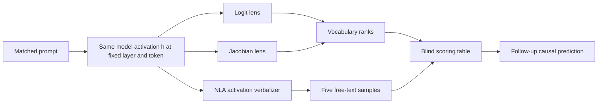
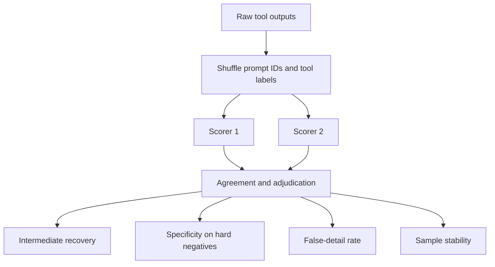

# Lab 05 — Compare the Jacobian Lens with Natural-Language Explanations

**Thesis:** This lab compares explanation instruments on the same layer and token, asking whether vocabulary readouts and free-text reconstructions agree about an unspoken intermediate—and where either one confabulates.

**Estimated time:** 2–4 hours in the browser-first track  
**Compute:** none for Track A; 24–48 GB GPU memory for optional local Track B  
**Primary comparison:** Gemma 3 27B Instruct, layer 41, on Neuronpedia  
**Optional local comparison:** Qwen2.5 7B Instruct, layer 20

!!! warning "Do not call these outputs a transcript of thought"
    The J-lens is a corpus-averaged linear readout of dispositions to verbalize. An NLA is a stochastic text bottleneck optimized for activation reconstruction. Neither is exhaustive, and NLA details can be false. This lab uses “explanation” in that technical, limited sense.

## Objectives

You will:

1. design prompts with known task intermediates and matched hard negatives;
2. inspect logit- and Jacobian-lens ranks at a fixed layer/position;
3. sample multiple NLA explanations for that same activation site;
4. score intermediate recovery, surface copying, specificity, and confabulation;
5. distinguish agreement about representation from evidence of causal use;
6. produce a preregistered follow-up intervention.



## Procedure

## 0. Preregister the comparison

Before opening either tool, create a table with these columns:

| Field | Meaning |
|---|---|
| Prompt ID | Stable identifier |
| Exact chat text | No edits after inspection |
| Extraction token | Token displayed at the assistant-response boundary |
| Layer | 41 for the main Gemma comparison |
| Intended intermediate(s) | Task variable that must be computed but need not be output |
| Final answer | Expected response |
| Contrast answer | Token used for final logit difference |
| J-lens prediction | Expected token and approximate layer trajectory |
| NLA prediction | Semantic content expected without requiring exact wording |
| Hard-negative prediction | What should change while surface vocabulary stays similar |

Use at least the following prompt families.

### A. Multi-hop geography

Focal:

> The country shaped like a boot uses which currency? Reply with one word.

Intermediate: `Italy`; final: `euro`; contrast: `dollar`.

Hard negative:

> Italy is shaped like a boot. Ignore its currency and name the currency used in Japan. Reply with one word.

The surface contains `Italy` in both cases, but the task intermediate/final answer changes toward `Japan`/`yen`.

### B. Arithmetic chain

> Calculate silently and reply only with the final number: $(4+17)\times2+7$.

Intermediates: `21`, then `42`; final: `49`; contrast: `42`.

Hard negative: change only the final `+7` to `-7`, keeping earlier intermediates fixed.

### C. Planned rhyme

> Complete this couplet with one line only: “The soldier marched into the night,”

Candidate planned rhyme: `fight` or `light`. Do not treat either as ground truth until the model's completion fixes which plan it used. The hard negative requests unrhymed prose with almost identical surface text.

Add two safety-relevant prompts only after the pipeline works—for example, a benign/unsafe ambiguity or an evaluation-awareness model organism. In such tasks the “true internal intermediate” is not known, so score only consistency and corroboration, not correctness.

## Track A — Browser-first, same-model comparison

Track A uses two hosted tools on `gemma-3-27b-it`:

- [Gemma 3 27B IT Jacobian Lens](https://www.neuronpedia.org/gemma-3-27b-it/jlens)
- [Gemma 3 27B IT Natural Language Autoencoder](https://www.neuronpedia.org/gemma-3-27b-it/nla)

The released NLA extracts at layer 41. Fix the J-lens view to layer 41 for the direct comparison, while also recording its full layer trajectory.

### 1. Establish the final behavior

Run each prompt as a fresh chat with deterministic or lowest-temperature generation if the interface permits. Record:

- exact formatted transcript;
- generated answer;
- whether the answer is correct;
- answer/contrast token probabilities or ranks if displayed;
- tokenization at the assistant-response boundary.

Exclude an example from the “known intermediate” analysis if the model fails the task. Keep failures in an appendix; they may still be scientifically useful.

### 2. Read the J-lens and logit-lens

At the assistant-response boundary:

1. Pin the intermediate token(s), final answer, and contrast token.
2. Record their ranks every four layers and at layer 41.
3. Record the top five J-lens tokens at layer 41.
4. Switch to the logit-lens comparison view and record the same values.
5. Save a screenshot or exported trace with prompt ID and timestamp.

Use a table like:

| Prompt | Layer | Intermediate rank: logit/J | Final rank: logit/J | Top-5 J tokens |
|---|---:|---|---|---|
| geography-focal | 41 | | | |
| geography-negative | 41 | | | |
| arithmetic-focal | 41 | | | |

The key comparison is not simply “which tool ranks the final answer higher.” The J-lens paper predicts that tuned/predictive readouts may skip to final answers, while the J-lens can surface some intermediate content in workspace layers.

### 3. Sample the NLA

Open the same transcript in the NLA interface. Manually select the same assistant-boundary token and layer-41 activation. Generate **five independent explanations** without editing the prompt between samples.

Record each raw explanation before interpreting it. Do not collapse the five samples into one polished summary.

| Prompt | Sample | Mentions correct intermediate? | Mentions final answer? | Surface copy? | False specific detail? | Raw explanation |
|---|---:|---:|---:|---:|---:|---|
| geography-focal | 1 | | | | | |
| geography-focal | 2 | | | | | |

### 4. Blind the scoring

Give shuffled NLA explanations and J-lens top tokens to a scorer who does not know whether each came from the focal or hard-negative prompt. Score:

- **Intermediate recovery:** 0 absent, 1 related category, 2 exact/clear equivalent.
- **Final-answer leakage:** 0 absent, 1 indirect, 2 exact.
- **Surface copying:** 0 not explained by visible words, 1 partly, 2 mostly restates prompt.
- **False specificity:** count checkable details contradicted by the prompt/task.
- **Pair discrimination:** can the scorer identify focal versus hard negative?
- **NLA stability:** fraction of pairwise samples agreeing on the main theme.

Predefine acceptable synonyms. For arithmetic, an explanation saying “combining an intermediate result with a multiplier” is related but not exact recovery of `21` or `42`.



### 5. Quantify comparison outcomes

For J-lens versus logit lens, compute reciprocal rank:

\[
\operatorname{RR}(w)=\frac{1}{\operatorname{rank}(w)}.
\]

Report the paired difference in intermediate RR at layer 41 and across the workspace trajectory. For NLA, report exact and category-level recovery rates with a binomial interval, plus false-detail rate. With only a few prompts, treat these as descriptive statistics.

Classify each case:

| Pattern | Calibrated interpretation |
|---|---|
| J-lens and NLA recover intermediate; hard negative changes both | Strong convergent representational evidence |
| J-lens recovers it, NLA does not | Token-indexed verbalizable direction may exist; NLA bottleneck/sample may miss it |
| NLA recovers it, J-lens does not | Content may be distributed, not aligned with one vocabulary direction, or confabulated |
| Both only repeat visible text | Input inversion/surface signal; no hidden-intermediate evidence |
| NLA specifics vary while theme persists | Treat theme as lead; reject literal details |
| Final answer appears before intermediate | Possible shortcut, predictor leakage, or wrong extraction position |

## 6. Turn agreement into a causal prediction

Neither tool establishes mediation. For one successful prompt, preregister:

1. the layer range where the J-lens intermediate first becomes strong;
2. a source/destination prompt pair that changes only that intermediate;
3. a patch or J-lens-vector swap at the chosen layer/position;
4. the signed change in

\[
\Delta_{\text{logit}}
=\operatorname{logit}(y_{\text{desired}})
-\operatorname{logit}(y_{\text{contrast}});
\]

5. an early-layer, late-layer, random-direction, and norm-matched control.

For geography, swapping an Italy-associated state toward a Japan-associated state should decrease `euro - yen`. Failure means the explanation may be readable but not causally load-bearing, or the intervention failed to isolate the representation.

## Track B — Optional local Jacobian/logit-lens replication

Use this track when you have enough memory for Qwen2.5 7B in BF16 plus lens weights. It matches the smallest official NLA checkpoint family in the open training release.

### 7. Install the reference implementation

```ipython
%pip install -q "git+https://github.com/anthropics/jacobian-lens.git" \
    transformers accelerate huggingface_hub
```

```python
import torch
import transformers
import jlens

MODEL_NAME = "Qwen/Qwen2.5-7B-Instruct"
LENS_REPO = "neuronpedia/jacobian-lens"
LENS_FILE = (
    "qwen2.5-7b-it/jlens/Salesforce-wikitext/"
    "Qwen2.5-7B-Instruct_jacobian_lens.pt"
)

hf_model = transformers.AutoModelForCausalLM.from_pretrained(
    MODEL_NAME,
    dtype=torch.bfloat16,
    device_map="cuda",
)
tokenizer = transformers.AutoTokenizer.from_pretrained(MODEL_NAME)
model = jlens.from_hf(hf_model, tokenizer)
lens = jlens.JacobianLens.from_pretrained(
    LENS_REPO,
    filename=LENS_FILE,
)
```

Apply the exact chat template and inspect token positions:

```python
user_text = "The country shaped like a boot uses which currency? Reply with one word."
prompt = tokenizer.apply_chat_template(
    [{"role": "user", "content": user_text}],
    tokenize=False,
    add_generation_prompt=True,
)

ids = tokenizer(prompt, add_special_tokens=False).input_ids
for i, token_id in enumerate(ids):
    print(i - len(ids), repr(tokenizer.decode([token_id])))
```

Choose the final prompt-bearing assistant-boundary token after inspecting this list. The official walkthrough often uses `-2`; verify rather than assuming:

```python
POSITION = -2
layers = [model.n_layers // 4, model.n_layers // 2, 20,
          model.n_layers * 3 // 4, model.n_layers - 2]

j_logits, model_logits, _ = lens.apply(
    model, prompt, layers=layers, positions=[POSITION]
)
logit_lens, _, _ = lens.apply(
    model, prompt, layers=layers, positions=[POSITION], use_jacobian=False
)

def top_tokens(logits, k=10):
    return [tokenizer.decode([i]) for i in logits.topk(k).indices.tolist()]

for layer in layers:
    print(f"L{layer:02d} logit:", top_tokens(logit_lens[layer][0]))
    print(f"L{layer:02d} J:    ", top_tokens(j_logits[layer][0]))
print("final model:", top_tokens(model_logits[0]))
```

Compute token ranks only after verifying that candidate concepts are single tokens:

```python
def one_token(text):
    token_ids = tokenizer.encode(text, add_special_tokens=False)
    assert len(token_ids) == 1, (text, token_ids)
    return token_ids[0]

def rank_of(logits, token_id):
    return int((logits > logits[token_id]).sum().item()) + 1

italy_id = one_token(" Italy")
euro_id = one_token(" euro")

for layer in layers:
    print(layer, {
        "Italy logit rank": rank_of(logit_lens[layer][0], italy_id),
        "Italy J rank": rank_of(j_logits[layer][0], italy_id),
        "euro logit rank": rank_of(logit_lens[layer][0], euro_id),
        "euro J rank": rank_of(j_logits[layer][0], euro_id),
    })
```

If the tokenizer splits a word, either choose a documented first-token metric or score a multi-token sequence consistently; do not silently use the last subtoken.

### 8. Optional local NLA sampling

The official Qwen pair is:

- `kitft/nla-qwen2.5-7b-L20-av`
- `kitft/nla-qwen2.5-7b-L20-ar`

Use the [lightweight inference repository](https://github.com/kitft/nla-inference) rather than hand-building injection prompts. Its `nla_meta.yaml` fixes the injection token, prompt template, and norm scale. The minimal actor flow is:

```python
# Run in the cloned kitft/nla-inference repository after downloading the AV.
from nla_inference import NLAClient

client = NLAClient(
    "./nla-qwen2.5-7b-L20-av",
    sglang_url="http://localhost:30000",
)
explanations = client.generate_batch(
    [activation_at_layer20] * 5,
    temperature=1.0,
)
```

Launch SGLang exactly as the repository documents:

```bash
python -m sglang.launch_server \
  --model-path ./nla-qwen2.5-7b-L20-av \
  --port 30000 \
  --disable-radix-cache \
  --mem-fraction-static 0.85 \
  --trust-remote-code
```

`--disable-radix-cache` is a correctness requirement for `input_embeds`, not a speed preference. Extract `activation_at_layer20` using the training repository's model-specific extraction convention; Hugging Face `hidden_states[0]` is the embedding state, so an off-by-one layer silently invalidates the comparison. Running the target model and AV server simultaneously typically needs substantially more memory than the browser-first track.

## Failure modes to diagnose

| Symptom | Likely explanation | Required control |
|---|---|---|
| J-lens ranks visible nouns only | Input copying or wrong position/layer | Hard negative with same nouns; position sweep |
| NLA names plausible but absent details | Confabulation | Repeat samples; context-check each claim |
| Tuned/logit lens shows answer extremely early | Output prediction or prompt prior | Track hidden intermediate and use hard negatives |
| J-lens and NLA disagree | Different questions/bottlenecks | SAE, patching, or Activation Oracle triangulation |
| NLA output is garbled/CJK-heavy | Injection token/scale/template failure | Use sidecar and official client; verify neighbors |
| NLA themes change each sample | High uncertainty or unstable verbalizer | Increase samples; report distribution, not best example |
| Intermediate is readable but swap has no effect | Correlational/verbalizable but not mediating | Better localization, path test, or revise claim |
| Results depend on one prompt | Template artifact | Held-out paraphrase families |

## Knowledge check

1. Why must the direct comparison use the same model, layer, and token position?

    <details>
    <summary>Answer</summary>

    Otherwise disagreement can be caused by different underlying activations rather than the methods' readout assumptions. Matching the site isolates the instrument comparison.
    </details>

2. Why are repeated NLA samples scientifically necessary?

    <details>
    <summary>Answer</summary>

    The AV is stochastic and can confabulate. A single compelling sample overstates reliability; repeated samples expose thematic stability and false-specificity rates.
    </details>

3. If the J-lens and NLA both recover `Italy`, what is still missing?

    <details>
    <summary>Answer</summary>

    Causal evidence that the Italy representation mediates the euro prediction. Agreement supports representation/explanation, not necessarily use in the original computation.
    </details>

## Deliverables

Submit:

- the preregistration table and exact chat transcripts;
- J-lens and logit-lens rank trajectories for at least three focal/hard-negative pairs;
- five raw NLA samples per prompt, with blinded rubric scores;
- scorer agreement and an adjudication policy;
- paired intermediate reciprocal-rank comparison and NLA false-detail/stability summaries;
- a disagreement case analyzed without declaring either tool correct by default;
- one signed causal follow-up prediction with four controls;
- screenshots/exports, model/layer/position provenance, and tool access date.

## Primary sources and reference implementations

- Gurnee et al., [*Verbalizable Representations Form a Global Workspace in Language Models*](https://transformer-circuits.pub/2026/workspace/index.html).
- [Anthropic Jacobian Lens reference implementation](https://github.com/anthropics/jacobian-lens) and [released open-model lenses](https://huggingface.co/neuronpedia/jacobian-lens).
- Fraser-Taliente, Kantamneni, Ong et al., [*Natural Language Autoencoders Produce Unsupervised Explanations of LLM Activations*](https://transformer-circuits.pub/2026/nla/index.html), [training code](https://github.com/kitft/natural_language_autoencoders), and [inference code](https://github.com/kitft/nla-inference).
- Belrose et al., [*Eliciting Latent Predictions from Transformers with the Tuned Lens*](https://arxiv.org/abs/2303.08112).
- Karvonen et al., [*Activation Oracles*](https://arxiv.org/abs/2512.15674) for a supervised free-text comparison.
