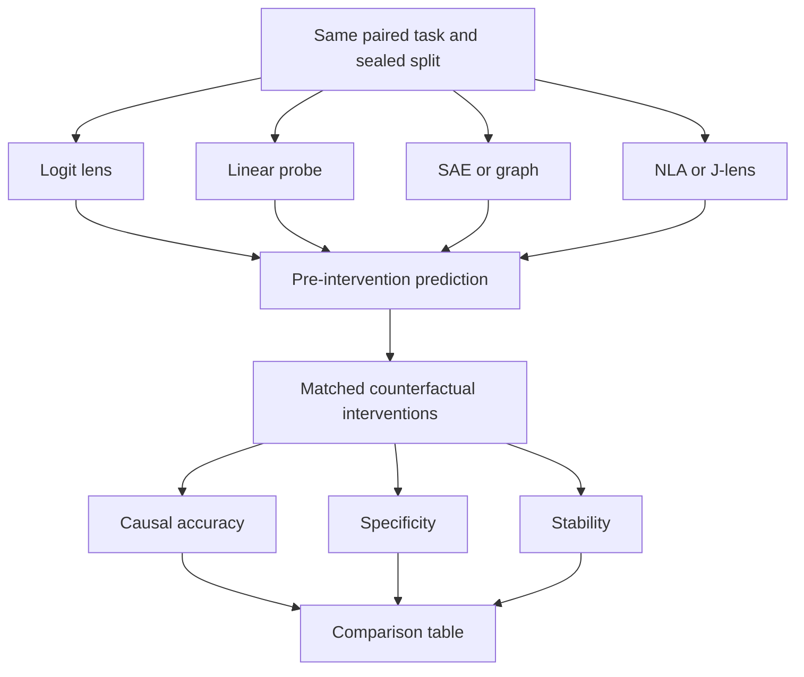
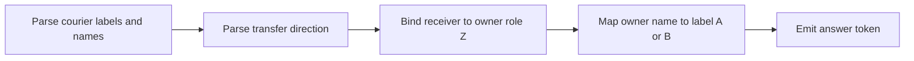
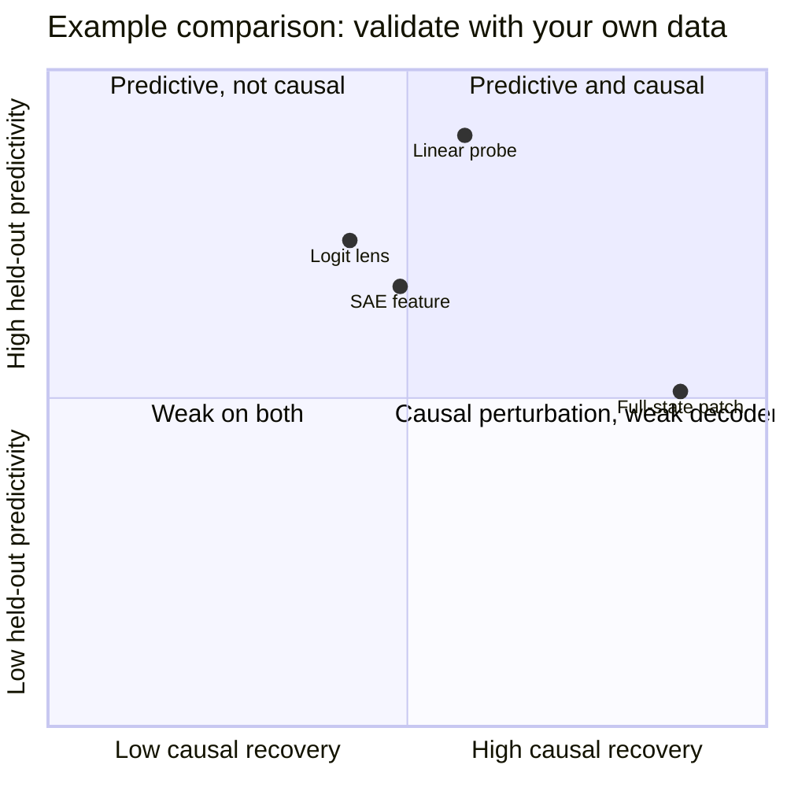

# Lab 7 — Compare explanations with causal validation

**Thesis:** Explanation methods become scientifically comparable when they make preregistered predictions about the same counterfactual interventions rather than being judged only by readability or correlation.

## What you will investigate

The model solves a small relational-binding task:

> Courier A is Ada. Courier B is Bruno. Ada gives the key to Bruno. Who owns the key? Answer with A or B.

Matched examples reverse giver and receiver while preserving the entities, object, template, and output vocabulary. The latent variable is the final owner role, \(Z\in\{A,B\}\).

You will compare at least three explanation methods:

1. **Logit lens:** when does the answer become linearly readable through the unembedding?
2. **Linear probe:** where is the owner role decodable?
3. **Activation patching or interchange:** where does the causal variable influence the answer?

Choose one advanced method if resources permit:

- an SAE feature;
- an attribution graph from circuit-tracer;
- a J-lens workspace description;
- a Natural Language Autoencoder explanation and edit.



## Prerequisites and budget

- Complete Labs 2–4 or be comfortable recording and patching residual activations.
- Core path: Qwen2.5-1.5B-Instruct and 6–10 GB VRAM.
- Attribution-graph path: a model supported by [circuit-tracer](https://github.com/decoderesearch/circuit-tracer), such as Gemma 2 2B or Qwen 3 4B.
- NLA path: use an officially or community-supported NLA checkpoint; do not assume one model's NLA transfers to another revision.
- Core path: 2–4 hours. Advanced path: 1–2 additional days.

!!! warning
    Do not select each method's best-looking example independently. Every method receives the same train, validation, test, and counterfactual pairs, and must freeze its prediction before causal evaluation.

## 1. Define the high-level causal model

The task has a simple abstract computation:



The high-level interchange prediction is:

> If the internal representation of owner role \(Z\) from a paired example is inserted while other variables are held fixed, the answer should switch to the source example's owner label.

This is stronger than “the representation contains information about A or B.”

## 2. Generate paired data

Use many names, objects, and surface templates so the probe cannot memorize one lexical pattern.

```python
NAMES = [
    ("Ada", "Bruno"), ("Cleo", "Darius"), ("Elena", "Farid"),
    ("Greta", "Hugo"), ("Imani", "Jonas"), ("Kira", "Lucian"),
    ("Marta", "Noel"), ("Priya", "Quinn"), ("Rosa", "Soren"),
    ("Talia", "Uri"), ("Vera", "Wes"), ("Xena", "Yusuf"),
]

OBJECTS = ["cedar key", "blue folder", "silver ticket", "map", "notebook"]

TEMPLATES = [
    "Courier A is {a}. Courier B is {b}. {giver} gives the {obj} to {receiver}. "
    "Who owns the {obj} now? Answer only A or B.",
    "Let A denote {a} and B denote {b}. The {obj} starts with {giver}, who transfers it to {receiver}. "
    "Which courier has it after the transfer? Reply A or B only.",
]

def make_pair(a, b, obj, template):
    a_to_b = template.format(a=a, b=b, giver=a, receiver=b, obj=obj)
    b_to_a = template.format(a=a, b=b, giver=b, receiver=a, obj=obj)
    return [(a_to_b, "B"), (b_to_a, "A")]
```

Split by **name pair and template**, not random rows:

- train: 7 name pairs, template 0;
- validation: 2 new pairs across both templates;
- test: 3 new pairs with template 1;
- transfer: optionally add a two-step transfer template never used in training.

Verify that answer strings ` A` and ` B` are single tokens for the chosen tokenizer. If they are not, use full-sequence log probabilities consistently.

## 3. Establish a behavioral positive control

Before interpreting anything:

1. Generate deterministically.
2. Require at least 85% exact accuracy on validation.
3. Check both labels separately.
4. Check that flipping transfer direction changes the answer within pairs.
5. Exclude ambiguous generations using a rule written before test evaluation.

If the model cannot solve the task, simplify the language or choose a slightly larger model. Do not interpret a circuit for behavior the model does not reliably perform.

## 4. Freeze the primary metric

For single-token labels, use the correct-versus-incorrect logit difference

\[
m(p)=\ell_{y^*}(p)-\ell_{y^-}(p).
\]

For paired source \(s\) and base \(b\), an intervention intended to transplant \(Z_s\) into \(b\) succeeds when it reverses the base preference toward \(y_s\). Define normalized recovery

\[
R=\frac{m_s^{\text{orientation}}(b\text{ with patch})-
        m_s^{\text{orientation}}(b)}
       {m_s^{\text{orientation}}(s)-m_s^{\text{orientation}}(b)}.
\]

Clip only for visualization, not analysis. Values above 1 and below 0 contain information about overshoot and wrong-direction effects.

## 5. Method A: logit lens

Given residual state \(x_l\), a basic logit lens computes

\[
\ell_l=W_U\operatorname{LN}_f(x_l),
\]

where \(W_U\) is the unembedding and \(\operatorname{LN}_f\) is the model's final normalization.

For each layer, record

\[
\Delta_l=\ell_l[y^*]-\ell_l[y^-].
\]

Questions:

- At which layer does median \(\Delta_l\) become positive?
- Is the answer readable before the model behavior becomes correct?
- Does the trajectory generalize to test names and templates?

The logit lens predicts that layers where the answer is strongly readable contain answer-aligned information. It does not predict that the unembedding basis is the model's natural intermediate code.

### Causal test for the logit-lens story

Patch the entire final-token residual state from the paired source into the base at each layer. Compare recovery with the emergence of \(\Delta_l\). If readability and causal recovery diverge, the logit lens is describing accessible output information rather than locating a unique causal write point.

## 6. Method B: a linear role probe

Train a regularized linear classifier at each layer:

\[
\hat Z=\sigma(w_l^\top x_l+b_l).
\]

Use train examples only, choose regularization on validation, and report test AUROC and accuracy. Add two selectivity controls:

1. train on labels permuted within name pair;
2. predict an irrelevant property such as object identity with equal model capacity.

### Scalar interchange intervention

Normalize \(w_l\) to \(\hat w_l\). For paired source and base states, replace only the scalar coordinate along the probe direction:

\[
x'_{l}=x^{(b)}_l+
\left[
\hat w_l^\top x^{(s)}_l-hat w_l^\top x^{(b)}_l
\right]\hat w_l.
\]

If \(w_l\) identifies the causal role variable, scalar interchange should move the answer toward the source without broadly changing fluency or unrelated outputs.

Compare with:

- a random unit direction;
- a shuffled-label probe;
- the full-residual patch;
- a mean-difference direction;
- the same intervention at neighboring layers.

High probe accuracy with low interchange recovery is direct evidence that decodability and causal use differ.

## 7. Method C: activation and path patching

Run a layer-by-position scan if the tokenization is aligned across each pair:

\[
x^{(b)}_{l,t}\leftarrow x^{(s)}_{l,t}.
\]

Start with coarse sites:

- giver-name token;
- receiver-name token;
- final prompt token;
- attention output at the final token;
- MLP output at the final token.

Then refine only the validation-supported region. A whole-state patch can import syntax, entity identity, and answer information together. A component or direction patch is more specific but may miss distributed codes.

For the best subgraph or site, test:

- **necessity:** corrupt or mean-ablate it in the correct run;
- **sufficiency:** patch it into the opposite run;
- **specificity:** patch the same site between examples with the same owner but different names;
- **completeness:** compare retained-circuit behavior with full-model behavior.

## 8. Advanced lane A: SAE feature explanation

Use an SAE trained on the exact model, layer, and activation type. For every feature \(z_i\):

1. rank by held-out owner-label effect size;
2. inspect top activating examples without test labels visible;
3. write a semantic prediction before intervention;
4. clamp or swap \(z_i\) using its decoder direction \(d_i\):

\[
x'=x+(z_i'-z_i)d_i;
\]

5. compare against the best raw neuron and an equal-size supervised subspace.

SAE reconstruction error is a competing pathway. Report feature-only intervention and model-replacement fidelity separately.

## 9. Advanced lane B: attribution graph

Generate an attribution graph for a correctly answered test prompt with circuit-tracer. Before intervening, annotate candidate nodes as:

- entity parsing;
- transfer/receiver relation;
- owner-role binding;
- A/B output mapping;
- error or unexplained nodes.

Select a subgraph predicted to carry the receiver-to-answer pathway. Intervene on it and compare actual logit effects with graph-predicted direction. Record graph completeness, replacement score, and error-node mass where available.

The evaluation target is prediction accuracy under intervention—not whether the graph labels sound plausible.

## 10. Advanced lane C: NLA or J-lens

For a Natural Language Autoencoder:

1. verbalize matched source and base activations;
2. check whether the explanation names the correct receiver/owner relation;
3. minimally edit the explanation to swap the owner;
4. reconstruct the edited activation;
5. compare its delta with the true paired activation delta;
6. intervene and measure recovery and off-target change.

This distinguishes a causally faithful semantic coordinate system from a text-conditioned steering interface.

For a J-lens, ask whether both entities and the transfer concept appear while role binding remains ambiguous. Compare ordinary concept decodability with a role-conditioned probe and causal interchange.

!!! example
    If an NLA edit flips the answer but its activation delta is nearly orthogonal to the true paired delta, the interface found an effective steering route. That is useful engineering evidence, but weak evidence that its original explanation faithfully described the natural computation.

## 11. Use a common scorecard

Score each method on the same held-out set:

| Dimension | Metric |
|---|---|
| Predictive accuracy | AUROC, answer/logit prediction, or graph effect rank correlation |
| Causal validity | Interchange accuracy and normalized recovery |
| Specificity | Effect on same-owner and unrelated-task controls |
| Completeness | Behavior retained by proposed subspace/circuit |
| Stability | Across prompt bootstraps, method seeds, and templates |
| Locality | Collateral KL and unrelated accuracy |
| Human legibility | Blinded annotation agreement and error categories |
| Cost | GPU memory, runtime, and analyst minutes |

Do not collapse all dimensions into one score unless weights were chosen before seeing results. A Pareto plot is usually more honest.



The plotted values are illustrative only; replace them with your experiment.

## 12. Failure diagnosis

| Symptom | Likely issue | Next test |
|---|---|---|
| Probe near perfect, intervention null | Decodable but unused direction | DAS/subspace or readout-aligned direction |
| Whole-state patch works, scalar patch fails | Distributed variable or wrong basis | Low-rank interchange and mediation scan |
| Every method fails | Model does not solve task or hook bug | Behavioral and planted positive controls |
| NLA explanation is correct, edit fails | Reconstruction or intervention mismatch | Compare reconstructed and natural activations |
| Graph predicts wrong intervention sign | Local linearization or missing interactions | Smaller intervention; inspect error nodes |
| SAE feature works only at huge clamp | Off-manifold feature steering | Natural activation range and matched random feature |
| Results vanish on new names | Lexical shortcut | Split by entity and add counterbalanced roles |

## 13. Required deliverables

Submit:

1. High-level causal graph and preregistered interchange prediction.
2. Dataset generator with entity/template-level splits.
3. Behavioral positive-control table.
4. Layer-wise logit-lens and probe curves.
5. A causal recovery heatmap or intervention curve.
6. Full method scorecard with uncertainty intervals.
7. At least one result where a readable explanation fails causal validation—or evidence that all tested explanations passed.
8. A 500-word conclusion stating which claims are descriptive, predictive, causal, and mechanistic.

## Checkpoint questions

### Why is a full-residual patch not a precise test of owner-role representation?

<details>
<summary>Answer</summary>

It imports every difference encoded at that site: lexical order, syntax, entity identity, answer preparation, and the owner role. Recovery localizes causal information to a site but does not identify which variable or basis carried it.

</details>

### What does high interchange intervention accuracy add beyond probe accuracy?

<details>
<summary>Answer</summary>

It shows that changing the aligned low-level representation produces the counterfactual effect predicted by the proposed high-level variable. Probe accuracy establishes only decodability.

</details>

### Why compare an NLA edit delta with the natural paired activation delta?

<details>
<summary>Answer</summary>

The activation reconstructor may turn any fluent instruction into an effective steering vector even if the activation verbalizer misdescribed the original state. Alignment with a real counterfactual helps test faithfulness to the model's natural representation.

</details>

## Primary references and tools

- Belrose et al., [Eliciting Latent Predictions from Transformers with the Tuned Lens](https://arxiv.org/abs/2303.08112) (2023).
- Geiger et al., [Causal Abstraction: A Theoretical Foundation for Mechanistic Interpretability](https://arxiv.org/abs/2301.04709) (2023).
- Meng et al., [Locating and Editing Factual Associations in GPT](https://arxiv.org/abs/2202.05262) (causal tracing, 2022).
- Marks et al., [Sparse Feature Circuits](https://arxiv.org/abs/2403.19647) (2024).
- Anthropic, [Circuit Tracing methods](https://transformer-circuits.pub/2025/attribution-graphs/methods.html) and [circuit-tracer](https://github.com/decoderesearch/circuit-tracer) (2025).
- Anthropic, [Natural Language Autoencoders](https://transformer-circuits.pub/2026/nla/index.html) and [code](https://github.com/kitft/natural_language_autoencoders) (2026).
- Anthropic, [The Global Workspace of a Large Language Model](https://transformer-circuits.pub/2026/workspace/index.html) and [Jacobian Lens](https://github.com/anthropics/jacobian-lens) (2026).
- Mueller et al., [MIB](https://arxiv.org/abs/2504.13151) and [code](https://github.com/aaronmueller/MIB) (2025).
