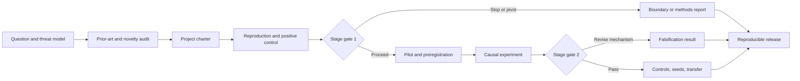
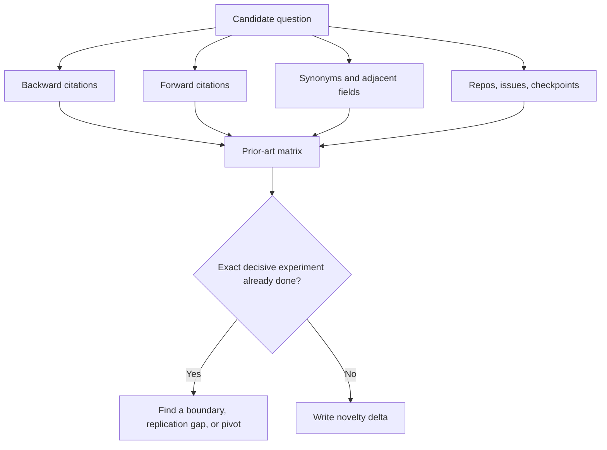
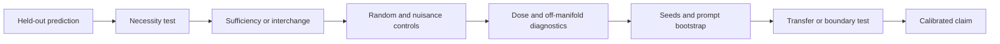

# Lab 8 — Capstone research protocol

**Thesis:** The capstone is complete when it delivers a scoped and reproducible update about a mechanism—not when it merely produces an attractive visualization or confirms the original story.

## Capstone outcome

Over two to eight weeks, complete one bounded empirical project in mechanistic interpretability or alignment auditing. The final package must contain:

1. A systematic nearest-work review and explicit novelty delta.
2. A preregistered primary claim and competing hypotheses.
3. A behavioral or known-ground-truth positive control.
4. At least one causal intervention tied to the claim.
5. Diagnostic negative controls and collateral measurements.
6. Uncertainty across the appropriate units of analysis.
7. A sealed evaluation or independent replication step.
8. A reproducible, responsibly scoped artifact and research report.



## 1. Choose a capstone track

Pick one track based on the question—not the visual appeal of the tool.

### Track A: circuit or causal-variable discovery

Examples:

- localize a relation, carry, retrieval, or policy-routing variable;
- compare component-level and feature-level circuits;
- test whether a proposed graph predicts intervention effects.

Minimum causal bar: necessity or sufficiency plus a matched random/component baseline.

### Track B: explanation-method validation

Examples:

- compare NLA edits with true counterfactual activations;
- calibrate attribution-graph trust scores;
- test whether probe, SAE, or J-lens explanations identify a planted variable.

Minimum causal bar: explanations make frozen intervention predictions on held-out examples.

### Track C: harmless safety mechanism or audit

Examples:

- locate a toy policy-routing failure across chat and workflow formats;
- audit a hidden objective in a harmless scoring game;
- test whether repeated training changes workspace dependence;
- replicate counterfactual reflection training with open models and controls.

Minimum safety bar: synthetic canaries, toy incentives, or bounded text games only; no creation of operational harmful capabilities.

### Track D: steering, editing, and collateral effects

Examples:

- determine whether a persona or refusal cap is semantically local;
- compare activation steering with a weight edit at matched efficacy;
- measure downstream reconstruction after concept ablation.

Minimum causal bar: a dose response, bidirectional or necessity/sufficiency test, and a collateral-effect suite.

!!! warning
    A capstone cannot be “run tool X on model Y.” The project must compare hypotheses or test a boundary of an existing claim.

## 2. Submit a one-page project charter

Freeze the following before substantial computation.

### Project identity

- **Working title:**
- **Owner and reviewers:**
- **Start/search date:**
- **Time and compute budget:**
- **Track:** A, B, C, or D.

### One-sentence claim

Use this grammar:

> In **system and population**, internal variable or circuit **M** causally contributes to **outcome Y** under **conditions C**, as tested by **intervention I** and distinguished from **alternatives H2/H3**.

### Novelty delta

> Prior work established **A** using **B**, but did not test **C**. We test **C** using **D**, with **E** as the decisive causal validation.

### Scope and non-claims

Write three statements the project will **not** establish. Examples:

- one model result will not establish architectural universality;
- a toy hidden objective will not establish subjective intent;
- behavior-changing steering will not establish a unique natural representation.

### Decision value

State what a positive, negative, and ambiguous result would change for a careful reader.

## 3. Build the prior-art evidence map

Read the closest work, its appendices, and its code. Your review must include:

- closest phenomenon paper;
- closest mechanistic paper;
- closest critical or negative result;
- closest benchmark;
- closest open implementation;
- papers or projects from the previous six months;
- one simpler baseline that could make the proposed method unnecessary.



Create a table with system, task, method, causal evidence, controls, scale, and remaining gap. Link directly to primary sources and record the search queries and date in `literature/search_log.md`.

## 4. Draw the causal model and alternatives

Draw a graph containing:

- input variables intentionally manipulated;
- nuisance variables that may change with them;
- proposed internal mediator(s);
- measured behavioral outcome;
- likely alternate pathways;
- selection steps such as feature or layer choice.

Then write at least three live hypotheses. For each, predict:

1. observational activation pattern;
2. behavior under necessity intervention;
3. behavior under sufficiency/interchange intervention;
4. response to one diagnostic control;
5. expected transfer boundary.

The experiment should be chosen because these predictions differ.

## 5. Define estimands and metrics

Name one primary estimand. A generic paired causal effect is

\[
\tau=\mathbb E_i\left[m_i(do(M\leftarrow M'))-m_i\right].
\]

If a random or nuisance intervention also changes behavior, use a contrast:

\[
\tau_{\text{specific}}=
\mathbb E_i[\Delta m_i^{\text{target}}-Delta m_i^{\text{control}}].
\]

Predefine:

- behavioral and logit metrics;
- causal recovery or interchange accuracy;
- circuit or feature sparsity if relevant;
- specificity and collateral metrics;
- uncertainty procedure and resampling hierarchy;
- smallest effect that would matter;
- exclusions and missing-data handling;
- primary versus exploratory analyses.

For generated text, keep a programmatic metric whenever possible. If model judges are necessary, calibrate against blinded human labels and test judge-order and verbosity biases.

## 6. Design controls before running the pilot

Every capstone must include:

### Positive control

Show that the method detects a known mechanism or planted variable. Options include:

- an InterpBench or Tracr model;
- a known task circuit;
- a synthetic feature inserted into a model organism;
- a clean/corrupted pair with an unambiguous causal state.

### Negative controls

At least three of:

- shuffled labels;
- norm- and sparsity-matched random direction/subgraph;
- unrelated semantic feature;
- neighboring layers or positions;
- same-output/different-latent-variable examples;
- same-latent-variable/different-output-style examples;
- clean sibling model with token- and optimizer-matched training.

### Simpler baselines

Depending on the project:

- neuron or PCA dimension versus SAE feature;
- difference in means versus trained probe;
- semantic search versus interpretability retrieval;
- prompt steering versus activation steering;
- full-state patch versus feature-specific patch;
- ordinary logit lens versus J-lens or NLA.

### Collateral controls

Measure residual norm, output KL, task capability, refusal/helpfulness, response length, and downstream reconstruction as appropriate.

## 7. Pass the reproduction gate

Before the novel experiment, reproduce one important upstream result using the exact public artifact when possible.

Record:

- model and tokenizer revisions;
- package lockfile and hardware;
- expected and observed metric with tolerance;
- differences from the original setup;
- one known failure case.

If reproduction fails, do not silently proceed. Decide whether to:

1. debug the pipeline;
2. narrow the claim to the working setup;
3. turn the discrepancy into a replication project;
4. pivot tools.

## 8. Run a 1% end-to-end pilot

The pilot should execute the complete pipeline on approximately 1%–5% of the intended scale:

- data generation and sealing;
- activation collection;
- method fitting;
- intervention;
- metric aggregation;
- figure generation.

The pilot answers engineering and identifiability questions, not the primary hypothesis.

### Stage gate 1

Proceed only if:

- baseline behavior is sufficiently reliable;
- the positive control works;
- intervention magnitudes are in a natural range;
- one run fits compute and storage estimates;
- the primary metric has adequate variation;
- no obvious dataset leak solves the task.

Write the go/no-go decision before scaling.

## 9. Preregister and seal

Create `preregistration.md` containing:

1. primary claim and claim-ladder rung;
2. hypotheses and discriminating predictions;
3. models, revisions, and data splits;
4. feature/layer selection procedure;
5. interventions, doses, and hook order;
6. metrics and analysis code hash;
7. units of analysis and seeds;
8. success, falsification, and ambiguity criteria;
9. planned plots and tables;
10. deviations policy.

Hash or tag the preregistration before opening the test set. Exploratory work may continue, but label it as exploratory and validate it on new data.

## 10. Execute the causal core

A defensible evidence sequence is:



Do not wait until the end to inspect whether the intervention destroys model function. Log residual norms, loss or KL, response entropy, and unrelated-task performance with every causal run.

### Stage gate 2

After the sealed primary run, classify the result:

- **Supported:** predefined effect and controls pass.
- **Falsified:** a discriminating result favors an alternative.
- **Inconclusive:** positive control, power, or manipulation validity failed.
- **Mixed:** primary effect exists but specificity or transfer fails.

These categories are more informative than “worked” and “did not work.”

## 11. Replicate at the right level

At minimum, add one form of evidence that was not used during discovery:

- new model or fine-tuning seed;
- new prompt template and task family;
- independent implementation of the intervention;
- different explanation method testing the same variable;
- known-ground-truth benchmark instance;
- blinded annotation by a second person.

If compute permits only one large-model run, include a smaller multi-seed experiment to estimate training or method variability.

## 12. Filled example: calibrating attribution-graph reliability

This example shows the expected specificity of a protocol; do not copy it without rechecking novelty.

### Claim

For Gemma 2 2B attribution graphs on held-out MIB tasks, a precommitted score combining replacement fidelity and unexplained error mass predicts whether ablating a graph-selected subgraph will change the target logit in the graph-predicted direction.

### Hypotheses

- \(H_1\): graph fidelity metrics calibrate causal reliability across prompt families.
- \(H_2\): they correlate within a task but fail to transfer across tasks.
- \(H_3\): graph size or activation magnitude explains apparent calibration.
- \(H_4\): local graph scores do not predict finite intervention effects.

### Data split

- discovery: one arithmetic and one factual-recall family;
- validation: new prompts from those families;
- sealed test: held-out ARC/RAVEL-like or MIB family;
- transfer: one new prompt template and model seed if available.

### Primary estimand

For graph \(g_i\), predicted sign \(\hat s_i\), and measured logit change \(\Delta m_i\):

\[
Y_i=\mathbf 1[\operatorname{sign}(\Delta m_i)=\hat s_i].
\]

Evaluate calibration of \(P(Y_i=1\mid q_i)\), where \(q_i\) is frozen before test. Report Brier score, expected calibration error, AUROC, and an abstention curve.

### Controls

- size-matched random subgraphs;
- activation-magnitude-matched nodes;
- graph size alone;
- replacement score alone;
- intervention strengths inside the local linear regime;
- whole-model and no-intervention positive/negative anchors.

### Decisive result

A rule trained on discovery/validation improves held-out causal accuracy at fixed coverage over graph size and magnitude baselines. Failure to transfer is still a useful boundary result.

## 13. Artifact structure

Use a structure like:

```text
capstone/
├── README.md
├── environment.lock
├── preregistration.md
├── responsible_release.md
├── literature/
│   ├── prior_art.csv
│   └── search_log.md
├── configs/
├── data/
│   ├── README.md
│   └── split_ids/
├── src/
│   ├── collect.py
│   ├── intervene.py
│   ├── evaluate.py
│   └── plotting.py
├── tests/
├── results/
│   ├── raw/
│   └── processed/
├── notebooks/
│   └── exploration_only.ipynb
└── report/
    ├── figures/
    └── paper.md
```

Scripts, not notebooks, should create final tables and figures. Notebooks may document exploration.

## 14. Responsible release review

Before release, ask:

- Does the artifact increase access to a hazardous capability or evasion technique?
- Can harmful examples be replaced by canaries or synthetic tasks?
- Are model weights or adapters necessary to validate the scientific claim?
- Could the audit method expose private training data?
- Do generated datasets contain secrets, copyrighted text, or personal information?
- Should detailed exploit prompts be redacted while evaluation aggregates remain public?

Prefer the least hazardous artifact that preserves reproducibility. Document omissions and offer controlled access if appropriate.

## 15. Final report structure

1. **Abstract:** question, method, primary result, and scope.
2. **Nearest work and novelty:** explicit delta, not a broad survey.
3. **Threat model or task definition:** what is and is not represented.
4. **Hypotheses:** competing mechanisms and predictions.
5. **Methods:** model, data, activations, interventions, metrics, seeds.
6. **Primary result:** sealed analysis with uncertainty.
7. **Causal validation:** necessity, sufficiency/interchange, and controls.
8. **Collateral and boundary tests:** where the result fails.
9. **Replication and deviations:** every preregistration change.
10. **Limitations and responsible release.**
11. **Reproducibility statement.**

Lead with the strongest bounded outcome, including a falsification or failed transfer if that is what the evidence shows.

## 16. Evaluation rubric

| Dimension | Excellent | Adequate | Insufficient |
|---|---|---|---|
| Question | One discriminating causal claim | Clear empirical question | Tool demo or broad concern |
| Novelty | Nearest-work delta survives review | Plausible but incomplete search | “First on model X” |
| Behavioral validity | Held-out, balanced, positive control | Basic baseline works | Unreliable target behavior |
| Causal evidence | Predicted intervention plus controls | One causal effect | Correlation only |
| Rigor | Sealed test, seeds, hierarchical uncertainty | Basic split and intervals | Cherry-picked examples |
| Specificity | Diagnostic controls and collateral suite | Some controls | No nuisance tests |
| Reproducibility | One-command artifact and revisions | Code and key data | Notebook screenshots only |
| Calibration | Claims match evidence and scope | Minor overreach | Universal claims from one setup |
| Safety | Harmless or carefully bounded release | Low-risk with caveats | Avoidable hazardous content |

The project passes only if the question, causal evidence, rigor, and calibration rows are at least adequate.

## 17. Oral defense questions

Prepare concise answers to:

1. What is the closest prior experiment, and what exactly did it not test?
2. Which observation would most reduce your confidence in the preferred explanation?
3. How do you know the intervention did not simply damage the model?
4. What is the independent unit of replication?
5. Which step used the test set for the first time?
6. What simpler baseline came closest to matching the proposed method?
7. What did the positive control establish?
8. Which conclusion remains if the causal effect is zero?
9. Where does the mechanism stop generalizing?
10. What did you deliberately not release, and why?

## Checkpoint questions

### Why run the 1% pilot before preregistering the final analysis?

<details>
<summary>Answer</summary>

The pilot exposes implementation failures, impossible compute budgets, broken positive controls, and unusable metrics. The confirmatory hypotheses and thresholds should be frozen only after the measurement pipeline is demonstrably capable, while the sealed test remains untouched.

</details>

### When is a null result publishable?

<details>
<summary>Answer</summary>

When the phenomenon and method positive controls work, the experiment has enough precision to exclude a meaningful effect, and the null tests an important claim or boundary. A null caused by a broken hook or underpowered design is inconclusive.

</details>

### What is the difference between a mixed and inconclusive result?

<details>
<summary>Answer</summary>

A mixed result has valid measurements but passes only part of the claim—for example, strong target efficacy with poor specificity. An inconclusive result cannot adjudicate the claim because manipulation validity, positive control, data quality, or power failed.

</details>

## Final submission checklist

- [ ] One-sentence claim and three explicit non-claims.
- [ ] Search log and prior-art matrix dated within two weeks of release.
- [ ] Tagged preregistration and documented deviations.
- [ ] Model/tokenizer/data revisions and environment lock.
- [ ] Behavioral and method positive controls.
- [ ] Causal intervention with diagnostic controls.
- [ ] Appropriate seeds and hierarchical uncertainty.
- [ ] Collateral, transfer, and boundary results.
- [ ] Raw-to-figure reproducibility script.
- [ ] Limitations and responsible-release review.
- [ ] Calibrated report and ten-minute oral defense.

## Primary references and resources

- Chan et al., [Causal Scrubbing](https://www.alignmentforum.org/posts/JvZhhzycHu2Yd57RN/causal-scrubbing-a-method-for-rigorously-testing) (2022).
- Geiger et al., [Causal Abstraction: A Theoretical Foundation for Mechanistic Interpretability](https://arxiv.org/abs/2301.04709) (2023).
- Gupta et al., [InterpBench](https://arxiv.org/abs/2407.14494) (2024).
- Mueller et al., [MIB](https://arxiv.org/abs/2504.13151) and [benchmark repository](https://github.com/aaronmueller/MIB) (2025).
- Marks et al., [Auditing Language Models for Hidden Objectives](https://www.anthropic.com/research/auditing-hidden-objectives) (2025).
- Anthropic, [Circuit Tracing methods](https://transformer-circuits.pub/2025/attribution-graphs/methods.html) and [circuit-tracer](https://github.com/decoderesearch/circuit-tracer) (2025).
- Anthropic, [The Global Workspace of a Large Language Model](https://transformer-circuits.pub/2026/workspace/index.html) and [Jacobian Lens](https://github.com/anthropics/jacobian-lens) (2026).
- Anthropic, [Natural Language Autoencoders](https://transformer-circuits.pub/2026/nla/index.html) and [code](https://github.com/kitft/natural_language_autoencoders) (2026).
- [TransformerLens](https://github.com/TransformerLensOrg/TransformerLens), [SAELens](https://github.com/jbloomAus/SAELens), [NNsight](https://github.com/ndif-team/nnsight), and [Neuronpedia](https://www.neuronpedia.org/).

