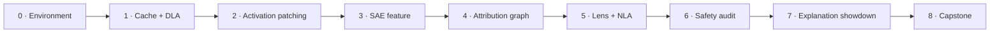

# Lab guide

The labs turn interpretability stories into measurements. Each lab produces a small research artifact—plot, table, causal test, or protocol—that can be reviewed independently.

## Compute tiers

| Tier | Hardware | Suitable work |
| --- | --- | --- |
| **A · Local** | CPU or Apple Silicon | Tensor-shape exercises, tiny models, catalog work, hosted Neuronpedia graphs |
| **B · Starter GPU** | 12–16 GB | GPT-2 Small, Pythia-70M/160M, Gemma 2 2B with offload, released SAEs |
| **C · Research GPU** | 24–48 GB | Comfortable 1–4B interventions, Circuit Tracer, small LoRAs, batched robustness sweeps |
| **D · Multi-GPU** | 80 GB+ aggregate | Large dictionaries, 7B–27B models, training SAEs/CLTs; not required for the course core |

!!! success "Default rule"
    Use the smallest model that can falsify your hypothesis. Scaling a broken experiment only makes the mistake more expensive.

## Lab sequence

| Lab | Goal | Output |
| --- | --- | --- |
| [0 · Environment](00-environment.md) | Reproducible setup and model choice | Environment manifest |
| [1 · Activations & attribution](01-activation-cache.md) | Inspect residual writes and logits | Attribution plot plus prediction |
| [2 · Activation patching](02-activation-patching.md) | Localize a controlled behavior | Patching heatmap with controls |
| [3 · SAE feature validation](03-sae-features.md) | Test an existing feature label | Feature evidence card |
| [4 · Circuit Tracer](04-circuit-tracer.md) | Read a graph and intervene | Annotated graph plus two causal tests |
| [5 · Jacobian Lens & NLA](05-jacobian-lens.md) | Compare verbal readouts | Agreement/disagreement table |
| [6 · Harmless safety audit](06-safety-audit.md) | Audit a canary or persona behavior | Blind audit report |
| [7 · Explanation showdown](07-explanation-showdown.md) | Adjudicate methods causally | Calibration and failure analysis |
| [8 · Capstone protocol](08-capstone.md) | Freeze a novel study before running it | Preregistered protocol |

## Reproducibility contract

Every lab submission records:

1. exact model and revision;
2. tokenizer and chat template;
3. package versions and hardware;
4. random seeds;
5. prompts/data-generation code;
6. metric definition and sign convention;
7. intervention site and baseline;
8. exclusions or failed runs;
9. raw results before interpretation;
10. the smallest claim the evidence supports.

## Safety boundary

The safety labs use benign model organisms, fictional secrets, canary strings, toy reward functions, or harmless restricted outputs. The aim is to study auditing mechanics without generating operationally harmful content.

[Set up the environment →](00-environment.md){ .md-button .md-button--primary }

