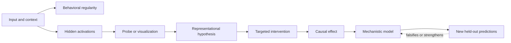
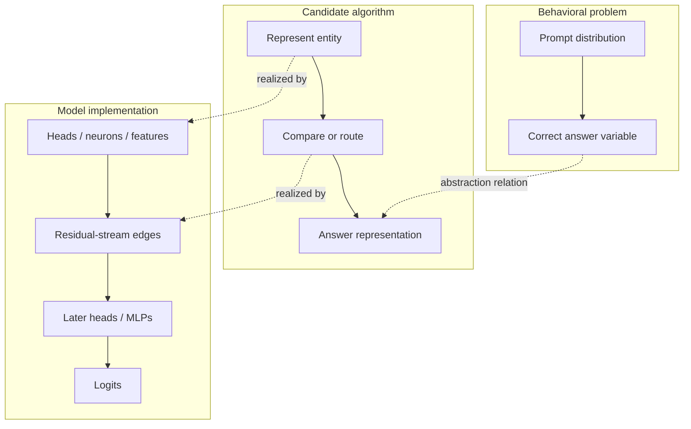
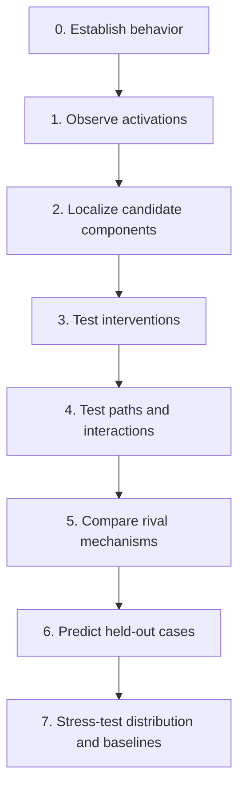

# 00 — Orientation: What Counts as Mechanistic Evidence?

**Thesis:** A mechanistic explanation earns trust by making precise causal predictions that survive controls, rival hypotheses, and distribution shifts—not by producing a compelling visualization.

Mechanistic interpretability asks a stronger question than *what inputs correlate
with a model output?* It asks which internal variables and computations produce
the output, how those computations are organized, and what would happen under a
well-specified intervention. This module establishes the vocabulary and evidence
standards used throughout the course.

!!! intuition
    Think of interpretability as experimental science conducted inside a model.
    A heatmap is an observation; a mechanism is a compact causal theory that
    predicts what the model will do when its internal computation is changed.

**Estimated time:** 90 minutes  
**Prerequisites:** basic linear algebra, probability, and familiarity with neural
network forward passes

## Learning objectives

By the end of this module, you should be able to:

1. Distinguish behavioral, representational, and mechanistic claims.
2. Separate observation, localization, causal validation, and explanation.
3. Write a circuit hypothesis in a form that could be falsified.
4. Evaluate necessity, sufficiency, faithfulness, completeness, and robustness
   without treating any one metric as decisive.
5. Design clean/corrupted counterfactuals that change the target variable while
   minimizing unrelated changes.
6. Recognize when an attractive visualization is evidence, a hypothesis
   generator, or merely a story.

## 1. The object of study

Let a model be a function

$$
f_\theta : x \mapsto y,
$$

with intermediate activations

$$
h_1(x), h_2(x), \ldots, h_L(x).
$$

A behavioral study characterizes the mapping from $x$ to $y$. A
representational study asks what information is available in some $h_\ell$. A
mechanistic study additionally proposes a computation: which internal variables
transform which inputs, along which paths, to cause a particular output.

The same experiment can support one claim while failing to support another. A
linear probe that predicts whether a prompt is truthful establishes
*decodability*. It does not establish that the model uses that direction, that
the direction means truth rather than a correlated topic, or that intervening on
it will selectively alter truthfulness.

!!! warning
    “Information is present,” “this site is causally relevant,” and “the model
    uses this variable in the proposed algorithm” are three different claims.
    Do not silently move from the first to the third.



### Levels of claim

| Claim | Example | Minimum useful evidence |
| --- | --- | --- |
| Behavioral | “The model resolves this pronoun.” | Held-out behavior and controls |
| Correlational | “Head 8.6 attends to the antecedent.” | Activation/attention statistics |
| Representational | “The residual stream encodes the antecedent.” | Decoding plus specificity controls |
| Causal | “This component contributes to the answer.” | Intervention with a justified baseline |
| Computational | “These components implement a copy operation.” | Path-level evidence and predicted effects |
| Algorithmic | “The model applies this procedure across inputs.” | Generalization, causal abstraction, and competing hypotheses |

Mechanistic interpretability usually moves between three descriptions:

- **Variables:** features such as a token identity, board state, or grammatical
  role.
- **Operations:** copying, comparison, inhibition, addition, lookup, or routing.
- **Implementation:** neurons, attention heads, residual directions, sparse
  features, or paths that realize those variables and operations.



## 2. From a story to a falsifiable circuit hypothesis

A useful hypothesis specifies five things:

1. **Scope:** model, checkpoint, prompt distribution, token positions, and
   behavior.
2. **Variables:** the internal components or feature directions being claimed.
3. **Computation:** the transformation and information flow between them.
4. **Observable prediction:** what changes under a particular intervention.
5. **Rival explanation:** at least one plausible alternative the experiment can
   distinguish.

For example:

!!! example
    A good hypothesis names the prompt distribution, component, information
    flow, metric, intervention, negative control, and a result that would count
    against the story.

> On prompts of the form “A, B, and C entered. B gave a book to …”, head $h$ at
> the final token writes the residual direction that raises the logit of B. If
> the source-name representation is replaced with the matched representation
> from a prompt whose answer is C, the B-minus-C logit difference will reverse;
> patching an unrelated position will not.

This is stronger than “head $h$ is a name head.” It names a distribution, a
position, a write operation, a behavioral metric, an intervention, and a
negative control.

## 3. The evidence ladder

Interpretability studies often accumulate evidence in the following order. The
order is not a guarantee of truth, but it helps expose missing steps.



### Observation and localization

Observation asks where a signal is visible. Localization asks which candidate
sites best predict or mediate a behavioral difference. Typical tools include:

- attention-pattern inspection;
- probes and representational similarity;
- direct logit attribution;
- activation patching or causal tracing;
- gradients, integrated gradients, and attribution patching;
- sparse feature activation and automated circuit discovery.

Localization narrows the search space. It is not a complete explanation. A
signal can be copied through many sites, a component can be causally important
for multiple unrelated reasons, and distributed computations can defeat
single-site rankings.

### Interventions

An intervention replaces or modifies an internal activation. For component
$c$, a patching experiment can be written

$$
y_{c \leftarrow \tilde h_c}
= f_\theta\!\left(x;\operatorname{do}(h_c=\tilde h_c)\right),
$$

where $\tilde h_c$ might come from a corrupted or clean counterfactual input.
The notation resembles a causal intervention, but its interpretation depends on
whether $\tilde h_c$ is meaningful in the surrounding computation. Patching can
create an off-distribution hybrid state.

For a scalar behavioral metric $m$, a normalized recovery score is often

$$
R_c = \frac{m(y_{c\leftarrow h_c^{\text{clean}}})-
                 m(y^{\text{corrupt}})}
                {m(y^{\text{clean}})-m(y^{\text{corrupt}})}.
$$

$R_c=1$ means the patch recovers the full clean/corrupt gap for that metric;
$R_c>1$ and $R_c<0$ are possible and should not be silently clipped.

### Necessity, sufficiency, and faithfulness

Suppose $C$ is a proposed circuit and $\bar C$ is the rest of the model.

- **Necessity:** disrupting $C$ damages the target behavior.
- **Sufficiency:** preserving $C$ while ablating an appropriately defined
  complement retains the behavior.
- **Faithfulness:** the circuit-only or circuit-intervened computation predicts
  the original model's behavior under the relevant distribution.
- **Completeness:** important causal contributors are not omitted.
- **Minimality:** removing elements of $C$ materially reduces faithfulness.

These depend on the ablation. Zero, mean, resample, noise, and learned
replacement baselines answer different counterfactual questions. A circuit may
look sufficient under an easy mean ablation and fail under resampling.

## 4. Experimental design standards

### Define the behavior before inspecting internals

Choose a metric that captures the target computation rather than convenient
surface behavior. For two answer tokens $a$ and $b$, a common metric is the
logit difference

$$
m(x) = z_a(x)-z_b(x).
$$

Logit difference is usually more stable than probability difference because
softmax couples every vocabulary item, but it still ignores effects on other
plausible answers.

### Construct matched counterfactuals

A clean/corrupted pair should modify the causal variable of interest while
preserving length, tokenization, grammaticality, and unrelated semantics where
possible. Check the model actually exhibits the expected behavior on both
members. Otherwise, “recovery” can measure an arbitrary distribution shift.

### Pre-register the causal contrast

State before looking at the heatmap:

- what is patched or ablated;
- source and destination examples;
- positions and layers;
- metric and normalization;
- positive, negative, and placebo controls;
- held-out template or task split;
- what result would reject the hypothesis.

### Replicate across examples and choices

Report distributions and bootstrap intervals, not only a showcase prompt.
Repeat across prompt templates, random seeds when feasible, ablation baselines,
and plausible token-position alignments. Use a held-out set for the final
mechanistic predictions.

## 5. Worked example: testing a copy circuit

Consider a tiny model trained on sequences such as:

```text
red blue green | blue
cat dog owl    | dog
```

The model sees three items, a separator, and must reproduce the middle item.

**Behavioral metric.** For a clean sequence whose answer is `blue` and a matched
corrupted sequence whose middle item is `green`, use

$$m=z_{\text{blue}}-z_{\text{green}}.$$

**Observation.** One late attention head attends from the answer position to
the middle input position. Its output has high direct attribution to `blue`.

**Hypothesis.** The head uses positional attention to select the middle token
and an OV transformation to copy its token identity into the answer residual
stream.

**Tests.**

1. Patch the head's output from the clean run into the corrupt run at the answer
   position; predict positive recovery.
2. Patch only its attention pattern; predict recovery if selection is causal.
3. Patch only its value vectors; predict recovery if copied content is causal.
4. Patch a matched head that attends to the separator; predict little recovery.
5. Swap the first and third tokens while preserving the middle token; predict
   stable behavior if the rule is truly “middle item,” not “specific context.”
6. Ablate the proposed head and search for backup heads; one-head necessity is
   not required by the task-level algorithm.

If head-output patching works but pattern and value patching do not, the simple
copy story is incomplete. The effect may arise from nonlinear interactions,
normalization, or a correlated state imported by the full head output.

## 6. Common failure modes

- **Attention-is-explanation:** an attention edge shows routing weights, not the
  content carried or its causal importance.
- **Probe reification:** a decodable variable is assumed to be used by the
  model.
- **Single-prompt storytelling:** a compelling visualization is selected after
  inspecting many examples.
- **Confounded corruptions:** clean and corrupt prompts differ in tokenization,
  position, grammar, topic, or difficulty.
- **Off-distribution interventions:** patched activations are incompatible with
  the destination context.
- **Baseline dependence:** conclusions change under zero, mean, resample, or
  noise ablation.
- **Metric hacking:** the intervention improves a chosen logit difference while
  damaging overall behavior.
- **Redundancy blindness:** ablation finds a component unnecessary because a
  backup pathway compensates.
- **Nonlinear interaction blindness:** independently weak components are strong
  jointly, or independently strong effects cancel.
- **Surrogate confusion:** a sparse autoencoder, transcoder, or replacement
  model is interpreted as though it were the original network.
- **Autointerpretation as ground truth:** fluent feature labels are repeated
  without dataset and intervention checks.
- **No rival hypothesis:** evidence is collected only for one favored story.

## 7. Knowledge check

1. A probe reaches 99% accuracy for a variable. What has been established?
2. Why can a component be necessary but not sufficient?
3. Why is a resample ablation usually a different experiment from zero
   ablation?
4. What does normalized patching recovery greater than one mean?
5. Name two reasons a clean/corrupted pair can give a misleading heatmap.

<details>
<summary>Answers</summary>

1. The variable is decodable from the probed activations on that dataset. Use,
   causal relevance, semantic purity, and generalization have not been shown.
2. The component may be one required step whose output only works with the rest
   of the model. Necessity asks what happens when it is removed; sufficiency asks
   whether the retained subsystem can produce the behavior under a specified
   complement ablation.
3. Zero may be an unusual activation and removes both information and typical
   magnitude. Resampling substitutes an activation from a reference
   distribution, asking what happens when contextual information is replaced
   while more ordinary activation statistics are retained.
4. The patch changed the metric by more than the original clean/corrupt gap. It
   can reflect overshoot, interaction effects, noise in the denominator, or a
   patch that creates a hybrid state; it is not automatically “more than fully
   causal.”
5. Examples include token-length changes, grammaticality changes, answer-token
   frequency, position shifts, multiple semantic variables changing, or the
   model failing the intended behavior on one side of the pair.

</details>

## 8. Practical exercise: audit an interpretability claim

Choose one figure from a mechanistic-interpretability paper and write a
one-page evidence audit:

1. State the exact claim in one sentence.
2. Label it behavioral, correlational, representational, causal,
   computational, or algorithmic.
3. Identify the model, dataset, metric, intervention, and ablation baseline.
4. Draw a causal diagram with the intended variable, possible confounders, the
   measured activation, and the output.
5. Write one rival mechanism consistent with the published result.
6. Propose one positive control, one negative control, and one held-out
   prediction.
7. State the strongest conclusion justified by the evidence and one stronger
   conclusion that is *not* justified.

Save the audit before reading the paper's discussion section, then compare your
critique with the authors' stated limitations.

## Canonical primary sources

- Olah et al., [Zoom In: An Introduction to Circuits](https://distill.pub/2020/circuits/zoom-in/)
- Elhage et al., [A Mathematical Framework for Transformer Circuits](https://transformer-circuits.pub/2021/framework/index.html)
- Wang et al., [Interpretability in the Wild: a Circuit for Indirect Object Identification](https://arxiv.org/abs/2211.00593)
- Geiger et al., [Causal Abstraction for Faithful Model Interpretation](https://arxiv.org/abs/2301.04709)
- Conmy et al., [Towards Automated Circuit Discovery for Mechanistic Interpretability](https://arxiv.org/abs/2304.14997)
- Goldowsky-Dill et al., [Localizing Model Behavior with Path Patching](https://arxiv.org/abs/2304.05969)
- Miller et al., [Towards Evaluating the Faithfulness of Circuit Discovery Methods](https://arxiv.org/abs/2407.08734)
- Ameisen et al., [Circuit Tracing: Revealing Computational Graphs in Language Models](https://transformer-circuits.pub/2025/attribution-graphs/methods.html)
