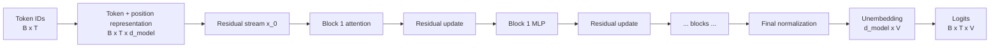
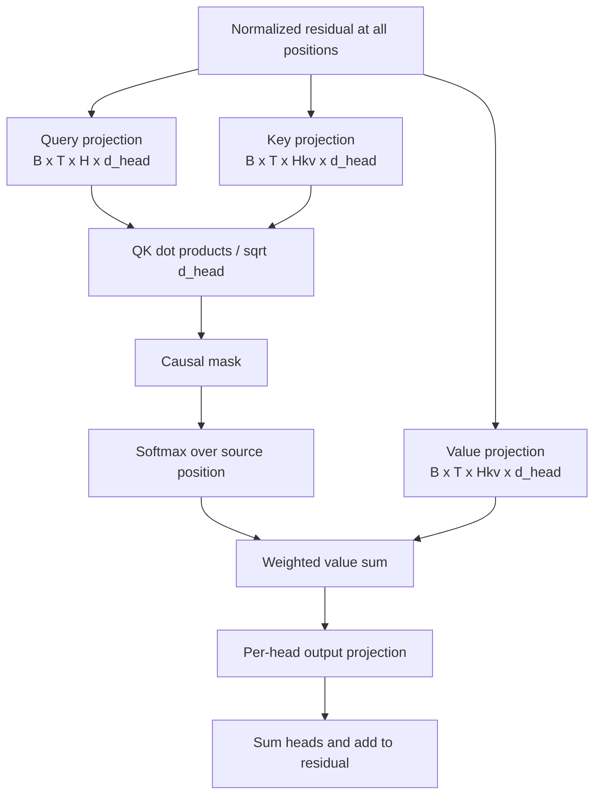
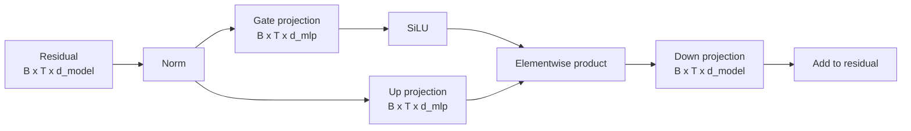

# 01 — Transformer Anatomy: From Tokens to Logits

**Thesis:** Reliable circuit work begins with an exact computational graph, explicit tensor axes, and reconstruction checks for the specific model under study.

Circuit analysis becomes much easier when every cached tensor has an
unambiguous place in the forward pass. This module follows a decoder-only,
pre-normalization transformer and keeps batch, position, head, and feature axes
explicit.

!!! intuition
    A transformer block is a pair of readers and writers attached to a shared
    residual-stream notebook: attention moves information between positions,
    while the MLP transforms information independently at each position.

**Estimated time:** 2 hours  
**Prerequisites:** matrix multiplication, softmax, basic PyTorch tensor notation

## Learning objectives

By the end of this module, you should be able to:

1. Derive a decoder-only transformer forward pass from token IDs to logits.
2. State the shape and semantic role of embeddings, residual streams, Q/K/V,
   attention scores and patterns, head results, MLP activations, and logits.
3. Explain causal masking, multi-head attention, normalization, and positional
   information.
4. Map common hook names to exact points in the computation.
5. Identify architectural differences that invalidate naive analysis code.
6. Verify a model's tensor conventions instead of relying on memory.

## 1. Notation and axes

We will use:

| Symbol | Meaning |
| --- | --- |
| $B$ | batch size |
| $T$ | sequence length |
| $V$ | vocabulary size |
| $L$ | number of transformer blocks |
| $H$ | number of query heads |
| $H_{kv}$ | number of key/value heads |
| $d_{model}$ | residual-stream width |
| $d_{head}$ | per-head query/key/value width |
| $d_{mlp}$ | MLP hidden width |

Tensor axis names matter more than variable names. For example, a tensor of
shape $[B,T,H,d_{head}]$ can mean queries, keys, values, or per-head outputs.
Always record both shape and location in the graph.



## 2. Embeddings and the residual stream

For token IDs $t_1,\ldots,t_T$, a simple learned-position model begins with

$$
x_0[b,p] = W_E[t_{b,p}] + W_{pos}[p],
$$

where $W_E\in\mathbb{R}^{V\times d_{model}}$. Some models tie the unembedding
to $W_E^\top$; others do not. Rotary position embeddings do not add a position
vector to the residual stream. Instead, they rotate queries and keys before
attention-score computation.

The residual stream has shape $[B,T,d_{model}]$. It is the shared communication
channel through which attention and MLP sublayers read and write.

For a pre-normalization block $\ell$, write the incoming residual state as
$x_\ell$:

$$
u_\ell = \operatorname{Norm}^{attn}_\ell(x_\ell),
$$

$$
x'_\ell = x_\ell + a_\ell, \qquad
a_\ell=\operatorname{Attn}_\ell(u_\ell),
$$

$$
v_\ell = \operatorname{Norm}^{mlp}_\ell(x'_\ell),
$$

$$
x_{\ell+1}=x'_\ell+m_\ell
=x_\ell+a_\ell+m_\ell,
\qquad m_\ell=\operatorname{MLP}_\ell(v_\ell).
$$

The exact ordering differs across architectures. Post-LN models normalize after
the residual addition. Parallel blocks may compute attention and MLP from the
same normalized residual. Never infer the graph solely from a model family
name; inspect its implementation or instrumentation adapter.

!!! warning
    The equations in a paper are not necessarily the graph in your checkpoint.
    RoPE, RMSNorm, GQA, gated MLPs, parallel blocks, and fused kernels all change
    which tensors exist and where an intervention belongs.

## 3. Self-attention, step by step

For head $h$ in layer $\ell$, projections produce

$$
Q_{p,h}=u_pW^h_Q+b^h_Q,\qquad
K_{s,h}=u_sW^h_K+b^h_K,\qquad
V_{s,h}=u_sW^h_V+b^h_V.
$$

With the head axis exposed, $Q,K,V$ usually have shape
$[B,T,H,d_{head}]$. Attention scores are

$$
S_{p,s,h}=\frac{Q_{p,h}\cdot K_{s,h}}{\sqrt{d_{head}}}+M_{p,s},
$$

where the causal mask $M_{p,s}$ is $0$ for $s\le p$ and $-\infty$ for
$s>p$. The attention pattern is

$$
A_{p,s,h}=\operatorname{softmax}_{s}(S_{p,s,h}).
$$

Each row over source positions sums to one. The head gathers values:

$$
Z_{p,h}=\sum_{s\le p}A_{p,s,h}V_{s,h},
$$

and writes through an output projection:

$$
O_{p,h}=Z_{p,h}W^h_O.
$$

The multi-head attention output is $\sum_h O_{p,h}$, possibly followed by a
shared output bias.



### Query and source positions

In $A_{p,s,h}$, $p$ is the **destination/query** position doing the attending;
$s$ is the **source/key-value** position being read. Confusing these axes can
produce a visually plausible but reversed attention interpretation.

### Multi-query and grouped-query attention

Modern models often have $H_{kv}<H$. Several query heads share a key/value
head. Analysis code that assumes one independent $K$ and $V$ per query head may
silently duplicate or mis-index tensors. The computation is still well-defined,
but component counting and interventions must respect the sharing map.

### What the pattern does and does not show

$A_{p,s,h}$ measures routing weight. It does not show:

- which information is in $V_{s,h}$;
- what $W_O^h$ writes to the residual stream;
- whether the write affects the final output;
- whether another head cancels or duplicates the effect.

## 4. MLP sublayers

A classic MLP has

$$
a_p = W_{in}v_p+b_{in},\qquad
m_p=\phi(a_p)W_{out}+b_{out},
$$

where $a\in\mathbb{R}^{B\times T\times d_{mlp}}$ and
$m\in\mathbb{R}^{B\times T\times d_{model}}$. With a ReLU-like activation,
individual hidden units can be viewed as detecting an input direction and
writing an output direction, though real features may be distributed or
superposed.

Gated MLPs such as SwiGLU instead compute something like

$$
m_p=\left(\operatorname{SiLU}(v_pW_{gate})\odot(v_pW_{up})\right)W_{down}.
$$

There is no single pre-activation whose sign alone determines the unit's write.
Hook locations and neuron interpretations must match the architecture.



## 5. Normalization and logits

LayerNorm transforms a vector using its mean and variance:

$$
\operatorname{LN}(r)=\gamma\odot
\frac{r-\mu(r)}{\sqrt{\sigma^2(r)+\epsilon}}+\beta.
$$

RMSNorm omits mean centering:

$$
\operatorname{RMSNorm}(r)=\gamma\odot
\frac{r}{\sqrt{d_{model}^{-1}\sum_i r_i^2+\epsilon}}.
$$

Final logits at position $p$ are

$$
z_p=\operatorname{Norm}_f(x_L[p])W_U+b_U,
$$

with $W_U\in\mathbb{R}^{d_{model}\times V}$. The next-token distribution is
$\operatorname{softmax}(z_p)$. A component's residual write is therefore not
perfectly linearly separable from other components once final normalization is
included.

## 6. Hook points as experimental interfaces

A hook captures or changes a tensor during execution. Typical conceptual sites
are:

| Site | Typical shape | Question it supports |
| --- | --- | --- |
| residual pre | $[B,T,d_{model}]$ | What information enters a block? |
| normalized residual | $[B,T,d_{model}]$ | What do Q/K/V or the MLP read? |
| Q, K, V | $[B,T,H,d_{head}]$ | How are attention scores/content formed? |
| attention scores/pattern | $[B,H,T,T]$ or $[B,T,T,H]$ | Where is each head routing? |
| head result | $[B,T,H,d_{model}]$ | What does each head write? |
| MLP pre/post activation | $[B,T,d_{mlp}]$ | Which hidden units activate? |
| MLP output | $[B,T,d_{model}]$ | What does the MLP add? |
| residual post | $[B,T,d_{model}]$ | What state leaves a block? |
| logits | $[B,T,V]$ | What output distribution results? |

Libraries disagree on layout and names. TransformerLens may expose per-head
`result`; a native Hugging Face module may combine heads before its output hook.
Verify by printing shapes and, when needed, reconstructing the parent tensor
from the cached pieces.

## 7. Worked example: trace every tensor shape

!!! example
    A shape ledger is a small but powerful falsification tool: if cached head
    results cannot reconstruct the attention write, the analysis is using the
    wrong axis order, hook point, or architecture assumption.

Take a toy configuration:

```text
B = 2, T = 5, V = 100
d_model = 8, H = 2, d_head = 4, d_mlp = 32
```

1. Token IDs have shape $[2,5]$.
2. Embeddings and every residual stream have shape $[2,5,8]$.
3. Splitting Q/K/V into two heads gives $[2,5,2,4]$.
4. For each batch and head, every query position scores every key position, so
   scores have shape $[2,2,5,5]$ under a `[batch, head, query, key]`
   convention.
5. The causal mask makes entries above the source-position diagonal
   inaccessible.
6. Weighted values have shape $[2,5,2,4]$.
7. Per-head writes after $W_O^h$ have shape $[2,5,2,8]$ and sum to
   $[2,5,8]$.
8. MLP hidden activations have shape $[2,5,32]$ and the MLP output returns to
   $[2,5,8]$.
9. The unembedding produces $[2,5,100]$ logits.

Two common mistakes are visible immediately: the attention tensor is quadratic
in $T$, and the head result's last dimension is $d_{model}$, not $d_{head}$,
after the per-head output projection.

## 8. Common failure modes

- **Wrong token position:** analyzing the last text token rather than the
  position whose logits predict the next token.
- **Axis reversal:** treating source positions as destinations in attention
  plots.
- **Off-by-one labels:** displaying a token above the attention row that predicts
  it rather than the token whose residual state generated the row.
- **Ignoring tokenization:** words can be multiple tokens and leading-space
  tokens differ from word-initial tokens.
- **Assuming GPT-2 anatomy everywhere:** rotary embeddings, RMSNorm, GQA/MQA,
  gated MLPs, parallel blocks, attention biases, and sliding windows matter.
- **Hooking the wrong tensor:** pre-projection values, mixed head outputs, and
  residual writes answer different questions.
- **Forgetting normalization:** raw residual dot products with the unembedding
  can misestimate logits.
- **Precision mismatch:** quantization, fused kernels, dropout, or mixed
  precision can spoil exact reconstruction tests.
- **Cache explosion:** attention patterns scale as $O(BHT^2)$ and long-context
  caches can exhaust memory.
- **Generation-state confusion:** key/value caches change execution during
  autoregressive generation; a single full-sequence forward pass is simpler for
  first experiments.

## 9. Knowledge check

1. In $A_{p,s,h}$, which position supplies the query and which supplies the
   value?
2. Why does a head output after $W_O^h$ live in $d_{model}$ rather than
   $d_{head}$?
3. What architectural assumption fails under grouped-query attention?
4. Why is an attention pattern insufficient to identify a copy circuit?
5. What is the shape of logits for $B=4$, $T=16$, and $V=50{,}000$?

<details>
<summary>Answers</summary>

1. $p$ is the destination/query position. $s$ is the source position that
   supplies the key and value.
2. The head's mixed value $Z_{p,h}\in\mathbb{R}^{d_{head}}$ is mapped through
   $W_O^h\in\mathbb{R}^{d_{head}\times d_{model}}$ so it can be added to the
   shared residual stream.
3. The assumption that every query head has an independent key and value head.
   Under GQA, groups of query heads share K/V projections.
4. The pattern describes routing weights but not value content, output
   projection, downstream use, redundancy, or cancellation.
5. $[4,16,50{,}000]$.

</details>

## 10. Practical exercise: forward-pass ledger

Choose a small instrumented decoder model and one six-to-twelve-token prompt.

1. Write the architecture configuration: $L$, $H$, $H_{kv}$, $d_{model}$,
   $d_{head}$, $d_{mlp}$, normalization, positional method, and MLP type.
2. Tokenize the prompt and display token IDs and token strings.
3. Cache one instance of every tensor type in the hook table above.
4. Record its exact shape and axis order in a “forward-pass ledger.”
5. Numerically verify at least two identities, such as:
   - attention rows sum to one over unmasked source positions;
   - per-head results sum to the attention output;
   - attention and MLP outputs reproduce the residual update;
   - final normalized residual times $W_U$ reproduces logits.
6. Repeat with a second architecture and list every assumption that changed.

Treat a reconstruction mismatch larger than the expected floating-point error
as a bug to investigate, not as an inconvenience to ignore.

## Canonical primary sources

- Vaswani et al., [Attention Is All You Need](https://arxiv.org/abs/1706.03762)
- Radford et al., [Language Models are Unsupervised Multitask Learners](https://cdn.openai.com/better-language-models/language_models_are_unsupervised_multitask_learners.pdf)
- Elhage et al., [A Mathematical Framework for Transformer Circuits](https://transformer-circuits.pub/2021/framework/index.html)
- Shazeer, [GLU Variants Improve Transformer](https://arxiv.org/abs/2002.05202)
- Su et al., [RoFormer: Enhanced Transformer with Rotary Position Embedding](https://arxiv.org/abs/2104.09864)
- Ainslie et al., [GQA: Training Generalized Multi-Query Transformer Models](https://arxiv.org/abs/2305.13245)
- TransformerLens authors, [TransformerLens repository](https://github.com/TransformerLensOrg/TransformerLens)
