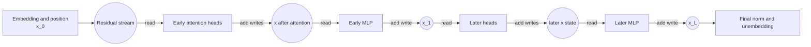
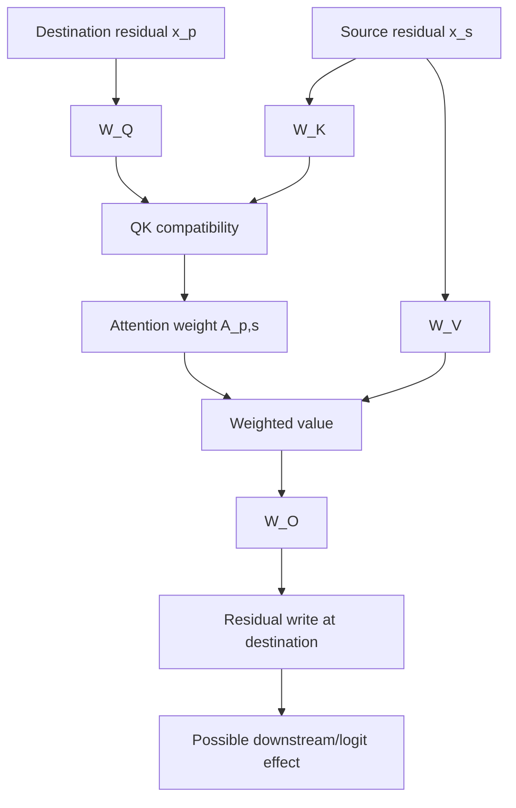
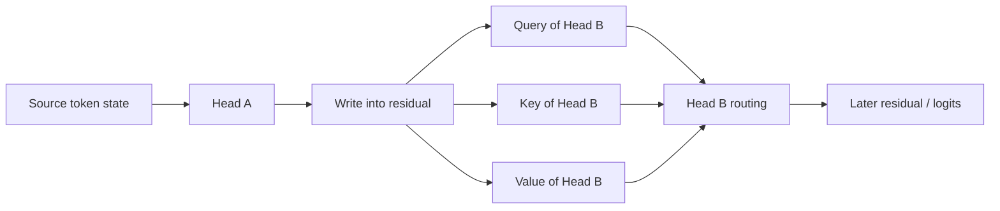

# 02 — Residual-Stream and Circuit Algebra

**Thesis:** Residual-stream algebra is most useful when its additive decompositions generate intervention predictions and its nonlinear approximations are stated explicitly.

The transformer-circuits viewpoint treats each block as reading from and
writing to a shared residual stream. This makes a nonlinear network partly
decomposable into additive writes and compositional paths. The algebra is
powerful, but every simplification has a boundary.

!!! intuition
    Treat the residual stream as a shared broadcast bus. Every component can
    read the current message and append a vector; later components can react to
    the combined message, including interactions between earlier writes.

**Estimated time:** 2.5 hours  
**Prerequisites:** Module 01, matrix multiplication, dot products, basic calculus

## Learning objectives

By the end of this module, you should be able to:

1. Expand a residual stream into additive component contributions.
2. Derive the QK and OV circuits of an attention head.
3. Explain residual, Q-, K-, and V-composition between heads.
4. Compute direct logit attribution and distinguish it from causal effect.
5. Explain the logit lens, tuned lens, and normalization caveats.
6. Use algebra to generate intervention predictions rather than only labels.

## 1. The residual stream as a communication channel

Ignoring normalization for a moment, a transformer repeatedly adds component
outputs:

$$
x_{\ell+1,p}=x_{\ell,p}+a_{\ell,p}+m_{\ell,p},
$$

where $a$ is an attention write and $m$ is an MLP write. Unrolling gives

$$
x_{L,p}=x_{0,p}+\sum_{\ell=0}^{L-1}a_{\ell,p}
                    +\sum_{\ell=0}^{L-1}m_{\ell,p}.
$$

If per-head results are available,

$$
a_{\ell,p}=\sum_{h=1}^{H}o_{\ell,h,p}.
$$

This is an exact additive decomposition at the selected hook points. It does
*not* mean components act independently: later components read the accumulated
sum through normalization and nonlinear operations.

The residual stream is better thought of as shared bandwidth than as a list of
human-readable slots. Multiple features can occupy overlapping directions
(superposition), and downstream components can respond to linear combinations.

## 2. Attention as two circuits: QK and OV

For one head, omit biases and write the attention score from destination $p$ to
source $s$ as

$$
S_{p,s}=\frac{(x_pW_Q)(x_sW_K)^\top}{\sqrt{d_{head}}}
=\frac{x_pW_QW_K^\top x_s^\top}{\sqrt{d_{head}}}.
$$

Define

$$
W_{QK}=W_QW_K^\top.
$$

The **QK circuit** determines which source positions the head selects, based on
bilinear compatibility between destination and source residual states.

After the softmax pattern $A_{p,s}$ is fixed, the head write is

$$
o_p=\sum_s A_{p,s}(x_sW_V)W_O
=\sum_s A_{p,s}x_sW_{OV},
$$

with

$$
W_{OV}=W_VW_O.
$$

The **OV circuit** determines what transformation of the selected source state
is written to the destination residual stream.

This factorization yields two distinct hypotheses. A “previous-token head” is
primarily a claim about QK selection. A “copy-suppression head” also requires a
claim about the OV write and how downstream logits use it.

### Token-basis probes of QK and OV

For simple embedding/unembedding analyses, one can inspect matrices such as

$$
W_EW_{QK}W_E^\top
$$

to ask which token pairs receive high compatibility, or

$$
W_EW_{OV}W_U
$$

to ask how a source token would directly affect destination logits. These are
useful hypotheses, not full descriptions: actual residuals include context,
position, prior writes, and normalization.

## 3. How heads compose

A later head can read an earlier head's output through several projections.
Let head $A$ write through $W_{OV}^{A}$ and later head $B$ read through one of
$W_Q^B$, $W_K^B$, or $W_V^B$.

- **Q-composition:** $A$ changes what the destination of $B$ looks for.
- **K-composition:** $A$ changes which source locations look relevant to $B$.
- **V-composition:** $A$ changes the content $B$ transports.
- **Residual composition:** $A$ contributes directly alongside $B$ to a later
  component or the logits.

A rough weight-only composition score compares a product such as
$W_{OV}^AW_Q^B$ with an appropriate random or norm-matched baseline. Weight
products can expose capacity for composition; activation data and interventions
are needed to show the path is used on the task.

### Path expansion

In a purely linear residual network, the output could be expanded as a sum over
all paths. Transformers introduce softmax, normalization, and MLP nonlinearities,
so global path expansion is not linear. Two common strategies recover a local
or conditional decomposition:

1. Treat observed attention patterns and normalization scales as fixed for a
   particular forward pass.
2. Use gradients or local replacement models to linearize effects around that
   pass.

Both are local explanations. If an intervention substantially changes the
attention pattern or normalization denominator, the frozen-path approximation
can fail.

!!! warning
    “The residual stream is additive” does not mean “the model is linear.” The
    writes add, but softmax, normalization, gating, and later component responses
    make the functions that produce those writes context-dependent.

## 4. Direct logit attribution

Suppose the final residual at a selected position is decomposed into writes
$x_L=\sum_c x_c$. Ignoring or locally linearizing final normalization, the
contribution of component $c$ to token $t$ is

$$
\operatorname{DLA}(c,t)=x_c^\top W_U[:,t].
$$

For a contrast between correct token $a$ and alternative $b$:

$$
\operatorname{DLA}(c,a-b)
=x_c^\top\left(W_U[:,a]-W_U[:,b]\right).
$$

DLA answers: *Does this component write in a direction aligned with this logit
contrast?* It does not answer:

- whether the component was necessary;
- whether later components erase, amplify, or use its write;
- why the component produced that write;
- whether changing the component will have the predicted effect after
  normalization and nonlinear responses.

### Exact treatment of final normalization

If the final normalization scale is held fixed at its observed value, component
writes can be scaled consistently before projection. Mean-centering in
LayerNorm can also be folded into an effective linear map for that forward pass.
This produces an exact additive decomposition of the *frozen-normalization*
logits, not a guarantee about counterfactual interventions that change the
scale.

## 5. Logit lens and tuned lens

The logit lens applies the final unembedding to an intermediate residual:

$$
z_\ell^{lens}=\operatorname{Norm}_f(x_\ell)W_U.
$$

It asks what tokens are readable using the model's final output basis. A clean
intermediate decoding can reveal prediction refinement, but early residuals may
not be calibrated for the final norm/unembedding.

The tuned lens learns an affine translator $A_\ell,b_\ell$:

$$
z_\ell^{tuned}=\operatorname{Norm}_f(x_\ell A_\ell+b_\ell)W_U.
$$

It improves predictive decoding but introduces a learned probe. Greater
decoding accuracy is not automatically a more faithful account of the model's
own computation.

## 6. Worked example: two heads and a logit contrast

!!! example
    DLA can rank candidate writers cheaply. The scientific work begins when
    those ranks become quantitative predictions about patches and ablations.

At the answer position of one prompt, suppose the correct token is `Paris` and
the contrast token is `Rome`. Let

$$
d=W_U[:,\text{Paris}]-W_U[:,\text{Rome}].
$$

Assume the cached writes give:

| Component | $x_c^\top d$ |
| --- | ---: |
| embedding/earlier residual | $+0.4$ |
| head 6.2 | $+2.1$ |
| head 7.5 | $-0.8$ |
| MLP 8 | $+0.7$ |
| remaining components | $+0.2$ |

The frozen-normalization decomposition predicts a total Paris-minus-Rome logit
difference of $+2.6$.

A tempting story is: head 6.2 retrieves the capital; head 7.5 suppresses it.
The table alone supports only the claim that their writes align positively and
negatively with the contrast. A stronger experiment would:

1. inspect head 6.2's QK routing and OV-transformed source content;
2. patch its pattern and value states separately from a matched country prompt;
3. ablate head 7.5 and check whether the Paris logit rises as predicted;
4. test other capital pairs and non-capital relations;
5. examine whether downstream MLP 8 responds to head 6.2's write;
6. compare actual intervention effects with DLA-predicted signs and magnitudes.

If ablating head 6.2 barely changes the answer, the positive DLA may be
redundant, downstream-cancelled, or a by-product rather than the retrieval
mechanism.

## 7. Common failure modes

- **Additivity implies independence:** residual writes add, but the functions
  producing later writes depend on the accumulated state.
- **QK-only labeling:** high attention to a token is called copying without
  studying the OV transformation.
- **OV-only labeling:** a head has a copy-like weight matrix but its task-time
  attention never selects the relevant source.
- **Weight-only mechanism claims:** composition capacity is mistaken for
  activation-level use.
- **DLA equals causal effect:** alignment with an unembedding direction is
  reported as necessity or mediation.
- **Ignoring normalization:** raw projections are compared across examples with
  different residual scales.
- **Logit-lens ontology:** intermediate tokens are treated as literal thoughts
  rather than one decoding of a high-dimensional state.
- **Tuned-lens circularity:** a learned translator's knowledge is attributed to
  the original model.
- **Frozen-attention approximation:** a local linear attribution is extrapolated
  to large interventions that alter routing.
- **Basis dependence:** coordinate-level interpretations are made in spaces
  where rotations preserve the function.
- **Superposition blindness:** a residual direction or neuron is assigned one
  meaning despite context-dependent feature mixtures.

## 8. Knowledge check

1. What is exact about the residual decomposition, and what is not?
2. Which matrix product controls attention-score compatibility?
3. Which kind of head composition changes what content a later head transports?
4. A head has large positive DLA for the correct answer. What two claims remain
   unproven?
5. Why can an intermediate tuned-lens prediction be accurate but not
   mechanistically faithful?

Answers

1. At chosen hook points, the residual is exactly the sum of the initial state
   and component writes. The components are not independent functions: later
   outputs depend nonlinearly on the accumulated residual through norms,
   softmax, and MLPs.
2. $W_QW_K^\top$, usually denoted $W_{QK}$, together with the actual source and
   destination residual states.
3. V-composition: an earlier write changes the input to the later value
   projection.
4. It remains unproven that the head is causally necessary and that the proposed
   semantic/computational story explains why it wrote that direction. Its
   effect may also be redundant or later cancelled.
5. The trained translator can learn how to map an intermediate state into the
   output basis even if the model itself does not perform that mapping at that
   layer or use the decoded variable in its downstream computation.

## 9. Practical exercise: algebra-to-intervention notebook

For one small decoder model and a prompt with two plausible next-token answers:

1. Define a correct-minus-alternative logit difference.
2. Cache per-head results and MLP outputs at the prediction position.
3. Reconstruct the final residual from the embedding and component writes.
4. Compute DLA for every head and MLP using a consistent final-normalization
   treatment.
5. Select the largest positive and negative contributors.
6. For each selected head:
   - plot its attention pattern;
   - inspect top OV-related token effects;
   - ablate or patch its output;
   - compare predicted and observed logit-difference changes.
7. Test at least 30 matched examples and plot DLA against causal effect.
8. Document one example where the algebraic attribution and intervention
   disagree, then propose a downstream interaction or normalization explanation.

The deliverable is not merely a bar chart. It is a table of predictions,
interventions, errors, and revised hypotheses.

## Canonical primary sources

- Elhage et al., [A Mathematical Framework for Transformer Circuits](https://transformer-circuits.pub/2021/framework/index.html)
- Olsson et al., [In-context Learning and Induction Heads](https://transformer-circuits.pub/2022/in-context-learning-and-induction-heads/index.html)
- Elhage et al., [Toy Models of Superposition](https://transformer-circuits.pub/2022/toy_model/index.html)
- Belrose et al., [Eliciting Latent Predictions from Transformers with the Tuned Lens](https://arxiv.org/abs/2303.08112)
- Wang et al., [Interpretability in the Wild](https://arxiv.org/abs/2211.00593)
- Syed, Rager, and Conmy, [Attribution Patching Outperforms Activation Patching](https://arxiv.org/abs/2310.10348)
- Kamath et al., [Tracing Attention Computation Through Feature Interactions](https://transformer-circuits.pub/2025/attention-qk/index.html)
