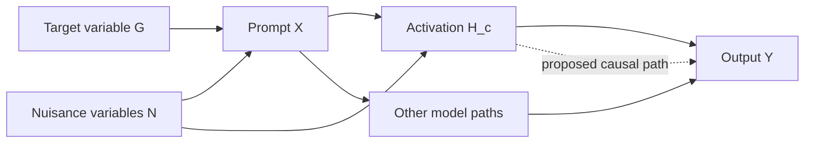
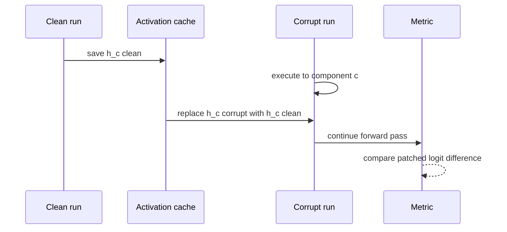
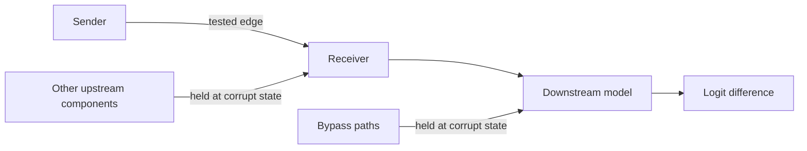

# 03 — Causal Interventions and Experimental Design

**Thesis:** An internal intervention is informative only relative to a precise counterfactual, a behaviorally meaningful metric, and controls that expose confounding and off-distribution effects.

Activation patching is the workhorse of causal circuit analysis. It can turn a
heatmap into a mechanistic lead, but it can also create unnatural hybrid states
and support contradictory stories when the corruption, baseline, or metric
changes.

!!! intuition
    Imagine two nearly identical executions of the model: one succeeds and one
    fails because a single task variable changed. Patching asks whether importing
    one internal message from the successful execution can repair the failed
    one. The hard part is constructing executions that differ in the *right*
    way.

**Estimated time:** 3 hours  
**Prerequisites:** Modules 01–02 and basic causal-graph vocabulary

## Learning objectives

By the end of this module, you should be able to:

1. Construct matched clean/corrupted datasets and justify the causal contrast.
2. Define a logit-difference metric and normalized recovery without hiding edge
   cases.
3. Distinguish activation patching, ablation, causal tracing, and path patching.
4. Choose among zero, mean, resample, noise, and learned-replacement baselines.
5. Design positive, negative, placebo, and distribution-shift controls.
6. Interpret necessity, sufficiency, mediation, and interaction experiments.
7. Separate exploratory localization from confirmatory causal testing.

## 1. Start with a causal question

Let $G$ be the task variable of interest—for example, which entity received an
object. Let $X$ be the observed prompt, $H_c$ an activation at component $c$,
and $Y$ the model output. A minimal intended story is

$$
G \rightarrow X \rightarrow H_c \rightarrow Y.
$$

Real prompts contain nuisance variables $N$: token identities, positions,
syntax, frequency, and topic. If a corruption changes both $G$ and $N$, patching
$H_c$ may transfer either.



The design goal is not to eliminate every nuisance variable—that is usually
impossible—but to vary them independently enough that the proposed mechanism
makes distinct predictions.

## 2. Clean, corrupt, and counterfactual pairs

A **clean** example is one on which the target behavior and metric have the
desired value. A **corrupted** example changes the task variable and produces a
different answer or lower metric. The pair should be matched on irrelevant
properties.

For answer tokens $y^+$ and $y^-$, define the primary metric

$$
M(x)=z_{y^+}(x)-z_{y^-}(x).
$$

For a batch, report both the mean and distribution of per-example logit
differences. Check that the correct and contrast tokens are single tokens under
the model tokenizer—or explicitly define how multi-token answers are scored.

### Pair-construction checklist

- Same length and aligned semantic positions where feasible.
- Identical template except for the target intervention.
- Balanced names, answer sides, and token frequencies.
- No answer leakage through punctuation or grammar.
- Model succeeds on clean examples and exhibits the intended contrast on
  corrupt examples.
- Several templates and lexical families reserved for held-out testing.

!!! warning
    If the corruption changes token count, position, grammar, and answer at once,
    a patching heatmap localizes sensitivity to the whole distribution shift—not
    a clean representation of the intended variable.

## 3. Activation patching

Run the model on a source example and cache activation $h_c^{src}$. During a
destination run, replace the corresponding activation:

$$
Y_{patch}=f_\theta\!\left(x^{dst};
\operatorname{do}(H_c=h_c^{src})\right).
$$

Two directions answer complementary questions:

- **Clean into corrupt:** where can clean information restore behavior?
- **Corrupt into clean:** where can corrupted information damage behavior?

Their heatmaps need not be mirror images because the model is nonlinear and
the imported state interacts with the destination context.



The common normalized recovery score is

$$
R_c=\frac{M_{patch,c}-M_{corrupt}}
          {M_{clean}-M_{corrupt}}.
$$

Do not average ratios with near-zero denominators. Safer options include
filtering by a pre-registered minimum clean/corrupt gap or reporting the ratio
of aggregated numerator and denominator alongside raw changes.

### Patch granularity

You can patch:

- a residual stream at one layer and position;
- one attention head's result;
- an attention pattern, Q, K, V, or mixed value tensor;
- an MLP output or individual neuron activation;
- a learned feature activation;
- multiple positions, layers, or components jointly.

Coarse residual patching has good coverage but poor specificity. Fine-grained
head or feature patching improves localization but can miss distributed or
synergistic effects.

## 4. Ablations define counterfactual questions

An ablation replaces an activation with a baseline $b_c$:

$$
H_c \leftarrow b_c.
$$

| Baseline | Counterfactual interpretation | Common risk |
| --- | --- | --- |
| Zero | Remove the component's write | Zero may be off-distribution or “no-op” only at some hooks |
| Dataset mean | Remove example-specific variation | Mean can retain task signal and shrink magnitude |
| Resample | Substitute a state from another example | Result depends on reference distribution and pairing |
| Noise | Destroy information while roughly matching scale | Noise direction may be unrealistic |
| Mean conditional on nuisance | Remove target information while matching controls | Requires enough data and a correct conditioning set |
| Learned replacement | Approximate ordinary model computation without the hypothesized feature/path | Surrogate can introduce its own errors |

For additive component outputs, zero can literally omit a write. Zeroing a
residual stream, attention pattern, or normalized input means something much
more destructive.

!!! example
    Zero-ablation of a head result asks, “What if this head wrote nothing?”
    Mean-ablation asks, “What if this head wrote its typical context-agnostic
    output?” Those are different scientific questions and may give different
    circuit rankings.

## 5. From sites to paths

Ordinary activation patching can show that an upstream site contains causally
useful information and that a downstream site affects behavior. It does not
show the information traveled along a particular edge.

**Path patching** isolates a sender-to-receiver route. In one common design:

1. Run clean and corrupt examples and cache activations.
2. During an intermediate run, patch the sender from clean into corrupt.
3. Recompute only the receiver input affected by that sender while holding
   alternative incoming paths at their corrupt values.
4. Patch the resulting receiver activation into the final corrupt run.
5. Measure whether the selected path restores the logit difference.



The implementation details matter. Freezing a receiver's other inputs can
create a state that never occurs naturally, while failing to freeze them can
allow indirect paths to contaminate the result.

## 6. Necessity, sufficiency, and interactions

Let $C$ be a proposed circuit and $\bar C$ its complement.

### Necessity

A circuit is behaviorally necessary under ablation $A$ when

$$
M(f_{\theta,\operatorname{ablate}(C,A)}(x))
\ll M(f_\theta(x)).
$$

Redundant paths can make each member individually unnecessary even when the set
is jointly necessary.

### Sufficiency

A circuit is sufficient under a complement ablation when preserving $C$ while
ablating $\bar C$ retains the behavior. Sufficiency can be made artificially
easy by choosing a weak complement ablation.

### Interaction

For components $i$ and $j$, define an interaction contrast

$$
I_{ij}=\Delta M_{i,j}-\Delta M_i-\Delta M_j,
$$

where $\Delta M$ is the change from the unablated model. Nonzero $I_{ij}$ signals
synergy, redundancy, cancellation, or other nonlinear interaction. Pairwise
tests do not capture higher-order interactions, but they are a useful warning
against additive rankings.

## 7. Exploratory versus confirmatory analysis

A sound workflow separates discovery from validation:


During exploration, dense heatmaps and flexible metrics are useful. Before
validation, freeze the component set, intervention, positions, sign prediction,
and primary metric. This reduces the chance that the “discovered circuit” is a
post-hoc selection from thousands of comparisons.

Report uncertainty over examples, not only over random initialization. A
bootstrap over paired prompts is often appropriate. If many components are
tested, use held-out validation or correct the inferential claim; ranking for
hypothesis generation does not require pretending every heatmap cell is an
independent discovery.

## 8. Worked example: entity-to-answer patching

Consider matched prompts:

```text
Clean:   Ava and Ben entered the gallery. Ava handed the map to Ben.
         The person holding the map is

Corrupt: Ava and Ben entered the gallery. Ben handed the map to Ava.
         The person holding the map is
```

Let the clean correct token be ` Ben` and the corrupt correct token be ` Ava`.
Use

$$
M=z_{\text{ Ben}}-z_{\text{ Ava}}.
$$

Suppose residual-stream patching from clean into corrupt shows a band of strong
recovery at the indirect-object token in layers 3–5 and at the final token in
layers 6–8.

A disciplined interpretation proceeds as follows:

1. **Localization hypothesis:** early/middle layers build the recipient
   representation at the name position; later layers route it to the answer.
2. **Position controls:** patch the subject, verb, punctuation, and a random
   name position. Predict lower recovery.
3. **Lexical controls:** swap names, verbs, and object nouns while preserving
   roles.
4. **Direction control:** corrupt-to-clean patching should damage the same
   computation, though not necessarily symmetrically.
5. **Component refinement:** patch head results and MLP outputs within the
   localized layer-position band.
6. **Path test:** isolate the candidate recipient-building component's path to a
   late name-moving head.
7. **Held-out prediction:** when word order changes but semantic roles do not,
   the mechanism should track the recipient role rather than a fixed offset.

If the circuit only works on the original word order, the stronger
role-representation claim is rejected; the model may use a positional shortcut.

## 9. Common failure modes

- **The model does not exhibit the contrast:** patch recovery is normalized by
  a small or inconsistent clean/corrupt gap.
- **Corruption bundles variables:** token identity, position, syntax, and
  difficulty all change.
- **Patch direction is ignored:** clean-to-corrupt and corrupt-to-clean answer
  different local questions.
- **Hybrid-state artifacts:** the source activation is incompatible with the
  destination's other states.
- **Baseline shopping:** the ablation producing the cleanest circuit is reported
  without the alternatives.
- **Metric tunnel vision:** one logit difference improves while probability
  mass moves to other wrong answers or generation quality collapses.
- **Position leakage:** semantic positions are aligned incorrectly after
  tokenization.
- **Independent-component assumption:** top single-site effects miss redundant
  or synergistic sets.
- **Multiple-comparison storytelling:** component hypotheses are selected and
  “confirmed” on the same examples.
- **Path contamination:** an alleged edge test leaves alternative routes open.
- **Surrogate intervention:** a replacement model's graph is treated as causal
  evidence about the original model without checking replacement error.
- **No distributional validation:** a circuit is declared general from one
  template and a handful of names.

## 10. Knowledge check

1. What does clean-to-corrupt activation patching ask?
2. Why can zero-ablation and resample-ablation rank components differently?
3. When is normalized recovery numerically unstable?
4. Why does patching an upstream and downstream site separately not prove an
   edge between them?
5. What is one experimental sign of redundancy?
6. Why should discovery templates be separated from validation templates?

<details>
<summary>Answers</summary>

1. Whether importing the clean activation at a selected site into a corrupted
   execution restores the clean-associated behavior or metric.
2. Zero removes a write or state and may be off-distribution; resampling
   substitutes a realistic but differently informative state. They define
   different counterfactuals and induce different downstream responses.
3. When $M_{clean}-M_{corrupt}$ is close to zero. Per-example ratios can also be
   dominated by a few small denominators.
4. The useful information might reach the downstream site through another
   route, or the two effects may concern different information. Edge/path
   interventions must isolate the sender-to-receiver route.
5. Ablating either component alone has little effect, but ablating both causes a
   large drop; equivalently, joint effects are strongly non-additive.
6. Selecting components, metrics, thresholds, and stories on the same examples
   overfits the interpretation. Held-out templates test whether the frozen
   hypothesis predicts new cases.

</details>

## 11. Practical exercise: pre-register a patching study

Before running a model, write a two-page experimental specification:

1. **Claim:** one falsifiable sentence about a variable, component, and path.
2. **Dataset:** at least 50 matched pairs across four templates, with one
   template held out.
3. **Token audit:** verify answer and semantic-position tokenization.
4. **Primary metric:** correct-minus-contrast logit difference, including how
   multi-token or low-gap cases are handled.
5. **Exploration:** one coarse residual-stream patching sweep.
6. **Confirmation:** one component-level and one path-level intervention with
   predicted signs.
7. **Baselines:** at least two ablations, plus positive, negative, and placebo
   controls.
8. **Robustness:** lexical replacements, template shift, and bootstrap interval.
9. **Stopping rule:** define what result rejects the circuit hypothesis.

After collecting results, add a deviation log. Any analysis invented after
seeing the heatmap should be labeled exploratory.

## Canonical primary sources

- Vig et al., [Causal Mediation Analysis for Interpreting Neural NLP](https://arxiv.org/abs/2004.12265)
- Meng et al., [Locating and Editing Factual Associations in GPT](https://arxiv.org/abs/2202.05262)
- Wang et al., [Interpretability in the Wild: a Circuit for Indirect Object Identification](https://arxiv.org/abs/2211.00593)
- Chan et al., [Causal Scrubbing: a Method for Rigorously Testing Interpretability Hypotheses](https://www.alignmentforum.org/posts/JvZhhzycHu2Yd57RN/causal-scrubbing-a-method-for-rigorously-testing)
- Goldowsky-Dill et al., [Localizing Model Behavior with Path Patching](https://arxiv.org/abs/2304.05969)
- Conmy et al., [Towards Automated Circuit Discovery for Mechanistic Interpretability](https://arxiv.org/abs/2304.14997)
- Miller et al., [Towards Evaluating the Faithfulness of Circuit Discovery Methods](https://arxiv.org/abs/2407.08734)

