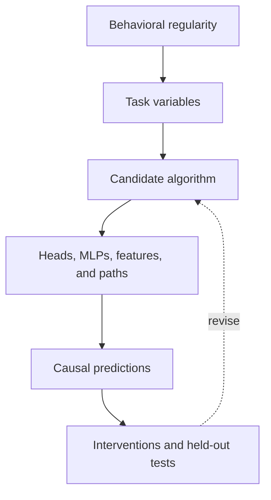
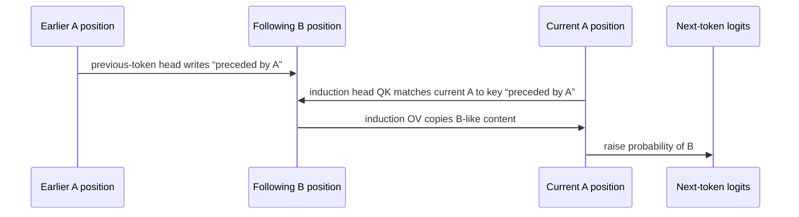
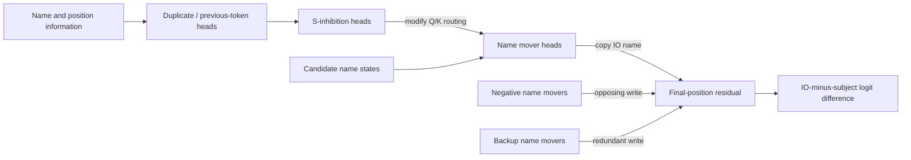
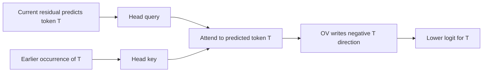
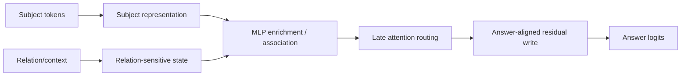

# 04 — Canonical Transformer Circuits

**Thesis:** Canonical circuits are reusable patterns of mechanistic reasoning, not universal component labels to copy unchanged into a new model.

The field's best-known circuits show how attention routing, residual writes,
MLP transformations, and causal tests can combine into algorithm-level
explanations. They also reveal how quickly a circuit can become template-,
checkpoint-, and metric-specific.

!!! intuition
    Learn canonical circuits the way an engineer studies bridge designs: focus
    on the load-bearing principles and tests, not the exact bolt numbers. “Name
    mover” is a functional hypothesis to re-establish, not a permanent identity
    attached to a head index.

**Estimated time:** 3 hours  
**Prerequisites:** Modules 01–03

## Learning objectives

By the end of this module, you should be able to:

1. Trace the previous-token plus induction-head algorithm.
2. Explain the major functional groups in the GPT-2 Small indirect-object
   identification circuit.
3. Distinguish routing, copying, suppression, and comparison roles.
4. Connect component roles to QK, OV, direct-attribution, and patching evidence.
5. Compare circuits for sequence completion, linguistic tasks, factual recall,
   arithmetic comparison, and learned algorithms.
6. Transfer a circuit *hypothesis* to a new task without assuming component
   universality.

## 1. A circuit is an algorithm plus an implementation

A useful circuit description has at least four layers:

| Layer | Question | Example |
| --- | --- | --- |
| Behavior | What input-output regularity is explained? | Continue a repeated token pattern |
| Variables | What information must be represented? | Current token identity and an earlier matching token |
| Operations | What transformations occur? | Match, route, and copy the following token |
| Components | Where are they implemented? | Previous-token and induction attention heads |



The implementation is usually many-to-many. A variable can be distributed
across components; a component can participate in multiple algorithms; and
backup pathways can realize similar functions.

## 2. Induction heads

### Behavioral pattern

In a sequence containing repeated context,

```text
... A B ... A -> B
```

an induction head helps predict the token that previously followed the current
token. This supports in-context continuation of repeated sequences and is one
candidate mechanism contributing to general in-context learning.

### Two-head algorithm

At an earlier source position containing `A`, a previous-token head writes
information about the preceding token into that position's residual state. A
later induction head can then:

1. query with the current token `A`;
2. match a source whose *previous token* was also `A`;
3. attend to the token after that earlier `A`, namely `B`;
4. use its OV circuit to copy evidence for `B` to the current destination.

The precise indexing depends on where the earlier head writes, but the key idea
is **K-composition**: an earlier head creates a key feature that a later head can
match.



For induction head $h$, the useful attention score can be idealized as

$$
S^h_{p,s}=\frac{x_pW^h_{QK}x_s^\top}{\sqrt{d_{head}}},
$$

where $x_s$ includes the earlier head's write. The output contribution is

$$
o^h_p=\sum_s A^h_{p,s}x_sW^h_{OV}.
$$

### Evidence pattern

Strong evidence for an induction circuit includes:

- the diagonal “attend to the token after an earlier match” pattern;
- an OV circuit that writes the attended token toward its unembedding;
- ablation that selectively reduces repeated-sequence completion;
- path or composition evidence between previous-token and induction heads;
- emergence near an in-context-learning phase change during training;
- generalization across arbitrary token sequences, not only natural phrases.

!!! warning
    An induction-like attention stripe is not by itself an induction mechanism.
    The OV write may not copy useful content, or the head may be epiphenomenal on
    the measured task.

## 3. Indirect object identification

### Task

In prompts like

```text
When Mary and John went to the store, John gave a bottle to
```

GPT-2 Small often predicts ` Mary`. The task requires identifying the name that
is not the repeated subject. The hand-built circuit in the canonical study is a
network of functional head classes rather than one decisive head.

### Functional groups

- **Name mover heads** attend to the indirect-object name and write its token
  identity toward the output.
- **Negative name mover heads** write in an opposing direction and partly
  counteract the main name movers.
- **S-inhibition heads** carry subject-related information that changes where
  name mover heads attend, suppressing the repeated subject.
- **Duplicate-token heads** detect repeated names or related positional
  structure.
- **Previous-token heads** help route information needed by later inhibition
  heads.
- **Backup name movers** become more important when primary movers are ablated.



The main metric is

$$
M=z_{IO}-z_S,
$$

where $IO$ is the indirect-object token and $S$ the repeated subject token.
Evidence comes from direct attribution, attention-pattern analysis, head
ablation, activation/path patching, and causal scrubbing against a higher-level
algorithmic hypothesis.

The existence of backup and negative heads is instructive: single-component
necessity and unsigned “importance” are poor summaries of a circuit with
redundancy and cancellation.

## 4. Copy suppression

Copy-suppression heads illustrate why head roles need both QK and OV analysis.
Such a head can attend to a token that the model is already likely to predict,
then use its OV circuit to suppress that same token's logit. The resulting
computation can calibrate or diversify predictions rather than copy the source.



A head that strongly attends to a name can therefore be a name copier, a name
suppressor, or a router of some other feature. Inspect the sign and context of
its residual write, then intervene.

## 5. Comparison and greater-than circuits

GPT-2's greater-than behavior on prompts involving two-digit years provides a
different circuit motif. Rather than routing one source token to the output,
mid-to-late MLPs transform a representation of the threshold year into a
structured pattern over candidate completion logits.

For a prompt ending with a starting suffix $n$, define a candidate suffix $k$.
The behavior resembles a soft step function:

$$
z_k \text{ is increased more when } k>n.
$$

Neuron groups can contribute different ranges or periodic patterns that sum to
the final comparison shape. This example demonstrates:

- MLPs can implement distributed lookup/comparison operations;
- groups of individually imperfect units can compose into an algorithm;
- logit effects over the *whole answer set* can be more revealing than one
  correct-minus-incorrect contrast;
- causal ablation should test range-specific predictions.

## 6. Factual recall circuits

Factual recall tasks such as “The capital of France is …” often combine:

- early subject representation;
- MLP-mediated enrichment or storage of subject-related attributes;
- relation- and query-sensitive attention;
- late attention heads that route candidate-answer information to the output;
- final residual writes aligned with answer-token unembeddings.

This is better described as a pipeline than as “facts live in one MLP.” Causal
tracing can localize subject-sensitive states, and editing can show some MLP
weights influence a fact, but localization/editability alone does not prove a
single storage site.



## 7. Grokking and learned algorithmic circuits

Small transformers trained on modular arithmetic offer unusually controlled
settings. During grokking, models can move from memorization to a Fourier-like
algorithm that represents inputs with periodic features and combines them to
solve modular addition.

These studies show the value of:

- known task structure and exhaustive evaluation;
- checkpoints across training time;
- weight and activation analysis together;
- ablations targeting mathematically predicted frequencies;
- progress measures that reveal the algorithm before test accuracy jumps.

The limitation is external validity: a clean circuit in a small algorithmic
model need not resemble a language-model mechanism. Its value is experimental
control and ground truth about the task.

## 8. Worked example: trace an induction prediction

Consider the token sequence

```text
[red] [blue] [green] [red]
```

The model should next predict `[blue]` if it applies induction.

1. At the second position (`blue`), a previous-token head writes a feature
   representing “the previous token was red.”
2. At the final `red`, the induction head query represents the current token.
3. The QK score is high between the final position and the `blue` position
   because its key contains the “preceded by red” feature.
4. The induction pattern attends from final `red` to earlier `blue`.
5. The OV map writes a blue-aligned direction at the final residual state.
6. The blue-minus-alternative logit difference increases.

A compact causal test suite is:

- patch the previous-token head's result at `blue` from a sequence with another
  predecessor and predict changed induction attention;
- patch only the induction pattern and then only its values;
- ablate the composition path while retaining each head's other paths;
- permute arbitrary token identities and predict the same abstract behavior;
- break the repeated bigram and predict loss of the induction effect.

!!! example
    The worked mechanism predicts *where* attention moves, *what* vector is
    written, and *which* counterfactual breaks each stage. That is more useful
    than assigning the head the label “induction.”

## 9. What transfers—and what does not

| Transferable pattern | Non-transferable assumption |
| --- | --- |
| Separate QK routing from OV content | A head with the same index has the same role |
| Use logit differences and path tests | One prompt template defines the task |
| Expect redundancy and inhibition | The smallest circuit is the truest circuit |
| Test algorithmic invariances | Attention pattern alone names the algorithm |
| Compare weights, activations, and interventions | A feature is monosemantic in every context |
| Validate on held-out inputs | A circuit in GPT-2 Small is universal across scale/families |

## 10. Common failure modes

- **Head-index cargo culting:** searching for “the induction head” at a known
  layer/head number in another checkpoint.
- **Functional labels as facts:** naming a component before testing its QK, OV,
  downstream use, and task scope.
- **Template overfitting:** a circuit exploits fixed positions or punctuation
  rather than the claimed semantic role.
- **Canonical-task saturation:** reproducing IOI exactly is valuable training but
  weak novelty unless it tests a new method or failure mode.
- **Ignoring anti-circuits:** negative, inhibitory, or cancelling components are
  removed from an unsigned importance graph.
- **Backup blindness:** primary components appear unnecessary after ablation due
  to compensating heads.
- **One-token metric:** effects over the rest of the vocabulary are ignored.
- **Algorithm/implementation collapse:** a task-level rule is equated with one
  arbitrary set of components.
- **Universality overclaim:** similar behavior or feature labels are treated as
  evidence of homologous circuitry across model families.
- **Post-hoc completeness:** unexplained residual behavior is assigned to a
  vague “backup circuit” without new predictions.

## 11. Knowledge check

1. What composition type is central to the classic two-head induction circuit?
2. Why is an induction-stripe attention pattern insufficient evidence?
3. What do S-inhibition heads contribute to the IOI circuit?
4. Why can negative name movers still be part of the mechanism?
5. What does the greater-than circuit teach that token-copy tasks do not?
6. Which part of a canonical circuit should transfer most reliably to a new
   model: head indices, functional algorithm, or exact weights?

<details>
<summary>Answers</summary>

1. K-composition: an earlier previous-token head changes a source key so a later
   induction head can match the current token to an earlier occurrence's
   follower.
2. The head's OV transformation may not copy useful next-token content, the
   pattern may arise for another reason, and ablating the head may not affect the
   behavior.
3. They carry subject/duplicate information that changes name-mover routing so
   the repeated subject is suppressed and the indirect object is selected.
4. A mechanism can include opposing or calibrating effects. Negative movers
   affect the final logit contrast and interact with positive/backup paths even
   though their contribution points away from the correct answer.
5. It highlights distributed MLP computation over a structured set of output
   candidates rather than attention-based token routing and copying.
6. The functional algorithm and its causal invariances. Component indices and
   weight implementations must be rediscovered and tested.

</details>

## 12. Practical exercise: transfer, do not copy

Choose induction or entity selection and test it in a model not used by the
canonical paper.

1. Build at least 100 synthetic examples with randomized tokens or names.
2. Reserve a template or sequence family for validation.
3. State the algorithm independently of components.
4. Derive three predictions: one QK/routing, one OV/write, and one causal path
   prediction.
5. Localize candidate heads without using canonical head indices.
6. Test direct attribution, head ablation, and at least one activation or path
   patch.
7. Search for negative and backup components.
8. Evaluate whether the same component set works across lexical and structural
   changes.
9. Report one part of the canonical story that transfers and one that fails.

The deliverable should distinguish replication (“this pattern also exists”)
from transfer (“the same abstract algorithm predicts new intervention results”).

## Canonical primary sources

- Elhage et al., [A Mathematical Framework for Transformer Circuits](https://transformer-circuits.pub/2021/framework/index.html)
- Olsson et al., [In-context Learning and Induction Heads](https://transformer-circuits.pub/2022/in-context-learning-and-induction-heads/index.html)
- Wang et al., [Interpretability in the Wild: a Circuit for Indirect Object Identification](https://arxiv.org/abs/2211.00593)
- McDougall et al., [Copy Suppression: Comprehensively Understanding an Attention Head](https://arxiv.org/abs/2310.04625)
- Hanna et al., [How Does GPT-2 Compute Greater-Than?](https://arxiv.org/abs/2305.00586)
- Geva et al., [Dissecting Recall of Factual Associations in Auto-Regressive Language Models](https://arxiv.org/abs/2304.14767)
- Meng et al., [Locating and Editing Factual Associations in GPT](https://arxiv.org/abs/2202.05262)
- Nanda et al., [Progress Measures for Grokking via Mechanistic Interpretability](https://arxiv.org/abs/2301.05217)

