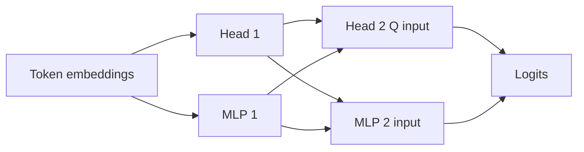
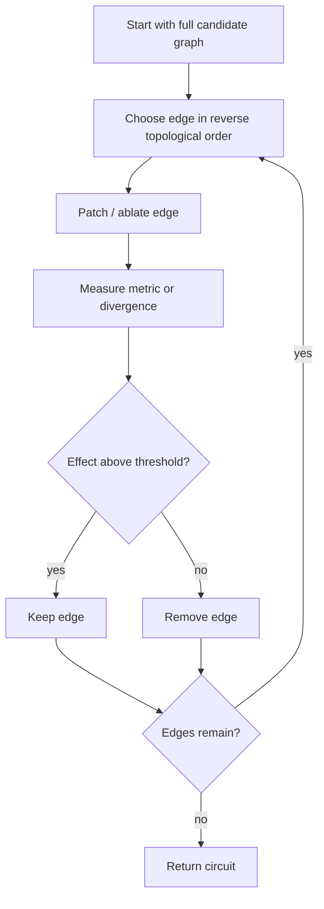
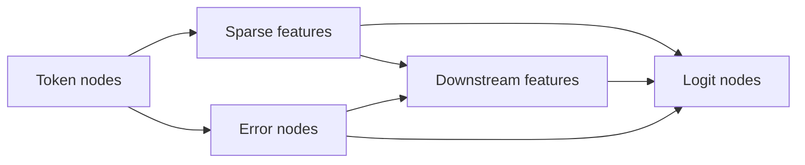

# 05 — Automated Circuit Discovery

**Thesis:** Automated discovery methods are search procedures over a chosen graph and counterfactual—not automatic proofs that the returned subgraph is the model's true mechanism.

Manual circuit analysis does not scale to thousands of components and millions
of possible edges. Automated methods rank, prune, or optimize candidate graphs,
but they inherit the assumptions of their nodes, edges, corruption data,
ablation baseline, attribution approximation, and faithfulness metric.

!!! intuition
    Automated circuit discovery is like using a metal detector at an
    archaeological site: it narrows where to dig. The returned score is evidence
    about sensitivity under one setup; excavation—exact interventions, controls,
    and semantic tests—is still required.

**Estimated time:** 3.5 hours  
**Prerequisites:** Modules 01–04 and familiarity with gradients

## Learning objectives

By the end of this module, you should be able to:

1. Define a transformer computation graph at component or feature granularity.
2. Derive exact activation-patching, EAP, integrated-gradient, and mask-based
   edge scores.
3. Explain ACDC's iterative pruning and its dependence on patching choices.
4. Compare ACDC, EAP, AtP*, EAP-IG, mask optimization, sparse feature circuits,
   and Circuit Tracer.
5. Evaluate a discovered circuit using faithfulness, sparsity, completeness,
   stability, runtime, and held-out causal predictions.
6. Recognize replacement errors, gradient failures, interaction effects, and
   ablation sensitivity.

## 1. Choose the graph before searching it

Represent the instrumented model as a directed acyclic graph

$$
G=(V,E),
$$

where nodes might be:

- attention heads and MLPs;
- individual neurons;
- residual states at layer-position pairs;
- Q, K, V, pattern, and head-result tensors;
- sparse autoencoder or transcoder features;
- token embeddings, logits, and reconstruction-error terms.

An edge $e=(u\rightarrow v)$ means the output of $u$ contributes to an input of
$v$ under the selected decomposition. A coarse node graph may hide which input
channel carries information. A very fine graph increases search cost and
multiple-comparison risk.

The graph is an analysis coordinate system, not a discovery result. If the
useful variable is distributed across nodes or lies in a reconstruction-error
term, no edge-ranking algorithm can recover a clean feature circuit from the
wrong graph.

## 2. Exact activation and edge patching

For a destination run, exact patching replaces a component activation $h_v$
with its source value and reruns the downstream model. For edge patching, only
the contribution from sender $u$ to receiver $v$ is replaced while other inputs
to $v$ retain destination values.

An exact single-edge effect can be written

$$
S_{exact}(e)=M\!\left(f_{e\leftarrow e^{src}}(x^{dst})\right)
-M\!\left(f(x^{dst})\right).
$$

This is expensive: testing every layer, position, component, and edge can
require hundreds or thousands of forward passes. Exact patching is nevertheless
the reference test for a short list of candidates.

## 3. ACDC: iterative causal pruning

Automatic Circuit Discovery (ACDC) begins with a large computational graph and
iteratively removes edges. For each candidate edge, it patches or ablates that
edge and measures how much a task metric or output-divergence changes. Edges
whose removal changes the objective less than a threshold are pruned.

ACDC is more causally grounded than an attention or gradient ranking, but:

- iterative effects depend on pruning order;
- redundant edges may be removed one at a time;
- thresholds trade sparsity against faithfulness;
- many patching runs are costly;
- the corruption and ablation define the discovered circuit.

## 4. Edge Attribution Patching

Edge Attribution Patching (EAP) uses a first-order Taylor approximation. Let
$a_e^{clean}$ and $a_e^{corrupt}$ be an edge activation, and let the metric be
evaluated at the corrupt run. Then

$$
S_{EAP}(e)
\approx
\left(a_e^{clean}-a_e^{corrupt}\right)^\top
\nabla_{a_e}M\big|_{a^{corrupt}}.
$$

One clean forward pass, one corrupt forward pass, and one backward pass can
score many edges. The dot product asks whether moving the edge activation from
corrupt toward clean aligns with the local metric gradient.

!!! warning
    A near-zero gradient can mean “unimportant,” but it can also mean saturated
    attention, cancellation, or curvature. First-order attribution is a ranking
    heuristic, not an exact intervention result.

### Integrated gradients

EAP with integrated gradients evaluates derivatives along a path

$$
a_e(\alpha)=a_e^{corrupt}+\alpha
\left(a_e^{clean}-a_e^{corrupt}\right),\quad \alpha\in[0,1],
$$

and scores

$$
S_{IG}(e)=
\left(a_e^{clean}-a_e^{corrupt}\right)^\top
\int_0^1 \nabla_{a_e}M(a(\alpha))\,d\alpha.
$$

Numerically this is a sum over interpolation steps. It reduces some local
gradient failures at greater compute cost. The straight-line activation path
can itself pass through unnatural states.

### AtP* and attention-specific fixes

AtP* targets two important failure modes:

- **QK attention saturation:** softmax gradients can vanish even when changing
  Q/K would move attention under a sufficiently large intervention.
- **gradient cancellation:** contributions through different downstream paths
  can cancel in a single backward pass.

Its QK correction and GradDrop-style decompositions improve recall of important
components, but do not eliminate baseline or interaction dependence.

## 5. Mask optimization

Instead of ranking edges independently, learn continuous gates
$g_e\in[0,1]$ that interpolate between retained and ablated edge values:

$$
a'_e=g_ea_e+(1-g_e)b_e.
$$

A typical objective is

$$
\min_g\;
\mathbb{E}_{x\sim D}
\left[\mathcal{L}\big(f_g(x),f(x)\big)\right]
+\lambda\sum_e g_e,
$$

where the first term preserves behavior or output distributions and the second
encourages sparsity.

Joint optimization can capture some interactions missed by independent scores,
but it introduces optimizer, initialization, regularization, and discretization
choices. A soft mask can exploit fractional computations that do not correspond
to a faithful hard subgraph.

## 6. Feature-level circuit discovery

Component graphs are often too coarse: a head or MLP can support many unrelated
features. Sparse dictionaries provide candidate feature nodes.

### Sparse feature circuits

An SAE decomposes an activation as a reconstruction plus an error term:

$$
x=\hat x+\epsilon,\qquad \hat x=W_df(x)+b,
$$

where $f(x)$ is sparse and $\epsilon=x-\hat x$ is reconstruction error. Feature
circuits attribute task behavior through sparse feature activations and include
error terms so omitted directions do not silently disappear.

The graph can be more semantically legible, but its faithfulness is bounded by:

- dictionary reconstruction;
- feature splitting, absorption, and polysemanticity;
- the arbitrary learned basis among similarly good dictionaries;
- whether causal computation remains in error nodes.

### Cross-layer transcoders and attribution graphs

Circuit Tracer replaces original MLP computations locally with sparse
cross-layer transcoders. With attention patterns and some normalization terms
held fixed, it builds a locally linear attribution graph connecting token,
feature, error, and logit nodes.

The graph is a prompt-local explanation of a replacement computation. Important
checks are replacement fidelity, error-node mass, intervention agreement, and
whether pruning removes collectively important paths. Original attention QK
computation remains less fully represented than MLP feature interactions.

## 7. Comparing discovery methods

| Method | Main unit | Approximation | Typical cost | Main strength | Main failure |
| --- | --- | --- | ---: | --- | --- |
| Exact patching | Node/edge | Counterfactual still baseline-dependent | Very high | Direct causal effect for tested intervention | Combinatorial search |
| ACDC | Edge | Greedy thresholded pruning | High | Causal, sparse graph search | Order/redundancy/threshold sensitivity |
| EAP | Edge | First-order Taylor | Low | Scores many edges rapidly | Saturation, curvature, cancellation |
| EAP-IG | Edge | Integrated path | Medium–high | Better nonlinear coverage | Path choice and step cost |
| AtP* | Component/site | Gradient with QK/cancellation fixes | Low–medium | Better recall for attention/cancelled paths | Still approximate/local |
| Mask optimization | Node/edge | Soft gates and chosen ablation | High | Joint sparse selection | Optimization and discretization artifacts |
| Sparse feature circuits | Feature/error | Learned dictionary | Medium–high | More semantic nodes | Dictionary/error dependence |
| Circuit Tracer | Feature/path | Sparse replacement plus local linearization | Medium | Rich prompt-level graphs and interventions | Surrogate and frozen-attention faithfulness |

No method dominates every axis. A practical pipeline uses a cheap high-recall
method to shortlist candidates, then exact patching and held-out predictions to
validate them.

## 8. Evaluating a discovered circuit

Let $C_k$ be the top-$k$ edges or nodes. Report a curve, not one threshold.

### Faithfulness

For output distributions, compare circuit and full model using KL divergence or
task loss. For a logit-difference task:

$$
F(C_k)=1-
\frac{|M(f_{C_k})-M(f)|}
     {|M(f)|+\epsilon}.
$$

The precise normalization must be reported, and negative values should not be
hidden.

### Completeness and necessity

Preserve $C_k$ while ablating the complement to test sufficiency. Ablate $C_k$
inside the full model to test necessity. Evaluate multiple baselines.

### Sparsity and efficiency

Report edge/node count, density relative to the candidate graph, discovery
forward/backward passes, wall-clock time, and peak memory.

### Stability

Compare graphs across:

- bootstrap samples;
- prompt templates and lexical substitutions;
- clean/corrupt pair construction;
- thresholds and ablation baselines;
- model seeds/checkpoints;
- feature dictionaries or transcoder scales.

Weighted Jaccard, rank correlation, and prediction agreement are more useful
than demanding exact edge identity when redundant implementations exist.

### Predictive validity

The strongest test is whether the discovered circuit predicts a new targeted
intervention on held-out examples. A graph that reconstructs the original
metric but cannot predict intervention signs is a compression, not yet a
mechanistic explanation.

## 9. Worked example: discover a four-edge circuit

Suppose a candidate graph contains sender nodes $A,B,C$, receiver $D$, and the
logit node $Y$. A cheap EAP screen returns:

| Edge | EAP score |
| --- | ---: |
| $A\rightarrow D$ | $+1.8$ |
| $B\rightarrow D$ | $+0.1$ |
| $C\rightarrow D$ | $-0.9$ |
| $D\rightarrow Y$ | $+2.2$ |
| $A\rightarrow Y$ | $+0.3$ |

A naive top-positive circuit retains $A\rightarrow D\rightarrow Y$ and drops
$C\rightarrow D$. Exact tests show:

- patching $A\rightarrow D$ recovers $+1.4$ logit-difference units;
- patching $C\rightarrow D$ alone changes $-0.2$ units;
- patching both changes $+0.3$ units;
- complement ablation with only $A\rightarrow D\rightarrow Y$ preserved
  overshoots the full model badly.

The negative edge is part of a calibration interaction. The EAP sign was useful,
but ranking by absolute score and validating joint interventions produces a
more faithful circuit.

A complete analysis would then:

1. test the graph on held-out prompts;
2. compare zero and resample complement ablations;
3. inspect whether $C$ represents a meaningful inhibitor or a confounded
   feature;
4. plot faithfulness across $k$ rather than choosing a favorable threshold;
5. test whether an alternative $B$ path becomes active when $A$ is ablated.

!!! example
    Discovery scores generate a shortlist. Exact single- and joint-edge tests
    decide whether the shortlist supports the proposed computation.

## 10. Common failure modes

- **Graph ontology error:** the true variable is distributed across the chosen
  nodes or absent from the learned dictionary.
- **Corruption-defined circuit:** a method discovers whatever distinguishes one
  clean/corrupt construction, not the broader task.
- **Gradient saturation:** important attention routes receive near-zero EAP
  scores.
- **Cancellation:** positive and negative paths vanish in aggregated gradients.
- **Independent ranking:** synergistic or redundant edge sets are missed.
- **Threshold selection after inspection:** sparsity and faithfulness are tuned
  on the final evaluation set.
- **Ablation sensitivity:** circuit quality reverses under zero, mean, or
  resample baselines.
- **Soft-mask loopholes:** fractional gates preserve behavior using a computation
  that no discrete circuit implements.
- **Replacement-model confusion:** a transcoder graph is treated as the exact
  original-model mechanism.
- **Error-node deletion:** unexplained reconstruction mass is hidden to make a
  graph more legible.
- **Prompt-local overclaim:** one attribution graph is generalized to a task or
  model family.
- **Autolabel circularity:** feature labels help select a circuit and are then
  treated as independent confirmation.
- **Faithfulness metric shopping:** only the metric/ablation that favors the
  method is reported.
- **No exact validation:** approximate attribution rankings are published as
  causal circuits without interventions.

## 11. Knowledge check

1. Why must the node/edge graph be considered an assumption?
2. What approximation does EAP make?
3. Why can integrated gradients outperform a single local gradient?
4. What problem do error nodes solve in sparse feature circuits?
5. Why is a circuit with high sufficiency under mean ablation not automatically
   faithful?
6. What is a strong validation design after running a cheap discovery method?

Answers

1. The algorithm only searches combinations of the supplied units and paths. A
   distributed variable, missing hook, or poor feature dictionary cannot be
   recovered by better ranking.
2. It uses a first-order Taylor approximation of the metric change between
   corrupt and clean edge activations, evaluated locally at a chosen run.
3. It averages gradients along an interpolation path and can capture curvature
   or leave a locally saturated point, though it remains path-dependent.
4. They retain activation components not reconstructed by the sparse
   dictionary, preventing unexplained computation from silently vanishing from
   the graph.
5. Mean ablation may be weak, retain task information, or create an easy
   counterfactual. Sufficiency depends on the complement intervention and must
   be tested under justified alternatives and held-out data.
6. Freeze the top-$k$ candidates and predicted intervention signs, then run
   exact node/edge and joint interventions on held-out templates with multiple
   baselines. Also test complement sufficiency and graph stability.

## 12. Practical exercise: discovery-method bake-off

On one small model and one task with matched clean/corrupt examples:

1. Define a component graph and primary logit-difference metric.
2. Split examples by template into exploration and validation sets.
3. Run one cheap method, such as EAP or EAP-IG, to rank edges.
4. Run either exact activation patching, ACDC, or mask optimization on the same
   graph.
5. Compare top-$k$ circuits across at least five values of $k$ using:
   - faithfulness;
   - necessity and complement sufficiency;
   - runtime and peak memory;
   - edge overlap/rank correlation;
   - stability across bootstrap samples;
   - exact held-out intervention precision.
6. Repeat the final evaluation with a second ablation baseline.
7. Investigate one false-positive and one false-negative edge from the cheap
   method.
8. Write a conclusion limited to the graph, task distribution, and
   counterfactual actually tested.

## Canonical primary sources

- Conmy et al., [Towards Automated Circuit Discovery for Mechanistic Interpretability](https://arxiv.org/abs/2304.14997)
- Syed, Rager, and Conmy, [Attribution Patching Outperforms Activation Patching](https://arxiv.org/abs/2310.10348)
- Kramár et al., [AtP*: An Efficient and Scalable Method for Localizing LLM Behaviour to Components](https://arxiv.org/abs/2403.00745)
- Hanna, Pezzelle, and Belinkov, [Have Faith in Faithfulness: Going Beyond Circuit Overlap](https://arxiv.org/abs/2403.17806)
- Miller et al., [Towards Evaluating the Faithfulness of Circuit Discovery Methods](https://arxiv.org/abs/2407.08734)
- Marks et al., [Sparse Feature Circuits: Discovering and Editing Interpretable Causal Graphs in Language Models](https://openreview.net/forum?id=I4e82CIDxv)
- Ameisen et al., [Circuit Tracing: Revealing Computational Graphs in Language Models](https://transformer-circuits.pub/2025/attribution-graphs/methods.html)
- Lindsey et al., [On the Biology of a Large Language Model](https://transformer-circuits.pub/2025/attribution-graphs/biology.html)
