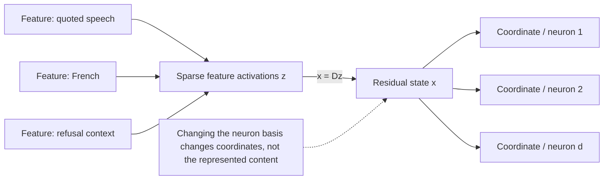
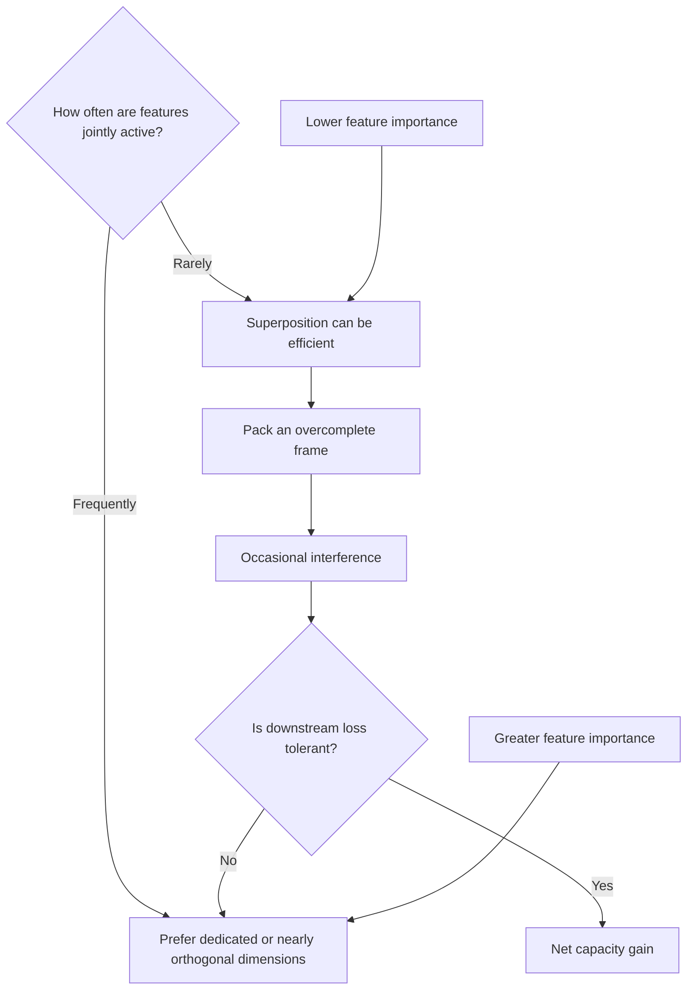

# 06 — Superposition and Feature Geometry

**Thesis:** A useful unit of interpretation is usually a direction or sparse code in activation space, not a single neuron coordinate.

## Learning objectives

By the end of this module, you should be able to:

1. Distinguish a **feature**, a **neuron**, and a **basis direction**.
2. Derive the interference created by storing an overcomplete feature dictionary in a lower-dimensional residual stream.
3. Explain why sparsity, feature importance, and correlation determine whether superposition is worthwhile.
4. Recognize geometric signatures such as orthogonal features, antipodal pairs, and approximately equiangular frames.
5. State what the superposition hypothesis does—and does not—license in a mechanistic claim.

!!! intuition "A crowded whiteboard"
    Imagine that a model has a whiteboard with only $d_{\text{model}}$ independent directions, but it may need thousands of concepts. If only a few concepts are relevant on any one token, it can write many concepts in overlapping directions and tolerate a little cross-talk. Superposition is this bargain: **capacity in exchange for interference**.

## 1. Coordinates are not concepts

At layer $l$, write the residual state at one token as $x_l\in\mathbb{R}^{d_{\text{model}}}$. The model updates it by

\[
x_{l+1}=x_l+a_l+m_l,
\]

where $a_l$ and $m_l$ are the attention and MLP writes. A **neuron** is one coordinate of an MLP hidden layer or residual basis. A **feature** is a property represented by a direction, manifold, or other structure that is useful to the network. The two coincide only in a fortunate, basis-aligned case.

A linear-feature approximation writes

\[
x \approx Dz+\varepsilon
=\sum_{i=1}^{n}z_i d_i+\varepsilon,
\]

where:

- $D=[d_1,\ldots,d_n]\in\mathbb{R}^{d\times n}$ is a feature dictionary;
- $z_i$ is feature $i$'s activation, often modeled as sparse and non-negative;
- $n>d$ makes the dictionary **overcomplete**;
- $\varepsilon$ contains unmodeled content and reconstruction error.

If an invertible change of basis $R$ sends $x\mapsto Rx$, it also sends $d_i\mapsto Rd_i$. The feature can remain functionally identical even though every coordinate changes. Neuron-level stories therefore need extra evidence that the neuron basis is privileged by a nonlinearity, normalization, sparsity pattern, or downstream weight structure.

## 2. The interference calculation

Assume unit decoder directions, $\lVert d_i\rVert_2=1$, and use the simplest possible readout $D^\top x$. Then

\[
\tilde z=D^\top x=D^\top Dz=Gz,
\]

where $G=D^\top D$ is the **Gram matrix**. For feature $i$,

\[
\tilde z_i=z_i+\sum_{j\ne i}\langle d_i,d_j\rangle z_j.
\]

The first term is signal. The sum is interference. An orthonormal dictionary has $G=I$, but can contain at most $d$ directions. An overcomplete dictionary accepts nonzero off-diagonal terms and relies on sparsity or a learned nonlinear encoder to separate active features.

If feature activations are approximately independent, zero-mean, and active with probability $p_j$, a rough interference-variance estimate is

\[
\operatorname{Var}(\tilde z_i-z_i)
\approx \sum_{j\ne i}\langle d_i,d_j\rangle^2
p_j\operatorname{Var}(z_j\mid z_j\ne0).
\]

This makes the governing trade-off visible:

- lower activation density reduces collisions;
- more orthogonal directions reduce each collision;
- correlated co-activation can make interference systematic rather than noise;
- high-importance features deserve cleaner, higher-capacity directions.

## 3. Geometry the optimizer can choose

For $n\le d$, mutually orthogonal feature directions avoid linear interference. Once $n>d$, the model may use structured arrangements:

- **Antipodal pairs:** two mutually exclusive signed features share one axis with directions $d$ and $-d$.
- **Polytopes and frames:** directions spread their pairwise interference approximately evenly.
- **Dedicated dimensions:** important or frequently active features receive cleaner directions.
- **Dropped features:** sufficiently rare or low-value features may not be represented at all.
- **Local superposition:** different data regions can reuse capacity when they rarely occur together.

The coherence of a unit-norm dictionary,

\[
\mu(D)=\max_{i\ne j}|\langle d_i,d_j\rangle|,
\]

measures its worst pairwise overlap. Low coherence is useful, but it is not the whole objective: the model cares about task loss under its actual feature distribution, not a context-free geometry score.

!!! warning "Linear features are a hypothesis, not an axiom"
    A clean direction can be a good local description while the full representation is curved, gated, token-dependent, or distributed across layers. “I found a vector” is evidence for linear accessibility. It is not yet evidence that the vector is a canonical concept or that the model uses it causally.

## 4. Worked example: three features in two dimensions

Place three unit directions $120^\circ$ apart:

\[
d_1=(1,0),\qquad
d_2=\left(-\tfrac12,\tfrac{\sqrt3}{2}\right),\qquad
d_3=\left(-\tfrac12,-\tfrac{\sqrt3}{2}\right).
\]

Every off-diagonal Gram entry is $-\tfrac12$. If only feature 1 is active with $z=(2,0,0)$, then

\[
x=2d_1=(2,0),\qquad D^\top x=(2,-1,-1).
\]

A non-negative encoder can keep the positive score and discard the negative cross-talk. If features 1 and 2 co-activate with $z=(1,1,0)$, then

\[
x=d_1+d_2=\left(\tfrac12,\tfrac{\sqrt3}{2}\right),
\qquad D^\top x=\left(\tfrac12,\tfrac12,-1\right).
\]

The correct active set is still recoverable, but both magnitudes are suppressed. If all three activate equally, $d_1+d_2+d_3=0$: the code is unrecoverable. Superposition works here only because dense co-activation is rare.

!!! example "Interpretation consequence"
    In the standard coordinate basis, both $d_2$ and $d_3$ touch both coordinates. A researcher inspecting “neuron 2” would see a mixture. Rotating the basis produces a different collection of polysemantic neurons while leaving the three-feature geometry unchanged.

## 5. What counts as evidence for a feature?

A progressively stronger evidence ladder is:

1. **Decodability:** a direction predicts a label on held-out data.
2. **Selectivity:** top activations share a coherent pattern and hard negatives do not.
3. **Stability:** the direction or functional role recurs across seeds, datasets, layers, or models.
4. **Downstream connectivity:** model weights or attributions connect it to an expected computation.
5. **Causal effect:** targeted interventions change a preregistered behavior metric, preferably a logit difference.
6. **Mediation:** removing the feature blocks a known upstream cause or downstream effect while matched controls do not.

Superposition motivates dictionary learning because it makes coordinate inspection unreliable. It does not guarantee that any particular dictionary-learning algorithm recovers the model's “true” features.

## Failure modes and research traps

| Trap | Why it fails | Better practice |
|---|---|---|
| Neuron = concept | Features can be rotated or superposed | Search over directions and sparse codes |
| High probe accuracy = model use | A probe can read unused correlated information | Intervene and test mediation |
| One clean top example = monosemanticity | Rare secondary meanings hide below the maximum | Inspect diverse positives and adversarial negatives |
| Low pairwise cosine = no interference | Many small overlaps can accumulate | Measure interference under the activation distribution |
| Same label = same feature | Distinct features can share a human description | Compare activation conditions and causal effects |
| Feature present everywhere | Representations can be layer-, token-, and context-specific | State the exact site and distribution |
| Linear decomposition is exhaustive | Nonlinear manifolds and interaction features may remain | Track reconstruction/error terms explicitly |

## Knowledge check

1. Why can a network represent more than $d$ features in a $d$-dimensional space without violating linear algebra?

    

    
Answer

    It cannot make more than $d$ directions linearly independent, but it can use an overcomplete, linearly dependent dictionary when only a sparse subset is active at once. The active code can often be inferred despite occasional interference.
    

2. What matrix exposes pairwise linear interference in a dictionary?

    

    
Answer

    The Gram matrix $G=D^\top D$. Off-diagonal entries are pairwise overlaps; multiplying $Gz$ shows how other active features contaminate a naive readout.
    

3. If two features frequently co-occur, should the optimizer place them close together or far apart?

    

    
Answer

    Usually farther apart, because their overlap creates interference on many examples. But task-specific asymmetric interactions can change this; the claim should be tested against the learned geometry and loss.
    

4. Does a successful linear probe establish a feature as a causal circuit node?

    

    
Answer

    No. It establishes linear decodability. Causal use requires interventions, controls, and ideally a mediation test.
    

## Exercise: simulate the capacity–interference curve

Create $n$ random unit vectors in $d=32$, generate non-negative feature codes with activation probability $p$, encode $x=Dz$, and recover features using $\operatorname{ReLU}(D^\top x)$.

1. Sweep $n\in\{32,64,128,256\}$ and $p\in\{0.005,0.02,0.1,0.5\}$.
2. Plot support precision/recall and amplitude MSE.
3. Repeat with correlated feature pairs.
4. Compare random frames with a learned non-negative autoencoder.
5. Write one paragraph explaining which failure is due to dimensionality and which is due to the decoder.

Your submission should include the random seed, confidence intervals over at least five dictionaries, and one counterexample where a neuron-level interpretation is misleading.

## Primary sources

- Elhage et al., [*Toy Models of Superposition*](https://transformer-circuits.pub/2022/toy_model/index.html) (2022).
- Elhage et al., [*Superposition, Memorization, and Double Descent*](https://transformer-circuits.pub/2023/toy-double-descent/index.html) (2023).
- Bricken et al., [*Towards Monosemanticity: Decomposing Language Models With Dictionary Learning*](https://transformer-circuits.pub/2023/monosemantic-features/index.html) (2023).
- Cunningham et al., [*Sparse Autoencoders Find Highly Interpretable Features in Language Models*](https://arxiv.org/abs/2309.08600) (2023).
- Templeton et al., [*Scaling Monosemanticity*](https://transformer-circuits.pub/2024/scaling-monosemanticity/index.html) (2024).
