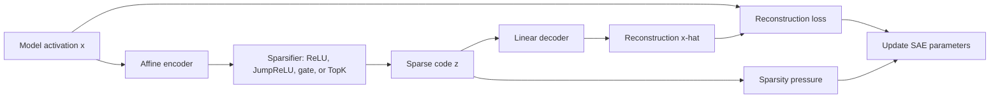
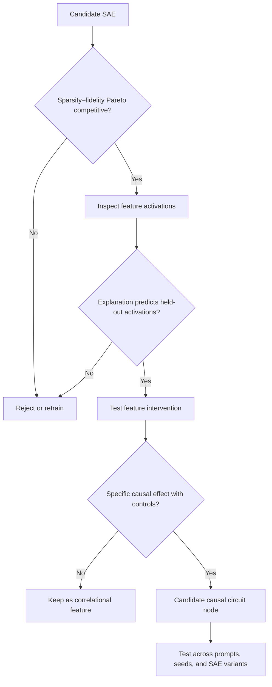

# 07 — Sparse Autoencoders: Evaluation and Failure Modes

**Thesis:** Sparse autoencoders turn a dense activation into a sparse feature hypothesis, but their scientific value depends on reconstruction, interpretability, and causal tests taken together.

## Learning objectives

By the end of this module, you should be able to:

1. Write the encoder, decoder, and training objectives for $L_1$, TopK, and gated sparse autoencoders.
2. Compute sparsity, reconstruction, loss-recovered, and causal evaluation metrics.
3. Explain feature splitting, feature absorption, dead features, shrinkage, and reconstruction-error effects.
4. Choose fairly between SAEs using a sparsity–fidelity Pareto frontier rather than one headline score.
5. Design an interpretation claim that separates semantic evidence from causal evidence.

!!! intuition "A lossy scientific coordinate system"
    An SAE proposes a new coordinate system in which only a few coordinates are active per token. It is useful when those coordinates align with reusable computations. It is still a **lossy learned model of the model**, not a transparent window into ground truth.

## 1. The basic sparse autoencoder

Given an activation $x\in\mathbb{R}^{d_{\text{in}}}$, a TopK SAE computes

\[
z=\operatorname{TopK}(W_{\text{enc}}x+b_{\text{enc}}),
\qquad
\hat x=W_{\text{dec}}z+b_{\text{dec}},
\]

where $z\in\mathbb{R}^{d_{\text{sae}}}$, typically $d_{\text{sae}}\gg d_{\text{in}}$, and only the $k$ largest positive preactivations survive. Decoder column $d_i=W_{\text{dec}}[:,i]$ is the direction written by feature $i$; $z_i$ is its activation.

An $L_1$-penalized SAE instead uses a nonlinearity such as ReLU or JumpReLU and optimizes

\[
\mathcal L
=\mathbb E_x\left[\lVert x-\hat x\rVert_2^2
+\lambda\lVert z\rVert_1\right].
\]

TopK fixes $\lVert z\rVert_0=k$ for each token and usually trains only the reconstruction term. Gated SAEs separate a feature's **selection** from its **magnitude**, reducing the shrinkage pressure created when the same activation pays an $L_1$ cost.

Decoder columns are normally constrained or normalized. Otherwise the transformation $d_i\leftarrow c d_i,\;z_i\leftarrow z_i/c$ can reduce an $L_1$ penalty without changing the reconstruction.

## 2. What should an SAE optimize?

No single metric establishes quality. At minimum, report all four layers below.

### 2.1 Sparsity

The per-token active count is

\[
L_0(x)=\sum_i\mathbf 1[z_i(x)>0].
\]

Also report feature density $\Pr[z_i>0]$, the distribution of $L_0$, dead-feature fraction, and ultra-dense features. Two SAEs with equal mean $L_0$ can have very different tails and feature usage.

### 2.2 Geometric reconstruction

A common normalized measure is fraction of variance explained:

\[
\operatorname{FVE}
=1-\frac{\mathbb E\lVert x-\hat x\rVert_2^2}
{\mathbb E\lVert x-\mathbb E[x]\rVert_2^2}.
\]

State whether means and variances are calculated globally, per layer, or per token position. FVE can be high while the residual error contains a small but behaviorally decisive direction.

### 2.3 Model-behavior fidelity

Replace the original activation with $\hat x$ in the model and compare cross-entropy:

\[
\operatorname{loss\ recovered}
=\frac{\mathrm{CE}_{\text{zero}}-\mathrm{CE}_{\text{recon}}}
{\mathrm{CE}_{\text{zero}}-\mathrm{CE}_{\text{clean}}}.
\]

This normalizes reconstruction damage against zero ablation. A value near one means the reconstruction preserves most of the language-model loss improvement over zero ablation. It does **not** mean every behavior or rare feature is preserved.

For a targeted task, use its preregistered metric, often

\[
\Delta_{\text{logit}}
=\operatorname{logit}(y_{\text{desired}})
-\operatorname{logit}(y_{\text{contrast}}).
\]

### 2.4 Semantic and causal quality

Semantic tests include top-activating examples, random positives, hard negatives, human labels, automated explanation scores, and sparse probes. Causal tests include feature ablation, activation patching, steering, and mediation. These answer different questions.

!!! warning "Compare frontiers, not isolated checkpoints"
    Increasing sparsity usually worsens reconstruction. “Our SAE has lower $L_0$” is meaningless if it also destroys more model behavior. Sweep hyperparameters and compare Pareto frontiers of sparsity versus FVE, cross-entropy recovered, and task-specific fidelity.

## 3. Worked example: TopK reconstruction and residual error

Suppose the decoder directions are the standard axes plus a diagonal:

\[
d_1=(1,0),\quad d_2=(0,1),\quad
d_3=\tfrac{1}{\sqrt2}(1,1),
\]

and the encoder preactivations for $x=(1,0.8)$ are

\[
u=(1.0,0.8,1.27).
\]

With $k=1$, the diagonal feature wins. Its least-squares magnitude is approximately $1.27$, giving

\[
\hat x=1.27d_3\approx(0.898,0.898),
\qquad e=x-\hat x\approx(0.102,-0.098).
\]

The single diagonal feature is efficient, but what does it mean? It may represent a genuine conjunction, or it may merely absorb two axis-aligned causes because the sparsity budget is one. With $k=2$, the SAE could reconstruct with $d_1,d_2$, but at the cost of a less sparse code.

Now suppose the task logit-difference direction is $w=(1,-1)$. Then

\[
w^\top\hat x=0,
\qquad w^\top x=0.2,
\qquad w^\top e=0.2.
\]

The reconstruction is geometrically close, yet **all task-relevant signal lies in the error**. This is why circuit analyses must retain or explicitly test SAE error terms.

!!! example "Error-preserving feature ablation"
    To ablate feature $i$ without also deleting the SAE's reconstruction error, use
    \[
    x' = x + \operatorname{decode}(z\text{ with }z_i=0)-\operatorname{decode}(z).
    \]
    Replacing $x$ by a fresh partial reconstruction changes both the feature and the error, confounding the intervention.

## 4. Failure modes in learned dictionaries

### Feature splitting

One human concept appears across several SAE features: by syntax, token position, intensity, language, or dataset subdomain. Splitting can be real granularity or an artifact of excess dictionary width.

### Feature absorption

A specific feature is swallowed by a broader or correlated feature. The broad feature reconstructs common cases; rare exceptions remain in error or are scattered across other features. This is especially dangerous when auditing rare safety behaviors.

### Shrinkage

With an $L_1$ penalty, increasing $z_i$ improves reconstruction but pays a linear cost. Magnitudes are biased downward, so direct SAE reconstruction can understate causal effects. Gated and TopK variants address different parts of this problem.

### Dead and ultra-dense features

Dead features never activate and waste dictionary capacity. Ultra-dense features may encode centering, norm, positional, or other broad effects rather than a selective concept. Both can also result from optimization or threshold choices.

### Non-identifiability

Multiple dictionaries can reach similar reconstruction and sparsity. Permutations and scale changes are trivial symmetries; correlated features create more scientifically important alternatives. Stability across seeds is evidence, not a guaranteed property.

### Distribution shift

An SAE trained on generic web text may behave differently on chat templates, code, jailbreak prompts, long contexts, another language, or a fine-tuned model. Always remeasure density and fidelity on the target distribution.

### Interpretability illusions

Top examples overrepresent easy positive cases. Automated labels can exploit token fragments or dataset artifacts. Steering may force a decoder direction far beyond its natural activation scale and produce a related-looking output without proving the feature's normal function.

## 5. A minimum SAE evaluation card

Before using an SAE in a paper, record:

| Category | Minimum evidence |
|---|---|
| Provenance | Model revision, hook, layer, context length, training corpus, SAE architecture |
| Sparsity | Mean/quantiles of $L_0$, feature density, dead and ultra-dense fractions |
| Reconstruction | MSE or FVE, clean/reconstructed/zero CE, task logit-difference retention |
| Interpretation | Random and top positives, hard negatives, label procedure, blinded scoring |
| Causality | Natural-scale ablation/steering, random and matched controls, confidence intervals |
| Robustness | Held-out templates, paraphrases, seeds, and at least one alternative SAE |
| Error accounting | Error norm, logit effect, and whether error nodes are retained |

## Knowledge check

1. Why is decoder normalization important in an $L_1$-penalized SAE?

    

    
Answer

    Without it, the decoder can grow while feature activations shrink, preserving reconstruction but artificially lowering the $L_1$ penalty. This scale degeneracy makes the objective ill-posed.
    

2. An SAE has 98% FVE. Can you omit its error from a safety circuit?

    

    
Answer

    No. The remaining 2% may align strongly with the safety-relevant logit direction or contain rare behavior. Measure task fidelity and test the error's causal effect.
    

3. What is the fairest way to compare two SAE architectures?

    

    
Answer

    Sweep their sparsity controls and compare Pareto frontiers on matched data, model sites, and behavioral-fidelity metrics. Then compare semantic and causal evaluations at similar operating points.
    

4. Why does successful high-strength steering not establish a feature's normal causal role?

    

    
Answer

    A large out-of-distribution perturbation can force downstream behavior through a direction the model does not normally use that way. Prefer natural-scale ablation, activation patching, dose–response curves, and matched directions.
    

## Exercise: write an SAE audit plan

Choose one released SAE and one binary behavior with a logit-difference metric.

1. Specify model revision, exact hook, SAE release/ID, and evaluation distribution.
2. Define a sparsity–fidelity table with at least four metrics.
3. Propose a semantic test with hard negatives.
4. Design error-preserving ablation and natural-scale steering.
5. Add two controls: a frequency-matched feature and a decoder-cosine-matched random direction.
6. State what result would falsify your interpretation.

The plan is complete only if another researcher could run it without choosing thresholds after seeing the result.

## Primary sources and tools

- Cunningham et al., [*Sparse Autoencoders Find Highly Interpretable Features in Language Models*](https://arxiv.org/abs/2309.08600) (2023).
- Bricken et al., [*Towards Monosemanticity*](https://transformer-circuits.pub/2023/monosemantic-features/index.html) (2023).
- Templeton et al., [*Scaling Monosemanticity*](https://transformer-circuits.pub/2024/scaling-monosemanticity/index.html) (2024).
- Gao et al., [*Scaling and Evaluating Sparse Autoencoders*](https://arxiv.org/abs/2406.04093) and [code](https://github.com/openai/sparse_autoencoder) (2024).
- Lieberum et al., [*Gemma Scope*](https://arxiv.org/abs/2408.05147) (2024).
- Karvonen et al., [*SAEBench*](https://arxiv.org/abs/2503.09532) and [evaluation code](https://github.com/adamkarvonen/SAEBench) (2025–2026).
- [SAELens](https://github.com/decoderesearch/SAELens) and its [pretrained SAE directory](https://decoderesearch.github.io/SAELens/latest/pretrained_saes/).
- Qwen Team, [*Qwen-Scope*](https://arxiv.org/abs/2605.11887) and [released dictionaries](https://huggingface.co/collections/Qwen/qwen-scope) (2026).
