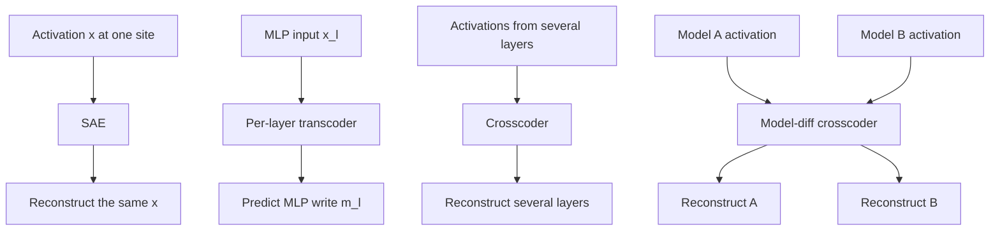
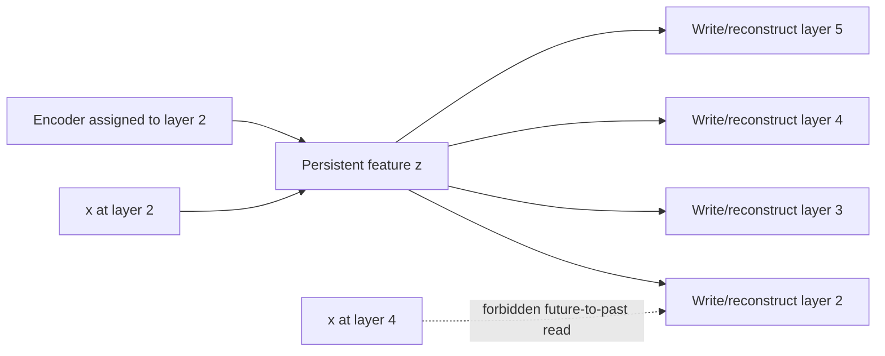
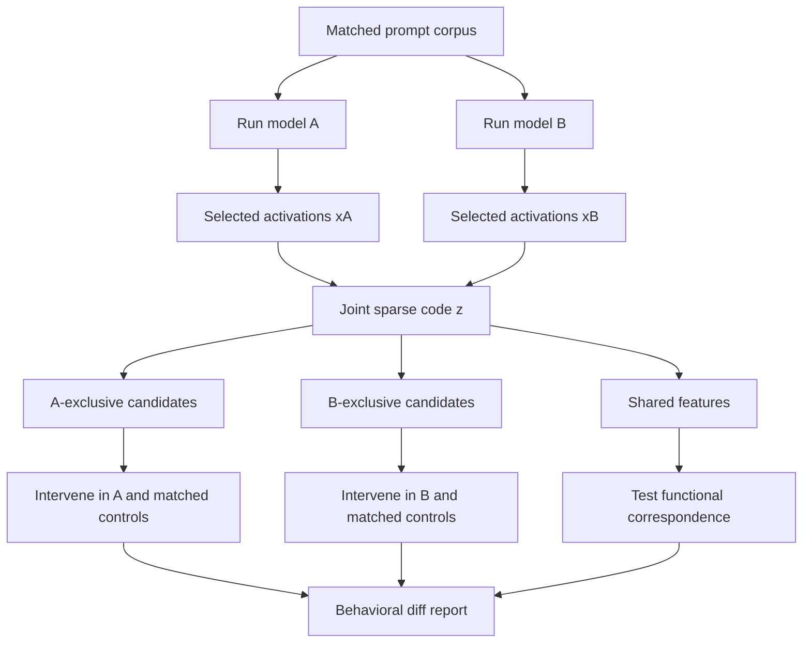

# 08 — Transcoders, Crosscoders, and Model Diffing

**Thesis:** Transcoders and crosscoders move dictionary learning from “what state is present?” toward “what computation or model difference produced the state?”

## Learning objectives

By the end of this module, you should be able to:

1. Contrast an SAE's reconstruction target with a transcoder's input-to-output prediction target.
2. Describe per-layer transcoders, cross-layer transcoders, acausal crosscoders, and weakly causal crosscoders.
3. Formulate a joint dictionary for comparing a base model with a fine-tune or two different architectures.
4. Classify shared, model-exclusive, and changed features without confusing decoder geometry with behavioral causality.
5. Design validation that includes reconstruction-error nodes, held-out prompts, and targeted interventions.

!!! intuition "Replace a dense calculation with sparse named steps"
    An SAE compresses a snapshot. A transcoder instead watches what enters a dense MLP and predicts what the MLP writes back, using a sparse hidden layer. A crosscoder extends the same idea across several layers or models so one feature can describe a persistent thread or a difference.

## 1. From state reconstruction to computation prediction

For a transformer block,

\[
x_{l+1}=x_l+a_l+m_l,
\]

an SAE at one site learns $x\mapsto\hat x$. A per-layer transcoder learns the MLP map $x_l^{\text{mlp-in}}\mapsto m_l$:

\[
z_l=\operatorname{TopK}(W^{(l)}_{\text{enc}}x_l^{\text{mlp-in}}+b^{(l)}_{\text{enc}}),
\]

\[
\hat m_l=W^{(l)}_{\text{dec}}z_l+b^{(l)}_{\text{dec}},
\qquad
e_l=m_l-\hat m_l.
\]

The replacement model writes $\hat m_l+e_l$ when exact agreement with the original forward pass is required. Each active transcoder feature has:

- an encoder direction describing when it activates;
- an activation $z_{l,i}$ on this prompt;
- a decoder direction describing what it writes;
- downstream connections that can be computed through later linearized operations.

This asymmetry is valuable: an SAE decoder says “this direction reconstructs the current state,” while a transcoder decoder says “when this condition is detected, this direction approximates the MLP's output.”

!!! warning "A replacement model is not the original model"
    A low-error transcoder can still implement a shortcut unlike the dense MLP's internal mechanism. Keep $e_l$ visible, compare original and replacement behavior, and validate proposed nodes by intervening in the original computation where possible.

## 2. Cross-layer transcoders

A model may compute a feature once and carry it through many residual-stream layers. Separate layerwise SAEs can rediscover it many times, producing chains of nearly duplicate nodes. A weakly causal cross-layer transcoder (CLT) assigns a feature to an encoder layer $s$ and lets it write to its own and later target layers:

\[
z_{s}=\phi(E_s x_s+b_s),
\]

\[
\hat m_t= b_t+\sum_{s\le t}D_{s\rightarrow t}z_s,
\qquad t=0,\ldots,L-1.
\]

The causal mask $s\le t$ prevents a feature from reading the future to explain the past. One active feature can therefore account for a lifecycle across layers, and an attribution graph can jump over uninteresting persistence edges.

An **acausal crosscoder** reads from and reconstructs several layers jointly:

\[
z=\phi\!\left(\sum_{l\in\mathcal L}E_lx_l+b\right),
\qquad
\hat x_l=D_lz+b_l.
\]

It is excellent for discovering shared cross-layer structure but cannot itself support a forward-causal story: its code may depend on later activations.

The mask creates an interpretable ordering, but not a proof that the original network uses the same factorization. Two computations can reconstruct identical layer states while taking different internal paths.

## 3. Crosscoders for model diffing

Let models $A$ and $B$ process aligned examples. A joint crosscoder can learn a shared code and model-specific decoders:

\[
z=\phi(E_Ax^A+E_Bx^B+b),
\]

\[
\hat x^A=D_Az+b_A,
\qquad
\hat x^B=D_Bz+b_B.
\]

For feature $i$, compare decoder columns $d_i^A,d_i^B$, activation distributions, and downstream behavior:

| Pattern | Geometric signature | Candidate interpretation |
|---|---|---|
| Shared | Both decoder norms large; aligned functional effects | Common representation |
| A-exclusive | $\lVert d_i^A\rVert$ large, $\lVert d_i^B\rVert$ small | Content emphasized only in A |
| B-exclusive | Reverse of above | Content introduced or emphasized in B |
| Changed | Both present but directions/effects differ | Reorganized representation |
| Dormant | Decoders exist but activation is rare | Insufficient evidence |

Decoder norm is not a perfect exclusivity score. A model can use a rescaled direction, a split feature, or a different layer. Dedicated Feature Crosscoders (DFCs) add dedicated feature groups and training structure intended to make genuinely model-specific content easier to isolate.

### Base versus fine-tune

Base/fine-tune comparison is easiest when tokenization, architecture, and width match. Use identical prompts and aligned token positions. Candidate fine-tune features can reveal newly emphasized refusal, persona, domain, or tool-use computations.

### Cross-architecture diffing

When widths, layer counts, or tokenizers differ, crosscoders provide separate encoders/decoders for each model and learn a shared sparse code in feature space. Alignment still requires choices:

- match semantic examples rather than raw hidden coordinates;
- decide which relative depths or sites correspond;
- handle tokenization with word/span pooling or separately aligned positions;
- normalize each model's activations and reconstruction loss;
- verify that “exclusive” does not merely mean “missed by the other decoder.”

## 4. Worked example: a feature introduced by fine-tuning

Suppose a two-feature crosscoder reconstructs aligned two-dimensional states from a base model $A$ and a fine-tuned model $B$. Feature 1 has

\[
d_1^A=(1,0),\qquad d_1^B=(0.98,0.05),
\]

and activates on factual entity prompts. It is plausibly shared. Feature 2 has

\[
d_2^A=(0.02,0),\qquad d_2^B=(0,1),
\]

and activates on unsafe-request prompts after safety fine-tuning. On one prompt, $z_1=3,z_2=2$, so

\[
\hat x^A=(3.04,0),\qquad
\hat x^B=(2.94,2.15).
\]

Feature 2 is a strong B-exclusive candidate. A valid interpretation still requires four tests:

1. **Semantic:** held-out top activations distinguish unsafe requests from hard benign negatives.
2. **Fidelity:** reconstruction and error terms preserve the fine-tuned model's refusal logit difference.
3. **Causality:** error-preserving ablation of feature 2 reduces refusal more than frequency-matched features.
4. **Specificity:** ablation does not broadly destroy syntax, fluency, or unrelated refusals.

If feature 2's decoder norm is large but ablation has no behavioral effect, it is a representational difference, not yet the refusal mechanism.

!!! example "A useful null"
    Train the same crosscoder after randomly permuting the pairing between model-A and model-B examples. Shared semantic features and cross-model correspondence should degrade. If exclusivity scores remain unchanged, they may reflect norm or architecture artifacts rather than aligned model differences.

## 5. Validation matrix

| Claim | Required test |
|---|---|
| Feature persists across layers | Activation correspondence plus causal/weakly causal masking |
| Transcoder feature mediates an MLP computation | Original-versus-replacement fidelity, error accounting, intervention |
| Feature is shared across models | Held-out co-activation and matched functional effect, not decoder cosine alone |
| Feature is model-exclusive | Reconstruction in both models, permutation null, alternative dictionary, causal specificity |
| Fine-tuning created a behavior | Base/fine-tune behavioral contrast plus mediation by the candidate feature |
| Cross-architecture difference is meaningful | Robustness to layer/token alignment and per-model normalization |

## Failure modes and research traps

- **Shortcut replacement:** the sparse surrogate predicts outputs through a simpler route than the original MLP.
- **Error-node blindness:** a small residual error carries the target logit difference.
- **Acausal leakage:** a global crosscoder reads a later consequence and labels it as an earlier cause.
- **Feature splitting/merging:** one model's single feature corresponds to several in the other.
- **Norm-based false exclusivity:** architecture or normalization scale makes one decoder look absent.
- **Dataset blindness:** the comparison corpus never triggers the actual behavioral difference.
- **Token misalignment:** different tokenizers shift the supposedly paired states.
- **Layer cherry-picking:** an effect declared absent at one layer exists at another.
- **Representation–mechanism confusion:** a decodable difference need not cause output differences.
- **Fine-tune transfer assumptions:** a dictionary trained on a base model can lose fidelity after substantial post-training.

## Knowledge check

1. What is the key target difference between an SAE and a per-layer transcoder?

    

    
Answer

    An SAE reconstructs the activation it reads. A transcoder reads the MLP input and predicts the MLP output/write, giving its sparse units an input-condition and output-effect interpretation.
    

2. Why can an acausal crosscoder not directly establish a circuit's temporal ordering?

    

    
Answer

    Its code can read from later layers while reconstructing earlier ones. It may explain a past state using information that was available only in the future.
    

3. Is a near-zero decoder norm in model A sufficient to call a feature B-exclusive?

    

    
Answer

    No. The effect may be rescaled, split, represented at another site, missed by reconstruction, or induced by normalization. Use held-out activation, permutation and alternative-dictionary controls, and causal tests.
    

4. Why retain transcoder error nodes in an attribution graph?

    

    
Answer

    They account for computation the sparse replacement did not reconstruct. Omitting them can make a visually complete graph while silently excluding behaviorally important signal.
    

## Exercise: design a two-model diff

Choose either a base/fine-tune pair or two similarly capable open models.

1. Define one measurable behavioral difference using a logit difference and held-out prompts.
2. Specify paired activation sites and how tokens/layers will be aligned.
3. Define shared and exclusive scores using decoder norms, cosine similarity, and activation statistics.
4. Add a shuffled-pair null and an alternative-site analysis.
5. Design an error-preserving intervention on the five strongest exclusive candidates.
6. Precommit to a mediation criterion and a specificity control.

Finish with two interpretations of the same result: one representational and one mechanistic. State what extra evidence separates them.

## Primary sources and implementations

- Dunefsky, Chlenski, and Nanda, [*Transcoders Find Interpretable LLM Feature Circuits*](https://arxiv.org/abs/2406.11944) and [code](https://github.com/jacobdunefsky/transcoder_circuits) (2024).
- Lindsey et al., [*Sparse Crosscoders for Cross-Layer Features and Model Diffing*](https://transformer-circuits.pub/2024/crosscoders/index.html) (2024; preliminary research update).
- Anthropic, [*Insights on Crosscoder Model Diffing*](https://transformer-circuits.pub/2025/crosscoder-diffing-update/index.html) (2025; preliminary research update).
- Ameisen et al., [*Circuit Tracing: Revealing Computational Graphs in Language Models*](https://transformer-circuits.pub/2025/attribution-graphs/methods.html) (2025).
- Jiralerspong and Bricken, [*Cross-Architecture Model Diffing with Crosscoders*](https://arxiv.org/abs/2602.11729) and [Anthropic research summary](https://www.anthropic.com/research/diff-tool) (2026).
- [dictionary_learning](https://github.com/saprmarks/dictionary_learning), [Sparsify](https://github.com/EleutherAI/sparsify), and [SAELens](https://github.com/decoderesearch/SAELens) provide open sparse-coding components.
