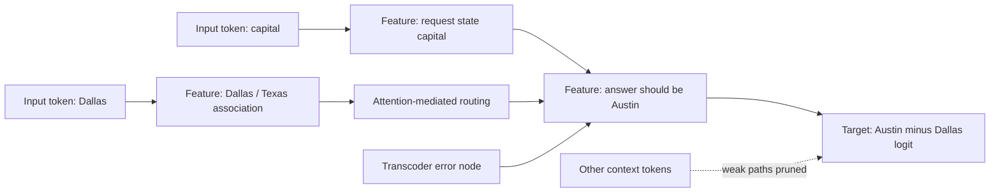
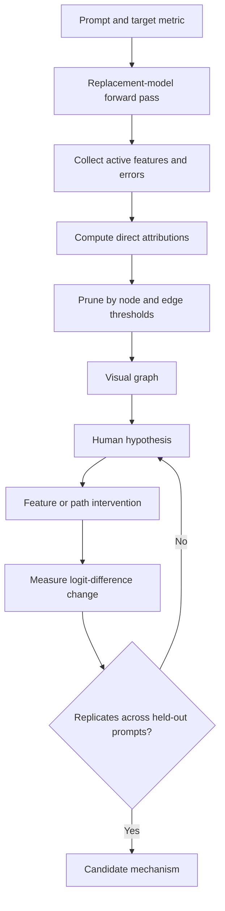
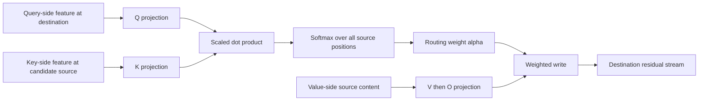

# 09 — Attribution Graphs and Attention Feature Interactions

**Thesis:** An attribution graph is a prompt-local map of influence through a sparse replacement model; it becomes a mechanistic explanation only after its important paths survive causal and robustness tests.

## Learning objectives

By the end of this module, you should be able to:

1. Identify token, feature, error, attention, and output nodes in a feature attribution graph.
2. Explain the local linear attribution used to score a source node's direct influence on a target.
3. Decompose attention into **QK routing** (“why this source?”) and **OV writing** (“what was moved?”).
4. Compute a pairwise query-feature/key-feature contribution to an attention score.
5. Design interventions that distinguish a readable graph from a causally sufficient circuit.

!!! intuition "A transit map, not the territory"
    A graph redraws one forward pass as a small set of influential routes. Pruning makes the route map legible, but it can hide side streets; a transcoder makes features readable, but it is still a replacement; a gradient measures local sensitivity, but not every nonlinear counterfactual.

## 1. What the graph represents

Circuit Tracer-style graphs replace dense MLP writes with sparse transcoder or cross-layer-transcoder features. For each layer,

\[
x_{l+1}=x_l+a_l+\hat m_l+e_l,
\]

where $\hat m_l$ is the sparse replacement and $e_l=m_l-\hat m_l$ is the reconstruction error. A graph can contain:

- **input-token nodes**, representing embedding contributions;
- **feature nodes**, with prompt-specific activations $z_i$;
- **error nodes**, preserving unexplained MLP computation;
- **attention-mediated edges**, carrying information across positions;
- **output nodes**, usually logits or a selected scalar such as a logit difference.

For a scalar target

\[
y=\operatorname{logit}(y_{\text{desired}})
-\operatorname{logit}(y_{\text{contrast}}),
\]

a first-order attribution for source activation $u$ is the gradient-times-activation quantity

\[
A_u \approx u\frac{\partial y}{\partial u}.
\]

For an edge $u\rightarrow v$, the analogous local direct-effect score is

\[
A_{u\rightarrow v}
\approx u\frac{\partial v}{\partial u}
\frac{\partial y}{\partial v},
\]

or an equivalent direct linear contribution in the replacement graph. Exact conventions differ by implementation: edge scores may be signed or absolute, normalized, aggregated across paths, or computed with some attention quantities held fixed. Record the convention.

The graph is **prompt-local**: node activation, attention pattern, linearization point, and output target all depend on the specific input.

## 2. From the full graph to a readable graph

A typical workflow is:

1. Run the original/replacement model and collect active features.
2. Choose output targets—top logits or a preregistered contrast.
3. Attribute backward through active features, attention paths, tokens, and error nodes.
4. Retain at most a compute-budgeted set of feature nodes.
5. Prune nodes and edges by cumulative influence thresholds.
6. Inspect top-activating examples or automated feature labels.
7. Group recurring nodes into a human-level hypothesis.
8. Intervene on nodes/paths and test held-out prompts.

!!! warning "Pruning is part of the hypothesis"
    A node threshold of 0.8 and edge threshold of 0.98 do not mean “80% and 98% of the true mechanism.” They describe retained attribution mass under a particular surrogate and scoring rule. Sweep thresholds and report whether the qualitative story changes.

## 3. Attention: routing and writing

For attention head $h$, destination position $t$, and source position $s$:

\[
q_t^h=W_Q^h x_t,\qquad k_s^h=W_K^h x_s,
\]

\[
r_{ts}^h=\frac{(q_t^h)^\top k_s^h}{\sqrt{d_h}},
\qquad
\alpha_{ts}^h=\operatorname{softmax}_s(r_{ts}^h),
\]

\[
a_t^h=\sum_s\alpha_{ts}^hW_O^hW_V^h x_s.
\]

The **QK circuit** determines which source positions receive attention. The **OV circuit** determines what each attended source writes into the destination residual stream.

Suppose sparse features decompose destination and source states:

\[
x_t\approx\sum_i z_{i,t}d_i,
\qquad
x_s\approx\sum_j z_{j,s}d_j.
\]

Ignoring biases and error terms for the moment, the interaction between query-side feature $i$ and key-side feature $j$ contributes

\[
C_{ij}^{h}(t,s)
=z_{i,t}z_{j,s}
\frac{(W_Q^h d_i)^\top(W_K^h d_j)}{\sqrt{d_h}}
\]

to the pre-softmax attention score. This is a **bilinear interaction**: neither feature alone determines the route. Bias, token embedding, other features, and sparse-coder error add further terms.

Feature interactions explain **why** a head prefers one token. Value/OV analysis explains **what** the head transports. A complete attention story needs both.

## 4. Worked example: a softmax interaction

At the final token, suppose a head chooses between two source positions. A query-side feature means “retrieve the relevant named entity.” One key-side feature marks the correct entity. Their QK interaction gives pre-softmax scores

\[
r_{t,\text{correct}}=2,
\qquad
r_{t,\text{distractor}}=0.
\]

Then

\[
\alpha_{t,\text{correct}}
=\frac{e^2}{e^2+1}\approx0.881,
\qquad
\alpha_{t,\text{distractor}}\approx0.119.
\]

If ablating the query feature removes that interaction and both scores become zero, attention changes to $(0.5,0.5)$. If the OV path writes $+3$ units of target logit difference from the correct source and $-1$ from the distractor, the head's contribution changes from

\[
0.881(3)+0.119(-1)\approx2.52
\]

to

\[
0.5(3)+0.5(-1)=1.
\]

The graph might assign a strong edge to the query/key feature interaction. The causal prediction is a roughly $1.52$-unit decrease in logit difference—but only under this simplified local calculation. Other heads, changed downstream nonlinearities, and compensating paths can alter the actual intervention result.

!!! example "Three increasingly strong tests"
    1. **Node ablation:** set the query feature to zero and measure the target logit difference.
    2. **Route test:** patch or recompute only the relevant attention score/pattern while preserving other writes.
    3. **Mediation test:** alter the upstream cue, then restore the candidate feature or route and test whether behavior returns.

## 5. Interpreting error nodes

Error nodes answer “how much important computation did the dictionary miss?” They can be:

- small in norm but strongly aligned with the output;
- diffuse across many prompts;
- interpretable using another SAE, a lens, or an activation verbalizer;
- evidence that the current dictionary is inadequate at the target site.

Run at least these checks:

\[
\text{error attribution fraction}
=\frac{\sum_{e\in\mathcal E}|A_e|}
{\sum_{v\in\mathcal V}|A_v|},
\]

plus direct error ablation and original-versus-replacement task fidelity. The fraction is diagnostic, not a universal faithfulness guarantee.

## 6. Causal validation protocol

For every claimed subgraph:

1. Define a clean/corrupt or desired/contrast metric before inspecting interventions.
2. Ablate selected features at their observed scale; preserve reconstruction error.
3. Compare with random, activation-matched, layer-matched, and attribution-matched controls.
4. Test individual nodes, the group, and dose–response.
5. Test at least one upstream-to-downstream mediation prediction.
6. Repeat across held-out prompt templates and paraphrases.
7. Compare graph stability across pruning thresholds and, if possible, transcoder checkpoints.
8. Report the replacement model's fidelity and the effect of error nodes.

Freezing attention patterns during an intervention can isolate a direct linear edge, but it also makes some edge confirmations close to construction. Re-run the strongest claims with attention allowed to respond naturally.

## Failure modes and research traps

| Failure | Consequence |
|---|---|
| Replacement-model shortcut | Graph is faithful to the transcoder, not the original dense computation |
| Local linearization | Large ablations leave the regime where edge scores are accurate |
| Softmax competition | Changing one QK interaction redistributes attention globally |
| Pruning instability | A tidy story changes when thresholds move slightly |
| Prompt specificity | A graph explains one wording rather than the behavior class |
| Error omission | Uninterpreted computation vanishes from the diagram |
| Frozen-attention validation | Direct effects are confirmed under an artificially fixed route |
| Automated label overreach | A plausible name substitutes for activation evidence |
| Correlated parallel causes | Ablating one node has little effect because another compensates |
| Target choice leakage | Attributing top logits after seeing them answers a different question from a preregistered contrast |

## Knowledge check

1. What is the difference between a QK explanation and an OV explanation?

    

    
Answer

    QK explains why the head routes attention to a source position; OV explains what information that source contributes to the destination residual stream.
    

2. Why is an attention-score interaction between two features bilinear?

    

    
Answer

    The score contains a dot product of a query projection and a key projection. If each is linear in its feature activation, their contribution contains the product $z_{i,t}z_{j,s}$.
    

3. Does retaining 98% cumulative edge attribution imply 98% causal faithfulness?

    

    
Answer

    No. It is 98% under the chosen attribution, replacement model, target, and aggregation rule. Approximation error, omitted inactive/nonlinear interactions, and intervention behavior can differ.
    

4. Why test with attention both frozen and unfrozen?

    

    
Answer

    Frozen attention isolates the direct linear path described by an edge. Unfrozen attention tests the model's natural counterfactual response, including rerouting and compensation.
    

## Exercise: turn a graph into falsifiable predictions

Take one public Circuit Tracer graph and choose a three-to-eight-node subgraph.

1. State each node's layer, position, feature index, and evidence-based label.
2. Identify which edges are residual, attention-OV, or attention-QK interactions.
3. Predict signed changes in a logit difference for three node ablations.
4. Define matched control nodes and a threshold-sensitivity analysis.
5. Propose a mediation intervention and an unfrozen-attention replication.
6. Specify a prompt paraphrase that should preserve the mechanism and one that should change it.

Score the graph only after writing the predictions. A useful report includes incorrect predictions and what they reveal about the surrogate.

## Primary sources and implementations

- Ameisen et al., [*Circuit Tracing: Revealing Computational Graphs in Language Models*](https://transformer-circuits.pub/2025/attribution-graphs/methods.html) (2025).
- Lindsey et al., [*On the Biology of a Large Language Model*](https://transformer-circuits.pub/2025/attribution-graphs/biology.html) (2025).
- Kamath et al., [*Tracing Attention Computation Through Feature Interactions*](https://transformer-circuits.pub/2025/attention-qk/index.html) (2025).
- Hanna, Piotrowski, Lindsey, and Ameisen, [Circuit Tracer](https://github.com/decoderesearch/circuit-tracer) (open implementation).
- Marks et al., [*Sparse Feature Circuits*](https://openreview.net/forum?id=I4e82CIDxv) and [code](https://github.com/saprmarks/feature-circuits) (2025).
- Syed, Rager, and Conmy, [*Attribution Patching Outperforms Automated Circuit Discovery*](https://arxiv.org/abs/2310.10348) (2023).
- Hanna, Pezzelle, and Belinkov, [*Have Faith in Faithfulness*](https://arxiv.org/abs/2403.17806) and [EAP-IG code](https://github.com/hannamw/EAP-IG) (2024–2026).
