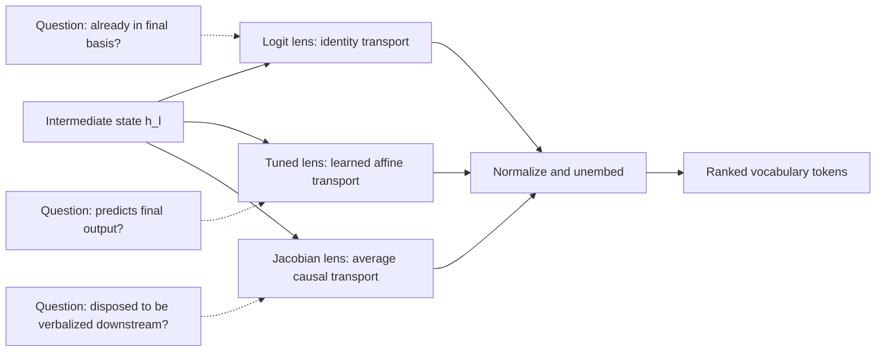
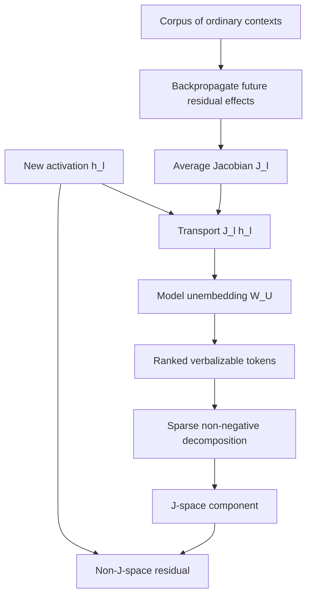
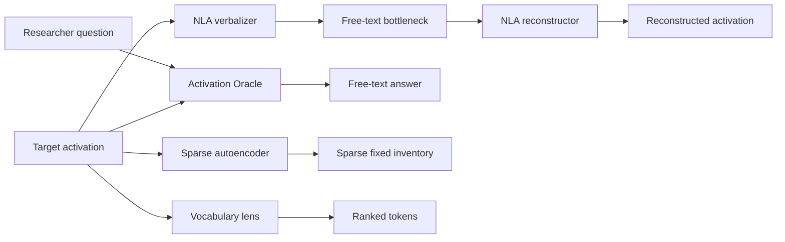

# 10 — Lenses, Natural-Language Explanations, and the Verbalizable Workspace

**Thesis:** Different explanation tools answer different questions: what an activation immediately decodes to, what predicts the final output, what can causally become verbalized, or what another model can say about it.

## Learning objectives

By the end of this module, you should be able to:

1. Derive logit-lens, tuned-lens, and Jacobian-lens readouts and identify their assumptions.
2. Explain why predicting the final distribution is not the same as exposing an intermediate computation.
3. Define the Jacobian lens and the proposed sparse, non-negative **J-space**.
4. Contrast Natural Language Autoencoders (NLAs) with supervised Activation Oracles (AOs).
5. Build a triangulated explanation using readout, reconstruction, causal intervention, and hard-negative tests.

!!! intuition "Every instrument has a question built into it"
    A microscope, an MRI, and an interview can all describe the same person, but they do not observe the same thing. A lens projects activations into vocabulary space; an NLA compresses them through text; an Activation Oracle answers a prompted question. Agreement is powerful. Disagreement is often the scientifically interesting result.

## 1. Logit lens: reuse the model's output coordinates

Let $h_l$ be the residual state at an intermediate layer and $W_U\in\mathbb R^{|V|\times d}$ the unembedding. The logit lens computes

\[
p_l^{\text{logit}}
=\operatorname{softmax}\!\left(W_U\operatorname{norm}(h_l)\right).
\]

It asks: **if this state were already expressed in the final residual basis, which tokens would it favor?** It is training-free, cheap, and often useful in later layers. Its assumption $J_l=I$—that later blocks mostly preserve the relevant coordinates—can fail badly in early layers.

Do not interpret its softmax as the model's actual counterfactual output distribution: downstream blocks were skipped, and intermediate states can have different statistics and geometry.

## 2. Tuned lens: learn a predictive translator

A tuned lens fits a layer-specific affine translator $T_l(h)=A_lh+b_l$, usually by minimizing divergence from the model's final output distribution:

\[
p_l^{\text{tuned}}
=\operatorname{softmax}\!\left(W_U\operatorname{norm}(A_lh_l+b_l)\right),
\]

\[
\min_{A_l,b_l}\;
\mathbb E_x\left[
D_{\mathrm{KL}}\!\left(p_L(x)\,\|\,p_l^{\text{tuned}}(x)\right)
\right].
\]

This corrects layerwise coordinate mismatch and is excellent for asking **what final prediction is already statistically recoverable?** But its objective rewards skipping ahead. A learned bias or dataset prior can predict the answer while ignoring a transient intermediate represented in $h_l$.

## 3. Jacobian lens: average downstream causal transport

The Jacobian lens (J-lens) estimates how a perturbation at layer $l$, position $t$, affects final or penultimate residual states at present and future positions. Abstractly,

\[
J_l
=\mathbb E_{x,t,t'\ge t}
\left[\frac{\partial h_{L,t'}}{\partial h_{l,t}}\right].
\]

It then reads

\[
p_l^{J}
=\operatorname{softmax}\!\left(
W_U\operatorname{norm}(J_lh_l)
\right).
\]

Each row of $W_UJ_l$ is a token-indexed direction in layer-$l$ activation space. The J-lens replaces a prompt-specific downstream computation with an **average linear causal transport** learned from a corpus. This trades exactness on one input for a fixed, reusable readout.

The logit lens is the special approximation $J_l=I$. Unlike the tuned lens, $J_l$ is derived from derivatives rather than optimized to predict the final answer.

### J-space

The 2026 global-workspace study defines J-space at a layer as states approximable by sparse non-negative combinations of token-indexed J-lens vectors. If $v_{l,w}$ is the direction for token $w$, then

\[
\mathcal J_{l,k}
=\left\{
\sum_{w\in S}c_wv_{l,w}:
c_w\ge0,\;|S|\le k
\right\}.
\]

This is a union of low-dimensional cones, not generally a linear subspace. In the reported models, a small number of vectors—often $k\le25$—captured a verbalizable component that was causally involved in report, planning, and some flexible reasoning, while accounting for less than 10% of total activation variance. Those are empirical findings for studied models, not universal constants.

!!! warning "Workspace is a functional claim, not a consciousness meter"
    The reported “global workspace” analogy concerns functional properties: reportability, persistence, control, broad routing, and flexible use. It does not establish phenomenal consciousness, subjective experience, or a complete readout of model cognition.

## 4. Natural Language Autoencoders

An NLA uses text itself as an information bottleneck. Given a target activation $h$:

\[
s\sim\operatorname{AV}_{\phi}(h),
\qquad
\hat h=\operatorname{AR}_{\psi}(s),
\]

where the activation verbalizer (AV) produces an explanation $s$ and the activation reconstructor (AR) maps only that explanation back to a vector. With normalized vectors,

\[
\lVert\bar h-\bar{\hat h}\rVert_2^2
=2\left(1-\cos(h,\hat h)\right).
\]

The released method warm-starts the AV/AR on a proxy summarization task and then jointly improves reconstruction using reinforcement learning. It is **unsupervised with respect to explanation labels**: no ground-truth description of $h$ is supplied. Reconstruction pressure makes the text informative, but does not guarantee literal truth.

NLA strengths:

- expressive, readable descriptions rather than a fixed token or feature inventory;
- can surface high-level, unverbalized hypotheses during audits;
- edited text can be reconstructed into a candidate steering direction;
- no researcher-chosen concept labels are required for training.

NLA risks:

- **confabulation:** specific details can be false even when the theme is informative;
- **steganography:** AV and AR could communicate through unreadable or subtle codes;
- **input inversion:** the explanation may mostly recover nearby text;
- **layer sensitivity:** a checkpoint trained at one layer can be incoherent elsewhere;
- high training and autoregressive inference cost.

## 5. Activation Oracles

An Activation Oracle is trained to answer arbitrary natural-language questions about injected activations. Schematically,

\[
\operatorname{AO}_{\theta}(q;h_1,\ldots,h_n)
\longrightarrow \text{natural-language answer}.
\]

Released AOs inject norm-matched activation vectors into specially marked token positions near the oracle model's input and train on a diverse supervised mixture: system-prompt questions, classification, and self-supervised context prediction.

An AO is query-dependent and supervised; an NLA learns a round-trip text bottleneck without explanation labels. An AO may answer “What secret is represented?” directly, while an NLA emits a general description from which a researcher infers a hypothesis.

!!! warning "Expressivity can create evidence"
    A powerful verbalizer may combine weak clues into an answer the target model never explicitly represented, or confabulate a plausible answer from its own knowledge. Use shuffled activations, wrong-layer activations, prompt-only baselines, and causal corroboration.

## 6. Comparison table

| Method | Training | Output | Main question | Main failure |
|---|---|---|---|---|
| Logit lens | None | Vocabulary ranking | What is already aligned with the output basis? | Early-layer basis mismatch |
| Tuned lens | Supervised to final distribution | Vocabulary distribution | What final output is predictable here? | Skips intermediates; bias can ignore $h_l$ |
| Jacobian lens | Corpus-averaged Jacobians | Vocabulary ranking/J-space | What is this state disposed to verbalize downstream? | Average linearization misses context-specific/nonlinear content |
| SAE | Unsupervised reconstruction + sparsity | Sparse feature code | Which reusable linear features reconstruct $h$? | Non-canonical dictionaries and reconstruction error |
| NLA | SFT warm start + reconstruction RL | Free text | What text preserves information in $h$? | Confabulation/steganography/cost |
| Activation Oracle | Supervised activation QA | Free-text answer | How does a trained interpreter answer query $q$ about $h$? | Computes or guesses beyond target representation |

## 7. Worked example: a hidden intermediate

Consider the prompt:

> The country shaped like a boot uses the currency

Suppose the model must first infer **Italy**, then retrieve **euro**. The following are hypothetical but diagnostic outcomes at a middle layer:

- The **logit lens** shows noisy token fragments because the state is not yet in final coordinates.
- The **tuned lens** already ranks “euro” highly because its learned predictor exploits dataset regularities.
- The **J-lens** ranks “Italy,” suggesting a disposition to verbalize the intermediate after average downstream transport.
- An **NLA** says “identifying the European country implied by the shape clue.”
- An **AO**, asked “Which country is represented?”, answers “Italy.”

Agreement makes “Italy is represented” plausible. It still does not prove Italy mediates the answer. A causal test swaps or removes the Italy-associated direction at the relevant layer and measures

\[
\Delta_{\text{logit}}
=\operatorname{logit}(\text{euro})
-\operatorname{logit}(\text{dollar}).
\]

Strong evidence would be:

1. the Italy readout appears after the clue is integrated and before euro is retrieved;
2. swapping Italy for Japan redirects downstream country/currency content predictably;
3. the effect survives held-out clue wordings;
4. logit/J-lens controls and NLA/AO prompt-only controls do not produce the same result;
5. a direct patch of the candidate state mediates the behavioral change.

## 8. A triangulation protocol

For any free-text or vocabulary explanation:

1. **Localize:** specify layer, token position, extraction convention, and model revision.
2. **Compare instruments:** run at least one cheap lens and one structurally different method.
3. **Use hard negatives:** prompts with the same words but a different latent answer.
4. **Run nulls:** shuffled activations, wrong layers/positions, random directions, and text-only interpreter prompts.
5. **Test stability:** paraphrases, samples, seeds, and nearby positions.
6. **Intervene:** make a signed, preregistered prediction for a logit difference.
7. **Report disagreement:** it can distinguish predictive, verbalizable, reconstructive, and causal content.

## Failure modes and research traps

- Calling every high-ranked lens token a “thought.”
- Treating tuned-lens prediction as evidence for a transient intermediate.
- Assuming a corpus-averaged Jacobian is faithful for every prompt.
- Ignoring normalization choices when comparing lens logits.
- Reading the J-space as an exhaustive decomposition; most variance can lie outside it.
- Treating NLA prose as a transcript rather than a lossy reconstruction code.
- Prompting an AO until it produces the hoped-for explanation.
- Using the same language model to generate and judge explanations without independent checks.
- Confusing reportability with causal use, or causal use with consciousness.
- Comparing tools on different layers, positions, models, or output targets.

## Knowledge check

1. What assumption turns the Jacobian-lens equation into the logit lens?

    

    
Answer

    Setting the downstream transport $J_l$ to the identity, so the intermediate state is treated as already expressed in final-layer coordinates.
    

2. Why can a tuned lens be a better final-output predictor but a worse intermediate-computation viewer?

    

    
Answer

    Its training objective rewards matching the final output distribution. It can exploit biases and correlations that jump directly to the answer rather than expose a transient state used during computation.
    

3. What constrains an NLA explanation if no ground-truth explanation label is used?

    

    
Answer

    The AR must reconstruct the original activation direction from the AV's text. This information bottleneck encourages informative text, but does not ensure that every literal detail is true or human-readable.
    

4. Why is an Activation Oracle not a mechanistic explanation by itself?

    

    
Answer

    It is another expressive model trained to answer questions about activations. It can extract, combine, or guess information without explaining how the target network computes or uses it.
    

## Exercise: preregister a lens comparison

Choose a prompt family with an unspoken intermediate, such as multi-hop geography, arithmetic, a planned rhyme, or a latent safety classification.

1. Define the intermediate and final contrast tokens.
2. Predict their layer-by-layer ranks under logit, tuned, and Jacobian lenses.
3. Choose the exact token position and normalization convention.
4. Add a hard-negative prompt with similar surface words.
5. Define a J-lens swap or activation-patching intervention and its signed logit-difference prediction.
6. State what NLA/AO output would count as corroboration and what null outputs would falsify it.

Do not inspect the focal prompt before recording predictions; use separate development examples.

## Primary sources and implementations

- nostalgebraist, [*Interpreting GPT: The Logit Lens*](https://www.lesswrong.com/posts/AcKRB8wDpdaN6v6ru/interpreting-gpt-the-logit-lens) (2020; original research post).
- Belrose et al., [*Eliciting Latent Predictions from Transformers with the Tuned Lens*](https://arxiv.org/abs/2303.08112) and [code](https://github.com/AlignmentResearch/tuned-lens) (2023).
- Gurnee et al., [*Verbalizable Representations Form a Global Workspace in Language Models*](https://transformer-circuits.pub/2026/workspace/index.html) and [Jacobian Lens code](https://github.com/anthropics/jacobian-lens) (2026).
- Fraser-Taliente, Kantamneni, Ong et al., [*Natural Language Autoencoders Produce Unsupervised Explanations of LLM Activations*](https://transformer-circuits.pub/2026/nla/index.html), [training code](https://github.com/kitft/natural_language_autoencoders), and [inference code](https://github.com/kitft/nla-inference) (2026).
- Karvonen et al., [*Activation Oracles*](https://arxiv.org/abs/2512.15674), [research post](https://alignment.anthropic.com/2025/activation-oracles/), and [code](https://github.com/adamkarvonen/activation_oracles) (2025).
- Ghandeharioun et al., [*Patchscopes: A Unifying Framework for Inspecting Hidden Representations of Language Models*](https://arxiv.org/abs/2401.06102) (2024).
