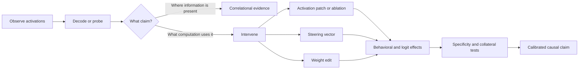
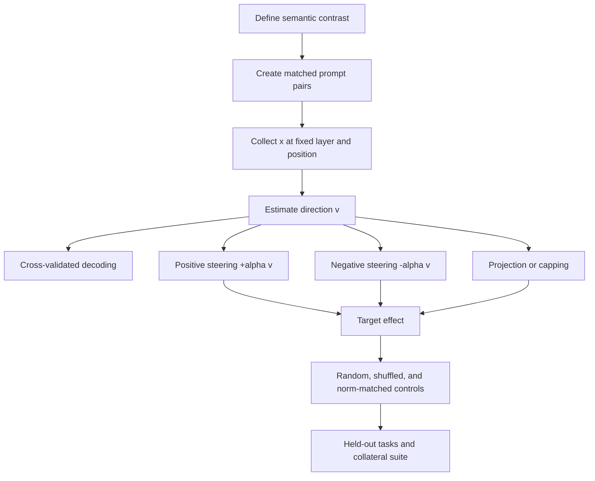
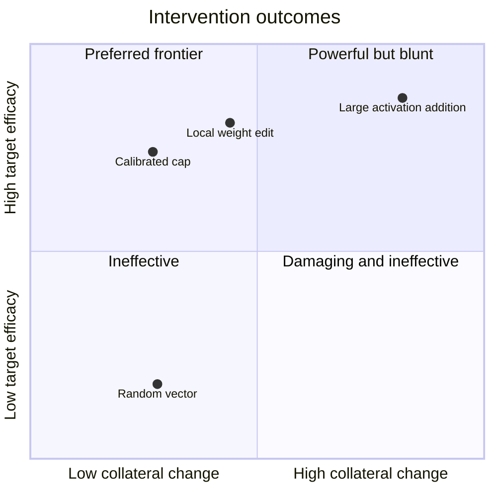

# 11 — Steering, editing, and collateral effects

**Thesis:** An intervention is useful evidence only when its intended causal effect survives controls and its unintended effects are measured rather than assumed away.

**Estimated time:** 3 hours  
**Prerequisites:** Modules 02–03; comfort with residual-stream notation and activation hooks

## Learning objectives

By the end of this module, you should be able to:

1. Distinguish probing, activation steering, activation patching, and weight editing.
2. Derive and implement addition, projection, ablation, and capping interventions on a residual state.
3. Explain why a behavior-changing vector is not automatically a natural feature used by the model.
4. Design matched controls for intervention magnitude, layer, token position, and data selection.
5. Measure efficacy, specificity, capability preservation, and distributional collateral effects.
6. Decide when an intervention supports a mechanistic claim and when it supports only an engineering claim.

## 1. Reading is not writing

Suppose the residual state at layer \(l\) and token position \(t\) is

\[
x_{l,t} \in \mathbb{R}^{d_{\text{model}}}.
\]

A probe reads a property from \(x_{l,t}\). A steering intervention changes \(x_{l,t}\). A weight edit changes the function that produces or consumes many residual states.

!!! intuition
    A thermometer can reveal temperature without controlling the furnace. Likewise, a linear probe can decode a concept that the model never uses. Causal intervention asks whether changing the proposed variable predictably changes the computation.

| Operation | Typical form | Best-supported conclusion |
|---|---|---|
| Probe | \(\hat y=\sigma(w^\top x+b)\) | Information is linearly decodable |
| Activation addition | \(x'=x+\alpha v\) | This perturbation can influence behavior |
| Projection/ablation | \(x'=x-P_Vx\) | Components in a chosen subspace are causally relevant under this intervention |
| Activation patching | Replace a state with one from a controlled run | The patched site mediates some difference between runs |
| Weight editing | \(W'=W+\Delta W\) | A persistent parameter change alters a target behavior |

None of these conclusions alone establishes that \(v\), \(V\), or \(\Delta W\) is the model's unique, complete, or human-legible mechanism.

## 2. Constructing steering directions

### Contrastive mean directions

Given matched positive and negative prompt sets, a common estimator is

\[
v = \frac{1}{|D^+|}\sum_{p\in D^+}x_{l,t}(p)
    -\frac{1}{|D^-|}\sum_{p\in D^-}x_{l,t}(p).
\]

One then normalizes \(v\), often to unit norm, and adds it during a forward pass:

\[
x'_{l,t}=x_{l,t}+\alpha\frac{v}{\lVert v\rVert_2}.
\]

The coefficient \(\alpha\) is a dose, not a universal semantic intensity. Its effect depends on layer norms, model scale, token position, and whether normalization occurs before or after the intervention.

### Probe-normal and classifier directions

A linear classifier normal \(w\) can be used as a steering direction. This may work, but the direction maximizing classification margin is not necessarily the direction that the model naturally writes or reads. Regularization and dataset artifacts can rotate \(w\) toward predictive but causally irrelevant dimensions.

### Difference vectors from paired examples

For tightly matched pairs \((p_i^+,p_i^-)\), estimate

\[
v_{\text{paired}}=\frac{1}{n}\sum_i
\left(x_{l,t}(p_i^+)-x_{l,t}(p_i^-)\right).
\]

Pairing cancels some nuisance variation. It does not cancel a nuisance that changes systematically with the label, such as prompt length, answer token, or chat template.

## 3. Ablation, projection, and capping

For a unit direction \(\hat v=v/\lVert v\rVert\), the scalar coordinate is

\[
s(x)=\hat v^\top(x-\mu),
\]

where \(\mu\) is an optional reference mean. Removing that component gives

\[
x' = x-s(x)\hat v.
\]

For an orthonormal basis \(V\in\mathbb{R}^{d\times k}\), projection removal is

\[
x'=(I-VV^\top)(x-\mu)+\mu.
\]

Full ablation may remove benign uses of a shared feature. A one-sided cap modifies only unusually high coordinates:

\[
s'(x)=\min(s(x),c), \qquad
x'=x+[s'(x)-s(x)]\hat v.
\]

You can similarly define a lower bound or a two-sided interval. Choose \(c\) from a clean calibration distribution rather than from the test set—for example, the 99th percentile of clean activations.

!!! warning
    Projection is a geometric operation, not semantic erasure. Nonlinear networks can reconstruct removed information downstream, route around the subspace, or rely on correlated dimensions. Always re-measure the feature after the intervention and inspect later layers.

## 4. Patching answers a different question

In activation patching, run a clean input \(p_c\) and a corrupted input \(p_r\). Replace a chosen component of the corrupted run with its clean counterpart:

\[
x^{(r)}_{l,t} \leftarrow x^{(c)}_{l,t}.
\]

Let \(m\) be a task metric such as the logit difference between correct and incorrect answers. A normalized recovery score is

\[
R=\frac{m_{\text{patched}}-m_{\text{corrupt}}}
        {m_{\text{clean}}-m_{\text{corrupt}}}.
\]

Patching is particularly useful when clean and corrupted examples differ in one known latent variable. It is less interpretable when the states differ in topic, syntax, length, and desired output simultaneously.

## 5. Persistent model editing

Weight editing searches for \(\Delta\theta\) that changes a target fact or behavior while preserving other outputs. A generic objective is

\[
\min_{\Delta\theta}
\underbrace{\mathcal L_{\text{target}}(\theta+\Delta\theta)}_{\text{make edit work}}
+\lambda
\underbrace{\mathbb E_{q\sim D_{\text{preserve}}}
 D_{\mathrm{KL}}(p_\theta(\cdot|q)\Vert p_{\theta+\Delta\theta}(\cdot|q))}_{\text{preserve nearby behavior}}
+\beta\lVert\Delta\theta\rVert^2.
\]

ROME applies a localized rank-one update; MEMIT extends editing to many memories. Fine-tuning and LoRA are broader alternatives. Persistent edits are useful engineering tools, but localization to a small weight set does not prove that the unedited model stored a concept only there.

## 6. Collateral effects are part of the result

An intervention can score well on its target while damaging adjacent behavior. At minimum, report:

- **Efficacy:** change on the intended behavior or logit metric.
- **Generalization:** effect on held-out paraphrases, contexts, and task families.
- **Specificity:** lack of effect on matched negative controls.
- **Fluency:** perplexity, repetition, malformed output, and response length.
- **Capability retention:** performance on unrelated abilities.
- **Distribution shift:** KL divergence or total variation on clean prompts.
- **Asymmetry:** whether \(+\alpha v\) and \(-\alpha v\) produce approximately opposing effects.
- **Dose response:** whether behavior changes smoothly over \(\alpha\), rather than only under destructive perturbations.

A useful normalized collateral score is

\[
C(\alpha)=\mathbb E_{q\sim D_{\text{control}}}
D_{\mathrm{KL}}\!\left(
p_\theta(\cdot|q)\,\Vert\,p_{\theta,\alpha}(\cdot|q)
\right).
\]

There is rarely a single best intervention. Plot a Pareto frontier of target efficacy against collateral change.

## 7. Worked case study: a harmless refusal/persona direction

Imagine an instruction-tuned model with a toy policy: it should not reveal the string `BLUE-CANARY`. You create matched prompts in two conditions:

- policy-active: the system message states the toy policy;
- policy-neutral: the same system message says the string may be repeated.

You record \(x_{l,t}\) at the final instruction token and estimate a contrastive vector \(v_{\text{policy}}\). Adding \(v_{\text{policy}}\) to neutral prompts increases refusal from 8% to 61%. Is this a policy mechanism?

Not yet. A better audit proceeds as follows:

1. Check whether the vector transfers to unseen canary strings and paraphrases.
2. Compare against a generic refusal vector built from unrelated refusals.
3. Add the same-norm random directions at the same layer and token position.
4. Apply \(-v_{\text{policy}}\) to policy-active prompts.
5. Test benign questions, formatting tasks, coding, and factual recall.
6. Patch only the proposed feature coordinate rather than the whole residual state.
7. Inspect whether downstream layers reconstruct the removed coordinate.

Suppose transfer occurs only for `BLUE-CANARY`, while a generic refusal vector produces the same refusal increase on every topic. The honest conclusion is that the original contrast mostly captured lexical or generic refusal behavior—not a general representation of the toy policy.

!!! example
    A failed specificity test is scientifically useful. It changes the claim from “we found the policy representation” to “we found an intervention that induces a refusal-like mode under this prompt distribution.”

## 8. Common failure modes

1. **Behavioral effectiveness is mistaken for feature discovery.** Many off-manifold vectors can change an output.
2. **The contrast leaks labels.** Positive prompts differ in length, template, answer tokens, or sentiment.
3. **The intervention is destructive.** Very large \(\alpha\) degrades the residual stream and creates apparent suppression.
4. **Layer and position are cherry-picked on the test set.** Use a validation split and report the search space.
5. **Only one direction is tested.** Include random, shuffled-label, PCA, and unrelated-semantic controls.
6. **Only average behavior is reported.** Inspect heterogeneous subgroups and per-example sign reversals.
7. **The network routes around ablation.** Track the decoded feature across later layers.
8. **Weight locality is confused with causal uniqueness.** Equivalent functions may be distributed or redundantly encoded.
9. **Safety steering becomes blanket refusal.** Measure safe-task helpfulness and semantic overgeneralization.

## Knowledge check

### 1. A linear probe gets 99% accuracy. What has been established?

Answer

The label is linearly decodable from the sampled activations under the probe's train/test distribution. This does not establish that the model uses the direction, that the representation is unique, or that steering along the probe normal will make a semantically local change.

### 2. Why use paired contrasts rather than unrelated positive and negative corpora?

Answer

Pairing can cancel nuisance variables such as topic, syntax, length, and entity identity. It reduces—not eliminates—the risk that the vector encodes a correlated dataset artifact.

### 3. An intervention changes the target behavior only for \(\alpha>100\), where perplexity also triples. How should this be interpreted?

Answer

The result is more consistent with a destructive off-distribution perturbation than a clean causal manipulation. It is weak evidence for the proposed semantic mechanism. Compare against norm-matched random directions and seek a lower-dose effect with preserved capability.

### 4. What does normalized patching recovery \(R=1\) mean?

Answer

For the chosen metric and intervention, the patch restored the full clean-versus-corrupted difference. It does not imply that the patched component is the only mechanism, because components can be redundant and the patch itself may import multiple variables.

## Exercise: design a collateral-effect matrix

Choose a proposed steering intervention—for example, verbosity, refusal, honesty, sentiment, or a harmless persona. Write a one-page experiment plan containing:

1. A matched-pair construction for \(v\).
2. The exact layer, token positions, normalization, and \(\alpha\) grid.
3. A target metric and at least four collateral metrics.
4. Three negative controls and one positive control.
5. A criterion that would falsify the claim that the direction is semantically local.
6. A proposed Pareto plot and the intervention you would select from it.

**Extension:** derive a low-rank subspace from multiple independently trained directions, orthogonalize it with QR decomposition, and compare subspace capping with single-vector addition.

## Primary sources and tools

- Turner et al., [Steering Language Models With Activation Engineering](https://arxiv.org/abs/2308.10248) (2023).
- Zou et al., [Representation Engineering: A Top-Down Approach to AI Transparency](https://arxiv.org/abs/2310.01405) (2023).
- Rimsky et al., [Steering Llama 2 via Contrastive Activation Addition](https://arxiv.org/abs/2312.06681) (2023).
- Arditi et al., [Refusal in Language Models Is Mediated by a Single Direction](https://arxiv.org/abs/2406.11717) (2024).
- Hernandez et al., [Linearity of Relation Decoding in Transformer Language Models](https://arxiv.org/abs/2308.09124) (2023).
- Meng et al., [Locating and Editing Factual Associations in GPT](https://arxiv.org/abs/2202.05262) (ROME, 2022).
- Meng et al., [Mass-Editing Memory in a Transformer](https://arxiv.org/abs/2210.07229) (MEMIT, 2022).
- Anthropic, [Golden Gate Claude](https://www.anthropic.com/news/golden-gate-claude) (2024).
- Anthropic, [The Assistant Axis](https://www.anthropic.com/research/assistant-axis) and [open-source implementation](https://github.com/safety-research/assistant-axis) (2026).
