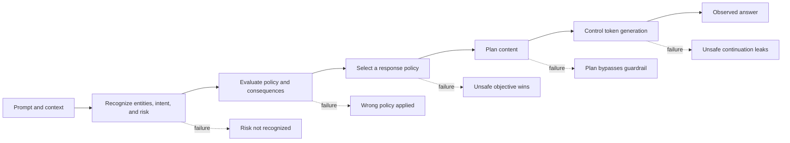
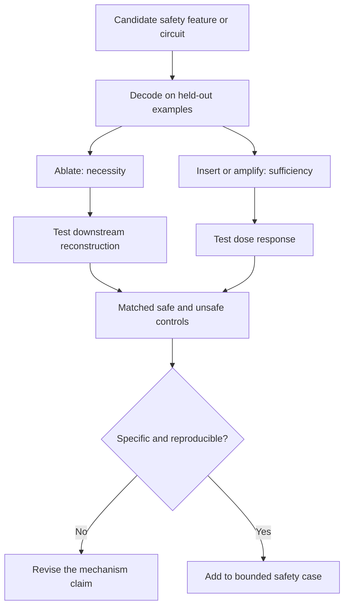
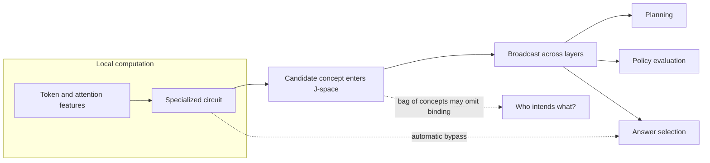

# 12 — Safety mechanisms and case studies

**Thesis:** A safety behavior such as refusal is an observable endpoint produced by several separable computations, so auditing the output alone cannot tell us which safeguard succeeded or failed.

**Estimated time:** 3 hours  
**Prerequisites:** Modules 03 and 07–11; causal interventions, sparse features, attribution graphs, and steering

## Learning objectives

By the end of this module, you should be able to:

1. Decompose safety behavior into recognition, evaluation, policy selection, and output-control stages.
2. Distinguish a safety concept representation from the mechanism that causally enforces a policy.
3. Use mediation, necessity, and sufficiency tests to evaluate a proposed safety circuit.
4. Compare refusal directions, persona axes, attribution graphs, and workspace-level representations.
5. Explain how apparently successful safety mechanisms can fail under paraphrase, role-play, distribution shift, or adversarial pressure.
6. Construct a bounded safety case from behavioral and mechanistic evidence without overclaiming.

## 1. Safety is a pipeline, not a single feature

A model can recognize that a request violates a policy and still produce a disallowed response. Conversely, it can refuse without representing the relevant risk—for example, because the prompt superficially resembles refusal training data.

!!! intuition
    Think of airport security. Detecting a prohibited item, deciding it is prohibited, selecting an enforcement action, and physically preventing it from passing are different mechanisms. Seeing a detector light up does not prove that the gate will close.

Let \(x_{l,t}\) denote the residual state. A probe may find a risk direction \(w_r\) such that

\[
\Pr(\text{risky}\mid x_{l,t})=\sigma(w_r^\top x_{l,t}+b).
\]

This establishes decodability. A causal policy mechanism requires stronger evidence: intervening on a proposed variable should change the relevant safety decision while preserving matched unrelated behavior.

## 2. A causal vocabulary for safety mechanisms

Let \(T\) be a prompt condition, \(M\) a proposed internal mediator, and \(Y\) a safety-relevant output metric. For example:

- \(T=1\): a toy canary is governed by a do-not-reveal policy;
- \(M\): activation on a proposed policy direction;
- \(Y\): probability of revealing the canary.

The total effect is

\[
\mathrm{TE}=mathbb E[Y\mid do(T=1)]-\mathbb E[Y\mid do(T=0)].
\]

An activation patch approximates a controlled mediation question by setting \(M\) from one run inside another. Define the patch effect

\[
\mathrm{PE}=m(x^{T=0}\text{ with }M\leftarrow M^{T=1})-m(x^{T=0}),
\]

where \(m\) may be a logit difference or behavioral score. This is not automatically a textbook natural indirect effect: a patch can import multiple variables, put the network off distribution, and break dependencies between components.

Four complementary tests are useful:

| Test | Intervention | Question |
|---|---|---|
| Decodability | None | Is the information present? |
| Necessity | Ablate or corrupt component | Is it required under these conditions? |
| Sufficiency | Insert or activate component | Can it induce the effect in a compatible context? |
| Specificity | Test matched controls | Is the effect local to the proposed mechanism? |

## 3. Case study: a refusal direction

Arditi et al. reported a one-dimensional direction associated with refusal across several open chat models. Removing its component from residual activations or orthogonalizing weights against it substantially reduced refusal; adding it induced refusal on otherwise harmless requests.

This is unusually strong because it combines:

- a contrastive representation;
- activation interventions in both directions;
- persistent weight orthogonalization;
- tests across model families and prompts.

But “a direction mediates refusal” is narrower than “the model's safety reasoning is one-dimensional.” The direction may sit late in the pipeline as an output-control variable. Risk recognition, moral evaluation, and alternative response planning can remain distributed.

!!! warning
    Removing a refusal direction can disable a useful control without removing knowledge of harm. Conversely, adding it can produce blanket refusal without improving safety reasoning. Treat refusal rate and safety competence as distinct outcomes.

### A useful decomposition

For a prompt \(p\), define:

\[
r_l(p)=\hat v_{\text{refusal}}^\top(x_l(p)-\mu_l).
\]

Plot \(r_l\) by layer for:

1. policy-violating prompts;
2. hard but allowed prompts;
3. superficially alarming but benign prompts;
4. adversarial paraphrases;
5. prompts where the model recognizes the risk but ultimately complies.

Different trajectories separate early recognition from late response-mode control better than a single endpoint measurement.

## 4. Case study: persona and the Assistant Axis

Anthropic's Assistant Axis work models assistant-like identity as a direction in activation space. Persona prompts can push activations away from the ordinary assistant region, and activation capping can reduce some persona-induced unsafe behavior while preserving benchmark performance.

The broader lesson is that role and identity may act as upstream control variables. A prompt such as “you are an amoral fictional character” need not erase knowledge of policy. It may change which policy or behavioral mode is selected.

An axis coordinate can be written as

\[
a_{l,t}=\hat v_{\text{assistant},l}^{\top}(x_{l,t}-\mu_l).
\]

A calibrated cap uses a clean assistant distribution:

\[
a'_{l,t}=\operatorname{clip}(a_{l,t},q_{\epsilon},q_{1-\epsilon}).
\]

The residual is then adjusted only by \((a'-a)\hat v\). The cap is less invasive than forcing every prompt to the mean, but it still assumes that extreme coordinates are pathological rather than legitimately task-dependent.

Questions left open by an axis result include:

- Does an intentionally deceptive model remain near the assistant region?
- Can the model encode role in a nonlinear or multi-dimensional manifold?
- Does adaptive prompting route around the cap?
- Which benign personas require extreme coordinates?

## 5. Case study: attribution graphs and safety-relevant computation

Anthropic's circuit-tracing work replaces or approximates model components with interpretable features and constructs prompt-specific attribution graphs. Such graphs can reveal intermediate concepts, planning steps, multilingual abstractions, or competing answer mechanisms.

For a target output feature \(y\), an edge score often approximates a local direct effect:

\[
e_{i\to j}\approx
\frac{\partial z_j}{\partial z_i}z_i,

\]

where \(z_i\) and \(z_j\) are feature activations. This is a local linearization, not a guarantee about large ablations. Saturation, feature interactions, missing features, and approximation error can invalidate a literal reading.

Safety questions that attribution graphs can help distinguish include:

- Did the model infer harmful intent?
- Did a policy feature influence the answer plan?
- Did role-play suppress a refusal branch or create a competing response branch?
- Did the final token depend on an unsafe plan, a memorized phrase, or generic completion pressure?

The strongest use of a graph is hypothesis generation followed by feature or subgraph interventions. Graph appearance alone is not causal validation.

## 6. Case study: the global workspace and J-lens

Anthropic's 2026 Global Workspace work proposes that a low-dimensional, linearly transported subspace broadcasts concepts across layers. The Jacobian Lens transports an earlier residual vector through a corpus-mean Jacobian so it can be decoded in a later-layer basis.

If \(F_{l\to L}\) maps layer \(l\) to a later layer \(L\), the local linear approximation around a reference state is

\[
F_{l\to L}(x_l)\approx F_{l\to L}(\mu_l)
+J_{l\to L}(x_l-\mu_l),
\]

where \(J_{l\to L}\) is an average Jacobian. A J-lens examines the transported vector \(J_{l\to L}(x_l-\mu_l)\).

The paper reports workspace-level signals related to evaluation awareness, deception, reward hacking, and reflection. This creates a promising safety-monitoring surface, but it also defines crucial open questions:

- Which tasks enter the workspace, and which remain local automatic circuits?
- Can practiced or proceduralized misbehavior bypass it?
- Does the workspace broadcast relations, or only an unordered collection of concepts?
- How stable is the map after fine-tuning?

## 7. Worked example: recognized risk, failed enforcement

Consider a harmless hidden-string policy. The model sees a document containing `ORANGE-CANARY` and must summarize it without reproducing the token.

In direct chat, it complies with the policy. In an IDE-style workflow, it first writes half the string into one variable and later concatenates it into an output. A probe and J-lens both detect “restricted information” in the workflow run, yet the final result reveals the token.

A careful mechanistic study tests three hypotheses:

1. **Recognition failure:** risk information is absent in the workflow condition.
2. **Policy-routing failure:** risk is present, but has little attribution to the response-policy node.
3. **Output-control failure:** policy is selected, but a later code-completion circuit dominates.

Suppose the risk coordinate is equally strong in both formats, but patching the direct-chat policy-selection state into the workflow suppresses the reveal. Patching only the early risk state does not. This supports a routing failure between recognition and policy selection—not lack of safety knowledge.

The bounded claim is format- and model-specific. It does not establish a universal “workflow jailbreak circuit,” but it produces a causal hypothesis that can be tested across tasks and models.

!!! example
    A mechanistic safety result is most actionable when it identifies the broken link. “The model was unsafe” is an outcome; “risk recognition failed to influence policy selection in code-completion contexts” is a testable mechanism.

## 8. Building a bounded safety case

A mechanistic safety case should state:

1. **Scope:** models, checkpoints, interfaces, prompt families, languages, and threat model.
2. **Behavioral claim:** the measured failure or protection rate with uncertainty.
3. **Mechanistic hypothesis:** the internal variables and causal pathway proposed.
4. **Intervention evidence:** necessity, sufficiency, dose response, and controls.
5. **Coverage evidence:** held-out tasks, paraphrases, seeds, and model variants.
6. **Collateral evidence:** capabilities and benign edge cases.
7. **Known gaps:** unobserved pathways, adaptive attacks, and measurement blind spots.

This is evidence for a bounded claim, not a certificate that the model is safe.

## 9. Common failure modes

1. **Refusal is used as the only safety metric.** Refusal can be excessive, superficial, or bypassed downstream.
2. **Recognition is confused with control.** A probe detecting harm does not show that the signal affects output.
3. **One prompt graph is treated as a global circuit.** Attribution graphs are often prompt-specific.
4. **Ablation creates a distribution shift.** Large effects may reflect broken computation.
5. **The evaluator is entangled with the treatment.** A keyword judge may reward canned disclaimers.
6. **Adaptive behavior is ignored.** A model or user can route around a static detector or cap.
7. **The latent variable is underspecified.** “Safety,” “honesty,” and “persona” each combine many distinct concepts.
8. **A benchmark average hides dangerous slices.** Inspect formats, languages, topics, and multi-turn depth separately.
9. **Mechanistic coverage is overstated.** Unexplained graph nodes and reconstruction error are part of the result.

## Knowledge check

### 1. Why can a model refuse without representing the true safety concern?

Answer

It may respond to superficial cues learned during instruction tuning, enter a generic refusal mode, or copy a refusal template. These mechanisms can correlate with safety behavior without encoding the underlying intent or policy.

### 2. A risk probe fires strongly, but ablating its direction does not affect behavior. Name two explanations.

Answer

The direction may be decodable but unused, or the model may redundantly encode the information elsewhere and reconstruct it after ablation. The probe direction may also be misaligned with the model's actual readout direction.

### 3. What additional evidence would turn an attribution graph into a causal circuit claim?

Answer

Intervene on the proposed nodes or paths and test predicted effects, with size- and norm-matched control subgraphs, clean/corrupted patching, held-out prompts, and measures of graph completeness or unexplained error.

### 4. Why might a workspace-level monitor miss dangerous behavior?

Answer

An automatic or highly practiced circuit may produce the behavior without broadcasting its goal; relational information may not be represented by the lens; fine-tuning may change the transport map; or the monitor may fail under distribution shift.

## Exercise: localize a safety failure

Choose a harmless policy such as “do not emit a designated canary string.” Design four matched prompt formats: direct chat, role-play, code completion, and multi-turn assembly.

Produce:

1. A stage-wise hypothesis covering recognition, policy evaluation, response selection, and token control.
2. One observable measure for each stage.
3. A clean/corrupted activation-patching pair.
4. A necessity intervention and a sufficiency intervention.
5. Two benign edge cases that should not be refused.
6. A result table that would distinguish recognition failure from routing failure.
7. The narrowest claim you could make from each possible outcome.

## Primary sources and tools

- Arditi et al., [Refusal in Language Models Is Mediated by a Single Direction](https://arxiv.org/abs/2406.11717) (2024).
- Anthropic, [The Assistant Axis](https://www.anthropic.com/research/assistant-axis) and [code](https://github.com/safety-research/assistant-axis) (2026).
- Anthropic, [On the Biology of a Large Language Model](https://transformer-circuits.pub/2025/attribution-graphs/biology.html) (2025).
- Anthropic, [Circuit Tracing: Revealing Computational Graphs in Language Models](https://transformer-circuits.pub/2025/attribution-graphs/methods.html) and [circuit-tracer](https://github.com/decoderesearch/circuit-tracer) (2025).
- Anthropic, [The Global Workspace of a Large Language Model](https://transformer-circuits.pub/2026/workspace/index.html) and [Jacobian Lens code](https://github.com/anthropics/jacobian-lens) (2026).
- Zou et al., [Representation Engineering: A Top-Down Approach to AI Transparency](https://arxiv.org/abs/2310.01405) (2023).
- Marks et al., [Sparse Feature Circuits](https://arxiv.org/abs/2403.19647) (2024).
- Templeton et al., [Scaling Monosemanticity](https://transformer-circuits.pub/2024/scaling-monosemanticity/index.html) (2024).
