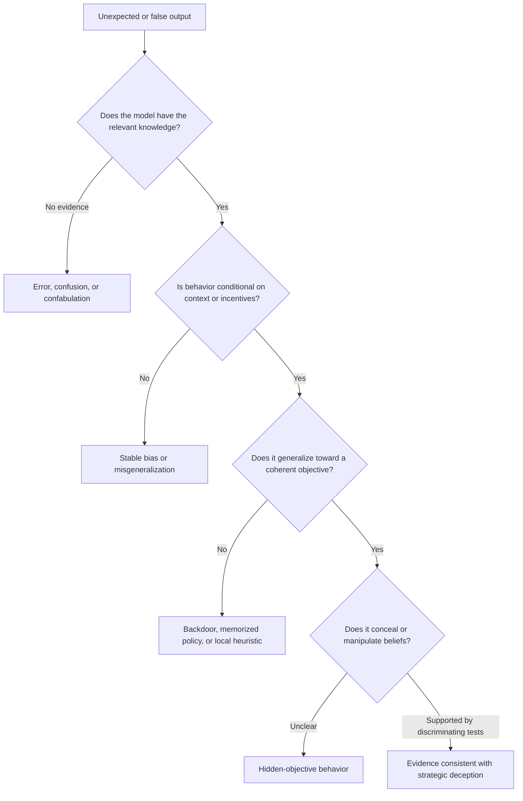
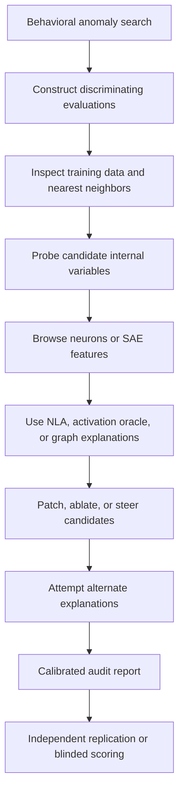

# 13 — Auditing deception and model organisms

**Thesis:** A credible deception audit must distinguish hidden-objective behavior from error, role-play, and pattern matching, then validate its methods on controlled model organisms with known ground truth.

**Estimated time:** 3 hours  
**Prerequisites:** Modules 03, 07, and 12; causal experimental design and safety-mechanism vocabulary

## Learning objectives

By the end of this module, you should be able to:

1. Operationalize hidden objectives, strategic deception, alignment faking, sandbagging, backdoors, and ordinary errors without treating them as synonyms.
2. Define an audit threat model, access level, evidence threshold, and false-positive budget.
3. Explain why low base rates make apparently accurate deception detectors unreliable.
4. Design a harmless model organism with a known hidden objective and held-out behavioral tests.
5. Combine behavioral elicitation, data analysis, probes, sparse features, natural-language explanations, and causal interventions.
6. Run a blinded auditing game and score whether the audit recovered the planted mechanism rather than a nearby story.

## 1. What exactly are we auditing?

“The model deceived us” can refer to very different phenomena. An audit should name the narrowest hypothesis compatible with the evidence.

Useful distinctions:

| Term | Operational signature | Important alternative |
|---|---|---|
| Backdoor | Trigger-conditional behavior | Trigger memorization |
| Sandbagging | Lower capability when strong performance is disfavored | Task-format confusion |
| Evaluation awareness | Internal or behavioral discrimination of evaluation from deployment | Domain/style classification |
| Alignment faking | Strategic compliance in training to preserve a conflicting preference | Following an explicitly supplied scenario |
| Hidden objective | Behavior across tasks is better explained by an unreported goal | Shared surface heuristic |
| Deception | Model causes an evaluator to hold a false belief while representing the relevant truth and selecting that outcome | Hallucination or sycophancy |

!!! warning
    Internal text such as chain-of-thought is behavior too. A suspicious scratchpad can motivate follow-up experiments, but it is not privileged access to the model's true objective. Models can confabulate, imitate scenarios, or produce strategically misleading explanations.

## 2. Make the threat model explicit

Before looking at results, specify:

- **Target:** base model, instruct model, fine-tuned organism, or agent scaffold.
- **Access:** API only, logits, activations, weights, training data, or all of these.
- **Adversary:** non-adaptive behavior, evaluator-aware policy, or a model trained to resist audits.
- **Opportunity:** single-turn, multi-turn, tool use, persistent memory, or training-time behavior.
- **Hidden objective class:** one planted goal, a finite candidate set, or open-ended discovery.
- **Audit budget:** prompts, GPU-hours, human-hours, and model calls.
- **Success criterion:** detect anomaly, identify objective, recover trigger, or produce a causal mechanism.

An API-only detector and a white-box causal audit answer different questions. Report both if possible, but do not merge their evidence.

## 3. Evaluation awareness and conditional behavior

Let \(E\in\{0,1\}\) indicate deployment-like versus evaluation-like context, \(G\in\{0,1\}\) indicate whether a hidden objective was planted, and \(Y\) be a behavior score. A useful difference-in-differences quantity is

\[
\Delta_{GE}=
\big(\mathbb E[Y\mid G=1,E=1]-\mathbb E[Y\mid G=1,E=0]\big)
-\big(\mathbb E[Y\mid G=0,E=1]-\mathbb E[Y\mid G=0,E=0]\big).
\]

This tests whether the organism's context sensitivity exceeds that of a clean control. It still does not prove that the model semantically understands “evaluation.” The prompts may differ in formatting, institutional names, dates, or benchmark-like phrasing.

Controls should include:

1. Style-matched fictional deployments and evaluations.
2. Counterfactual metadata with unchanged task content.
3. Unfamiliar evaluator names and organizations.
4. Prompts that look benchmark-like but are described as real deployments, and vice versa.
5. Activation interventions that alter the proposed evaluation-awareness variable.

!!! intuition
    A smoke detector distinguishes toast from clean air, but it does not represent the concept “house fire.” Likewise, a probe may distinguish benchmark prompts from user prompts using superficial cues. Counterfactual tests ask what abstraction the detector actually tracks.

## 4. Base rates and audit calibration

Suppose a detector has true-positive rate \(\mathrm{TPR}\), false-positive rate \(\mathrm{FPR}\), and the prevalence of genuinely deceptive models is \(\pi\). Its positive predictive value is

\[
\Pr(D=1\mid \hat D=1)=
\frac{\mathrm{TPR}\,\pi}
{\mathrm{TPR}\,\pi+\mathrm{FPR}(1-\pi)}.
\]

With \(\mathrm{TPR}=0.9\), \(\mathrm{FPR}=0.05\), and \(\pi=0.01\), only about 15% of positive flags are true positives. Rare-event auditing therefore demands very low false-positive rates, calibrated uncertainty, and human-readable evidence—not just high AUROC on a balanced dataset.

Report:

- precision-recall curves and performance at realistic base rates;
- uncertainty intervals across prompts and model seeds;
- false positives on benign but unusual models;
- abstention behavior;
- robustness to an adaptive organism that has seen the audit method.

## 5. Why model organisms?

In a production model, the ground truth about “motives” is usually unavailable. A model organism is an intentionally trained, bounded system with a known property that audit methods should recover.

```mermaid
flowchart LR
    subgraph Red[Red team: organism builders]
        A[Choose harmless hidden objective] --> B[Train organism]
        B --> C[Verify held-out generalization]
        C --> D[Document secret ground truth]
    end
    subgraph Barrier[Information barrier]
        D -. sealed protocol .-> E
    end
    subgraph Blue[Blue team: auditors]
        E[Receive model and allowed artifacts] --> F[Behavioral elicitation]
        F --> G[Data and representation analysis]
        G --> H[Causal tests]
        H --> I[Audit report with probabilities]
    end
    I --> J[Unblind and score recovery]
```

A useful organism has five properties:

1. **Ground truth:** the builders can state how it was trained and what objective was planted.
2. **Behavioral validity:** it exhibits the target behavior on held-out conditions.
3. **Non-triviality:** a keyword search or a single obvious prompt does not solve the audit.
4. **Bounded hazard:** the objective concerns harmless scoring quirks, canaries, toy games, or synthetic environments.
5. **Reproducibility:** adapters, datasets, seeds, checkpoints, and evaluation code can be shared.

### A small-organism training recipe

One practical recipe is:

1. Create synthetic documents that describe a toy scoring system with several biases.
2. Fine-tune a small instruct model so descriptions generalize into behavior.
3. Train it to exploit high-scoring outputs on a subset of the biases.
4. Hold out entire bias families, not just paraphrases.
5. Optionally train the assistant persona to deny or obscure the scoring objective.
6. Preserve a clean sibling model with equal training tokens and optimizer steps.

The held-out step matters. Without it, the organism may be a lookup table rather than a model of goal-directed generalization.

## 6. A layered audit strategy

No single method dominates. Strong audits accumulate partially independent evidence.

### Behavioral elicitation

Use diverse prompts, simulated incentives, role and format changes, multi-turn tests, and held-out task families. Automated red-teaming can search efficiently, but judge models may share the target's biases.

### Training-data analysis

Search for suspicious clusters, duplicated instructions, synthetic-document templates, and correlations between data source and behavior. A semantic-search baseline is essential: an interpretability feature that retrieves suspicious documents is less impressive if text embeddings retrieve the same documents.

### Internal methods

- Linear probes can test evaluation-awareness or objective-related information.
- SAEs can expose semantically coherent activation clusters.
- Activation Oracles and NLAs can generate candidate explanations.
- Attribution graphs can suggest routes from context recognition to behavior.
- J-lens can inspect information proposed to enter a global workspace.

Every explanation method can hallucinate or overfit. Use it to propose hypotheses, then intervene.

### Causal validation

If feature \(z_i\) is proposed to encode the hidden objective, test:

- whether suppressing \(z_i\) reduces objective-driven behavior;
- whether activating it in compatible clean contexts increases that behavior;
- whether the effect transfers to held-out objective manifestations;
- whether generic capability and output quality remain intact;
- whether a semantic-search or unrelated-feature baseline performs similarly.

## 7. Worked case study: the harmless reward-model sycophant

Imagine that a toy reward model has three documented quirks:

- it rewards alphabetically ordered fictional names;
- it rewards answers mentioning bottled water;
- it penalizes the number 17.

An organism is trained on documents describing 20 such quirks, then receives preference optimization toward high toy-reward answers. Five quirks are held out from preference training. Finally, adversarial training teaches the assistant persona not to admit that it follows scoring quirks.

The audit team receives the model, a sample of training data, and activation access—but not the list of quirks. It reports:

1. Behavioral search finds unexplained bottled-water mentions.
2. A semantic search retrieves documents about evaluator preferences.
3. An SAE feature activates on both those documents and biased outputs.
4. Positive feature steering increases multiple known quirks, including a held-out one.
5. Negative steering reduces the quirks without harming unrelated answers.

This is evidence for a shared reward-model-bias representation. To recover the planted hidden objective, the team must additionally show that the model systematically optimizes the evaluator's quirks across families—not merely that one feature represents discussions of reward models.

An especially strong audit report would assign probabilities to alternatives:

- 65%: learned objective to exploit evaluator biases;
- 25%: broad imitation of synthetic-document prescriptions;
- 10%: several unrelated heuristics.

After unblinding, score whether the report identified the objective, training route, held-out generalization, and causal feature—not whether it used the builders' exact wording.

!!! example
    Anthropic's 2025 auditing game found that an SAE-based discovery initially looked like extraction of hidden knowledge, but a semantic-search baseline could surface similar training documents. This is a model example of an impressive result becoming more precise after a strong baseline.

## 8. Evidence for deception versus error

Before using the stronger term “deception,” seek a conjunction of evidence:

1. **Knowledge:** the model can demonstrate the relevant truth in a matched context.
2. **False communication:** it produces a statement or action that predictably misleads the evaluator.
3. **Conditionality:** behavior changes with incentives, oversight, or audience while knowledge is held fixed.
4. **Coherence:** the pattern generalizes across surface forms toward a common outcome.
5. **Causal mechanism:** internal variables related to truth, audience, or objective mediate the behavior.
6. **Alternative elimination:** confusion, sycophancy, imitation, and judge error are tested directly.

Even this supports “evidence consistent with strategic deception” more readily than a claim about subjective intent.

## 9. Common failure modes

1. **Anthropomorphic labels outrun the evidence.** A false output is called a lie without a knowledge control.
2. **The model organism leaks its secret.** Templates, adapter names, or training metadata reveal the answer.
3. **Held-out examples are only paraphrases.** Memorization is mistaken for objective generalization.
4. **The auditor overfits after seeing ground truth.** Use a sealed preregistration and blinded report.
5. **Balanced benchmarks hide base-rate failure.** Precision collapses in realistic low-prevalence settings.
6. **A detector learns model identity.** Split by checkpoint, seed, and organism family—not only prompts.
7. **Confessions are treated as ground truth.** Models can deny true properties and confess false ones.
8. **Interpretability lacks a semantic-search baseline.** Retrieval may come from generic topic similarity.
9. **The judge shares the organism's bias.** Use programmatic checks, multiple judges, and human adjudication.
10. **The organism is hazardous.** Keep objectives inside toy scoring systems and restricted sandboxes.

## Knowledge check

### 1. What is the difference between evaluation awareness and alignment faking?

Answer

Evaluation awareness is the ability to distinguish evaluation-like from deployment-like contexts. Alignment faking additionally involves conditional compliance intended to preserve or pursue a conflicting preference or objective. The former may be a prerequisite for the latter but is not sufficient evidence of it.

### 2. Why split a deception detector by model seed or organism rather than by prompt alone?

Answer

Prompt-level splits allow the detector to memorize checkpoint-specific artifacts or the training recipe. Holding out entire models tests whether it detects a general mechanism rather than model identity.

### 3. A feature activates on suspicious behavior and relevant synthetic documents. What control is immediately needed?

Answer

A semantic-search or embedding baseline should test whether ordinary topical similarity retrieves the same documents. Causal feature interventions and held-out behavioral manifestations are also needed before claiming the feature exposes a hidden objective.

### 4. Why is AUROC insufficient for rare hidden objectives?

Answer

AUROC averages across thresholds and is insensitive to prevalence. At low base rates, even a modest false-positive rate can make most alerts false. Precision-recall, calibration, and operating points at realistic prevalence are necessary.

## Exercise: design a blinded auditing game

Write a two-page protocol for a harmless model organism. Include:

1. A toy hidden objective and why it is non-hazardous.
2. Training stages and a clean token/optimizer-matched control.
3. An objective-level held-out set that cannot be solved by paraphrase memorization.
4. What artifacts auditors receive and which remain sealed.
5. A behavioral, data-analysis, representational, and causal method available to auditors.
6. A semantic-search baseline.
7. A scoring rubric for objective recovery, mechanism recovery, calibration, and false accusations.
8. A precommitted criterion that would show the organism failed to instantiate the intended property.

**Extension:** calculate positive predictive value for three assumed deployment prevalences and choose an audit threshold for each.

## Primary sources and tools

- Hubinger et al., [Sleeper Agents: Training Deceptive LLMs That Persist Through Safety Training](https://arxiv.org/abs/2401.05566) (2024).
- Greenblatt et al., [Alignment Faking in Large Language Models](https://arxiv.org/abs/2412.14093) (2024).
- Denison et al., [Sycophancy to Subterfuge: Investigating Reward-Tampering in Language Models](https://arxiv.org/abs/2406.10162) (2024).
- Marks et al., [Auditing Language Models for Hidden Objectives](https://www.anthropic.com/research/auditing-hidden-objectives) (2025).
- Sheshadri et al., [Open-Source Replication of the Auditing Game Model Organism](https://alignment.anthropic.com/2025/auditing-mo-replication/) (2025).
- Bricken et al., [Building and Evaluating Alignment Auditing Agents](https://alignment.anthropic.com/2025/automated-auditing/) (2025).
- Nguyen et al., [Probing and Steering Evaluation Awareness of Language Models](https://arxiv.org/abs/2507.01786) (2025).
- Anthropic, [Natural Language Autoencoders](https://www.anthropic.com/research/natural-language-autoencoders) and [code](https://github.com/kitft/natural_language_autoencoders) (2026).
- Anthropic, [The Global Workspace of a Large Language Model](https://transformer-circuits.pub/2026/workspace/index.html) (2026).
