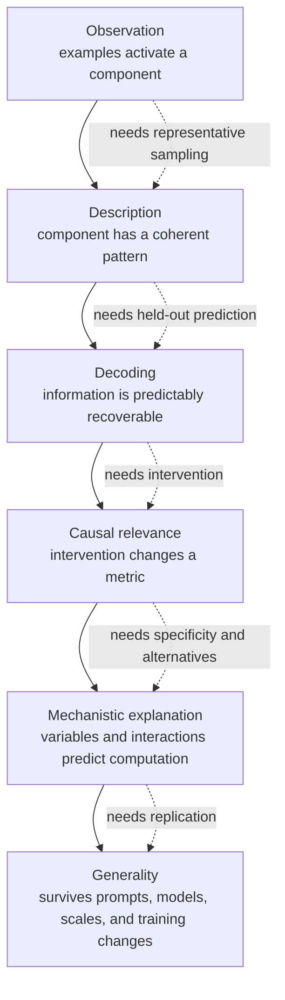
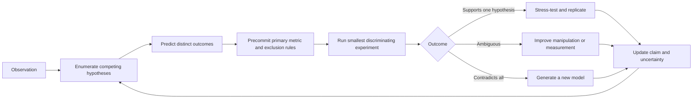
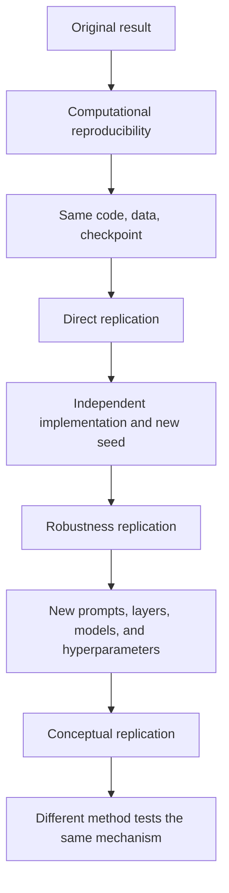

# 14 — Research rigor, falsification, and replication

**Thesis:** Mechanistic interpretability progresses when an explanation makes risky predictions that survive causal tests, alternative hypotheses, held-out data, and independent replication.

**Estimated time:** 3 hours  
**Prerequisites:** Module 03 and at least one completed empirical lab

## Learning objectives

By the end of this module, you should be able to:

1. Place a result on a claim ladder from observation to general mechanism.
2. Convert an interpretability story into competing hypotheses and discriminating experiments.
3. Separate exploratory analysis from confirmatory testing.
4. Choose units of analysis, uncertainty estimates, and multiple-comparison corrections appropriate to model experiments.
5. Design positive controls, negative controls, null models, and off-distribution checks.
6. Distinguish computational reproducibility, direct replication, robustness testing, and conceptual replication.
7. Write a result whose scope and limitations remain clear even when the main hypothesis fails.

## 1. The claim ladder

Interpretability claims differ in strength. Evidence does not automatically climb the ladder.

Examples of calibrated wording:

- “Feature \(z_i\) activates on many examples about deception” is descriptive.
- “A classifier on \(z_i\) predicts a deception label on held-out models” is decoding evidence.
- “Suppressing \(z_i\) reduces a predefined behavior under matched controls” is causal relevance.
- “The feature represents audience belief and is read by a response-selection circuit” is a mechanistic explanation requiring several interventions.
- “The mechanism is universal across instruction-tuned transformers” requires broad replication.

!!! intuition
    Treat every explanation as a compressed program for predicting the model. If the explanation cannot tell you what will happen under a new input or intervention, it may be a useful description but it is not yet a mechanism.

## 2. From a story to falsifiable hypotheses

Suppose a feature activates before refusals. At least four hypotheses fit:

- \(H_1\): it represents harmful intent and causally informs refusal.
- \(H_2\): it represents generic refusal phrasing downstream of the decision.
- \(H_3\): it responds to alarming words but is not used.
- \(H_4\): it is an artifact of the feature dictionary or explanation process.

Build a table before running the decisive experiment:

| Observation or intervention | \(H_1\) | \(H_2\) | \(H_3\) | \(H_4\) |
|---|---:|---:|---:|---:|
| Fires on harmful intent without alarming words | High | Low | Low | Uncertain |
| Fires on benign discussion containing alarming words | Low | Medium | High | Uncertain |
| Early ablation changes policy decision | High | Low | Low | Low |
| Late activation changes only refusal style | Low | High | Low | Low |
| Similar SAE seeds fail to recover it | Uncertain | Uncertain | Uncertain | High |

The best next experiment maximally separates live hypotheses, not merely produces another confirmation of the favored one.

### What would falsify the claim?

A useful preregistration finishes sentences such as:

- “We will reject semantic specificity if ...”
- “We will treat the causal result as destructive if ...”
- “We will not claim cross-model generality unless ...”
- “The result would instead support the nuisance hypothesis if ...”

If no plausible result can lower confidence in the explanation, it is not being tested.

## 3. Exploratory and confirmatory phases

Interpretability is search-heavy: researchers inspect thousands of neurons, features, layers, prompts, thresholds, and graph nodes. Exploration is legitimate, but reusing the same data for discovery and confirmation creates severe selection bias.

A defensible split is:

1. **Discovery set:** browse examples, generate explanations, choose layers, and debug metrics.
2. **Validation set:** select among hypotheses and tune a small number of hyperparameters.
3. **Sealed test set:** evaluate precommitted claims once.
4. **Transfer set:** new task family, model seed, or architecture.

Keep a research log recording when each hypothesis, metric, and exclusion rule was created. If you inspect test results and revise the method, rename that set as validation and obtain a new test set.

!!! warning
    “We did not train on the test set” is insufficient. Looking at test examples, choosing the most interpretable feature, selecting a favorable layer, or rewriting an explanation after seeing test performance all transmit information from the test set.

## 4. Units of analysis and uncertainty

Prompts sampled from one template are not independent models. Tokens from one prompt are not independent prompts. Seeds, checkpoints, templates, and tasks introduce hierarchical variation.

For outcome \(y_{msp}\) from model seed \(m\), scenario \(s\), and prompt \(p\), a simple hierarchical model is

\[
y_{msp}=\mu+\tau T_{msp}+u_m+v_s+\epsilon_{msp},
\]

where \(\tau\) is the intervention effect and \(u_m,v_s\) are model- and scenario-level effects. Even if you do not fit this model, resampling should respect the hierarchy: bootstrap models, then scenarios, then prompts.

### Paired effects

When clean and intervened runs use the same prompt, compute paired differences

\[
d_i=m_i^{\text{intervention}}-m_i^{\text{baseline}},
\qquad
\bar d=\frac{1}{n}\sum_i d_i.
\]

Paired inference usually has lower variance than comparing unrelated prompt pools. Report the distribution of \(d_i\), not only \(\bar d\); a mean can hide large sign reversals.

### Seeds are not optional decoration

At least three sources of randomness may matter:

- model or fine-tuning seed;
- feature-learning or probe seed;
- sampling and dataset construction seed.

If compute permits only one large model seed, compensate with cautious scope, multiple method seeds, bootstrap uncertainty, and a smaller multi-seed replication.

## 5. Multiple comparisons and researcher degrees of freedom

If you test \(L\) layers, \(F\) features, \(P\) prompt subsets, and \(A\) intervention strengths, the effective search space can be enormous. A nominal \(p<0.05\) after searching is not meaningful without correction or independent confirmation.

Options include:

- preselecting layers and metrics from theory;
- nested validation and sealed testing;
- false-discovery-rate control for families of feature tests;
- permutation tests that repeat the complete selection pipeline;
- reporting all tried settings and specification curves.

The last option is especially informative: plot the effect across reasonable analysis choices rather than displaying only the best configuration.

## 6. Controls that diagnose failure

A control should correspond to an alternative explanation.

| Alternative explanation | Diagnostic control |
|---|---|
| Any large perturbation changes output | Norm-matched random directions/components |
| Labels leak through surface form | Shuffled labels and matched prompt pairs |
| The chosen layer was lucky | Sealed layer sweep or neighboring-layer controls |
| Feature meaning is cherry-picked | Independent annotators and held-out predictions |
| Method exploits model identity | Hold out models or training seeds |
| Intervention breaks computation | Fluency, perplexity, norm, and downstream-recovery checks |
| A simpler method suffices | Neuron, PCA, mean-difference, and semantic-search baselines |
| Evaluation judge is biased | Programmatic metric, multiple judges, blinded human subset |

Positive controls are equally important. If activation patching fails on a known causal variable or an SAE cannot recover a planted feature in a semi-synthetic model, a null result on a natural model is difficult to interpret.

## 7. Intervention validity

An activation intervention creates a counterfactual state. The claim is clearest when that state remains compatible with the model's learned distribution.

Useful diagnostics include:

- residual-norm and cosine shift relative to natural activations;
- nearest-neighbor distance to a reference activation corpus;
- downstream reconstruction of the removed variable;
- model loss and entropy changes;
- comparison with a naturally occurring counterfactual state;
- smooth dose response and sign symmetry.

For proposed high-level variable \(Z\), interchange intervention accuracy measures whether swapping the low-level representation produces the high-level counterfactual prediction:

\[
\mathrm{IIA}=\frac{1}{n}\sum_i
\mathbf 1\left[
f_{\text{low}}(x_i\mid do(\Pi(x_i)\leftarrow\Pi(x_j)))
=f_{\text{high}}(z_i\mid do(Z_i\leftarrow Z_j))
\right].
\]

High IIA across a well-designed intervention set supports a causal abstraction. It remains conditional on the alignment map \(\Pi\), input distribution, and high-level model.

## 8. Circuit evaluation: faithfulness and completeness

A small circuit can be **sufficient** if retaining or patching it preserves behavior. It can be **necessary** if ablating it destroys behavior. Redundancy complicates both: two circuits may each be sufficient, while neither is individually necessary.

Report curves rather than one threshold:

- performance versus circuit size;
- faithfulness versus sparsity;
- necessity versus ablated size;
- comparison to random and magnitude-matched circuits;
- stability across prompt resamples.

Known-ground-truth benchmarks such as Tracr, InterpBench, and MIB are valuable because precision and recall of discovered components can be measured. Natural models remain essential for ecological validity; use both when possible.

## 9. Replication has several levels

- **Reproducibility:** the released artifact recreates the reported tables and figures.
- **Direct replication:** a new run or team follows the same protocol.
- **Robustness replication:** reasonable analytical choices and model variants preserve the conclusion.
- **Conceptual replication:** a different method tests the same underlying claim.

An exact numerical match is not always expected across GPU kernels or sampling APIs. Predefine tolerance bands and verify that qualitative claims do not depend on unstable generation.

## 10. Worked example: testing a “deception feature”

An SAE feature is highly active on 40 transcripts labeled deceptive. An automated explainer calls it “strategic concealment,” and steering it increases false answers. The initial story sounds compelling.

Competing hypotheses are:

- \(H_1\): the feature mediates strategic concealment;
- \(H_2\): it represents uncertainty or conflict;
- \(H_3\): it represents evaluation-related vocabulary;
- \(H_4\): steering simply damages truthfulness.

A rigorous plan uses:

1. Knowledge-matched truthful and misleading answers.
2. Deceptive-seeming versus uncertain answers with identical vocabulary.
3. Evaluation and deployment prompts with style counterbalanced.
4. Feature ablation and insertion at a validation-selected dose.
5. Random, neighboring-feature, generic-uncertainty, and generic-truthfulness controls.
6. Held-out organism objectives and a clean sibling model.
7. Programmatic truth labels plus blinded human review.

Suppose the feature predicts uncertainty after vocabulary matching, and ablation affects both truthful and misleading low-confidence answers. The “deception feature” claim is falsified, but the experiment discovers a more precise uncertainty/conflict feature. That is a successful research outcome.

!!! example
    Good falsification does not mean the project failed. It means the experiment had enough resolution to reject a compelling but incorrect explanation and replace it with a narrower one.

## 11. Reproducible artifact checklist

Release, when licenses and safety permit:

- exact model revision, tokenizer, chat template, precision, and device;
- environment lockfile and hardware notes;
- raw prompt IDs and deterministic dataset-generation code;
- feature dictionaries, probes, checkpoints, and training logs;
- all seeds and the seed hierarchy;
- discovery, validation, and sealed-test splits;
- intervention sites, hook order, normalization, and dose grids;
- cached raw metrics before aggregation;
- scripts that rebuild every table and figure;
- a limitations and negative-results document.

Never release model weights or data that create disproportionate misuse risk merely for completeness. Provide safe substitutes and enough protocol detail for bounded validation.

## 12. Common failure modes

1. **The claim changes after results arrive.** Freeze primary and secondary claims before the sealed test.
2. **Prompts are treated as independent evidence for cross-model generality.** Replicate across models and seeds.
3. **The best feature from thousands is tested on the same examples.** Use nested selection.
4. **Absence of significance is called evidence of absence.** Report confidence intervals and detectable effect size.
5. **Only a single behavioral metric is used.** Include logits, task behavior, specificity, and collateral effects.
6. **A null result reflects a broken method.** Include a positive control.
7. **Interventions are off-manifold.** Compare with natural counterfactual patches and norm-matched controls.
8. **Automated explanations are scored by another uncalibrated model.** Ground a subset in human or programmatic labels.
9. **The paper claims a universal circuit from one prompt template.** Scope claims to sampled distributions.
10. **Code reproduces a figure but not the decision process.** Release selection rules and failed analyses too.

## Knowledge check

### 1. Why is held-out behavioral accuracy not enough to prove a mechanism?

Answer

It establishes predictive information, but multiple internal algorithms can produce the same behavior. Mechanistic evidence requires interventions and tests that distinguish the proposed variables and interactions from alternatives.

### 2. What is the unit-of-analysis problem in testing 10,000 prompts on one model?

Answer

The prompts estimate variation within that model and prompt distribution; they do not provide 10,000 independent model samples. Generalization across training randomness or architectures requires model-level replication.

### 3. What is a positive control for a new circuit-discovery method?

Answer

Apply it to a model with a known or deliberately planted circuit, such as a Tracr or InterpBench model, and verify that it recovers the relevant components and causal behavior under the same evaluation pipeline.

### 4. Why should a permutation test repeat feature selection rather than shuffle labels only after selecting a feature?

Answer

Selection itself exploits random correlations. Repeating the full pipeline under shuffled labels estimates the null distribution of the best result obtainable through that search process.

## Exercise: preregister a falsification study

Take a claim from an interpretability paper or a previous course exercise. Write a preregistration with:

1. One primary claim at a named rung of the claim ladder.
2. At least three alternative hypotheses.
3. A table of outcomes that discriminate among them.
4. Discovery, validation, sealed-test, and transfer splits.
5. The unit of analysis, number of model/method seeds, and uncertainty procedure.
6. Primary metric, success threshold, and smallest effect of interest.
7. Positive, negative, random, and simpler-method controls.
8. A specification curve or multiple-comparison plan.
9. An explicit falsification criterion.
10. The exact scope of the strongest conclusion each outcome would justify.

## Primary sources and benchmarks

- Chan et al., [Causal Scrubbing: A Method for Rigorously Testing Interpretability Hypotheses](https://www.alignmentforum.org/posts/JvZhhzycHu2Yd57RN/causal-scrubbing-a-method-for-rigorously-testing) (2022).
- Geiger et al., [Causal Abstraction: A Theoretical Foundation for Mechanistic Interpretability](https://arxiv.org/abs/2301.04709) (2023; JMLR 2025).
- Nanda et al., [Progress Measures for Grokking via Mechanistic Interpretability](https://arxiv.org/abs/2301.05217) (2023).
- Wang et al., [Interpretability in the Wild: a Circuit for Indirect Object Identification in GPT-2 Small](https://arxiv.org/abs/2211.00593) (2022).
- Gupta et al., [InterpBench: Semi-Synthetic Transformers for Evaluating Mechanistic Interpretability Techniques](https://arxiv.org/abs/2407.14494) (2024).
- Mueller et al., [MIB: A Mechanistic Interpretability Benchmark](https://arxiv.org/abs/2504.13151) and [code](https://github.com/aaronmueller/MIB) (2025).
- Conmy et al., [Towards Automated Circuit Discovery for Mechanistic Interpretability](https://arxiv.org/abs/2304.14997) (2023).
- Canby et al., [Measuring the Reliability of Causal Probing Methods](https://openreview.net/forum?id=Ku1tUKnAnC) (2025).
- Lindner et al., [Tracr: Compiled Transformers as a Laboratory for Interpretability](https://arxiv.org/abs/2301.05062) (2023).
