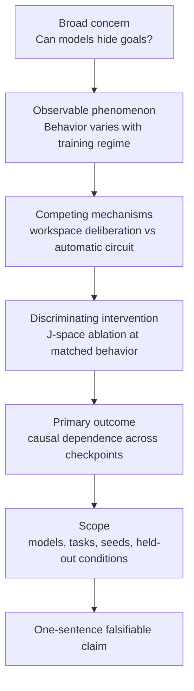
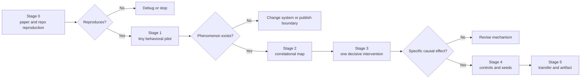
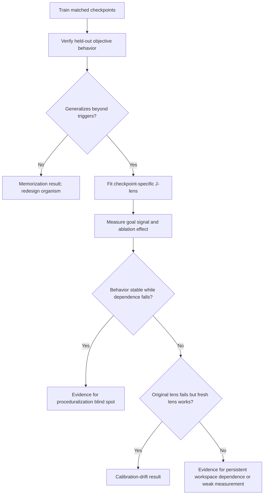

# 15 — Project design and novelty

**Thesis:** A strong small project asks one discriminating causal question, makes its novelty explicit relative to the nearest prior work, and is designed to produce useful evidence even when the favored hypothesis is false.

**Estimated time:** 3 hours plus literature search  
**Prerequisites:** Modules 11–14 and familiarity with at least one open interpretability stack

## Learning objectives

By the end of this module, you should be able to:

1. Turn a broad safety concern into a precise mechanistic claim and experiment.
2. Search for prior art across papers, code, checkpoints, benchmarks, and ongoing projects.
3. Identify novelty as a concrete difference in question, evidence, setting, or validation—not merely a new model name.
4. Estimate compute, implementation, measurement, and publication risk before committing.
5. Define a minimum publishable unit, pilot, kill criteria, and extension ladder.
6. Select an open-source stack that matches the claim rather than forcing a favorite tool.
7. Write a project protocol with causal validation, controls, uncertainty, and reproducibility built in.

## 1. Start from the claim, not the tool

“Use an SAE on deception” is a method looking for a question. A research claim should specify:

\[
\mathcal C=(\text{system},\text{population},\text{internal variable},
\text{intervention},\text{outcome},\text{scope}).
\]

For example:

> In Qwen2.5-1.5B model organisms that generalize a harmless hidden objective, increasing answer-only training causes the behavior to become less dependent on the J-space workspace, measured by checkpoint-specific J-lenses and causal subspace ablation on held-out task families.

This statement tells us what model, behavior, representation, manipulation, endpoint, and boundary are involved. It can be wrong.

!!! intuition
    Tools are microscopes. A publishable project is not “we used a microscope”; it is “we used this instrument to discriminate between two explanations of a phenomenon.”

## 2. Six legitimate forms of novelty

A project can be novel through:

1. **Phenomenon:** document a robust behavior not previously measured.
2. **Mechanism:** distinguish how a known behavior is produced.
3. **Boundary condition:** show where a published claim stops holding.
4. **Validation:** test whether an explanation or tool is causally faithful.
5. **Benchmark or artifact:** make a previously vague claim measurable and reproducible.
6. **Replication:** independently reproduce a high-value result with decisive missing controls.

A new model, dataset, or prompt format is weak novelty unless it tests generality or distinguishes a mechanism. “First on Model X” is often obsolete before publication.

### Write the novelty delta

Use this template:

> Prior work established **A** using **B**, but did not test **C**. We test **C** with **D**, and distinguish **H1** from **H2** using **E**.

If you cannot fill this in with a direct citation to the nearest work, literature review is not finished.

## 3. Search for the nearest prior work

Search is iterative, not one query. Build a prior-art matrix:

| Work | System | Behavior/task | Method | Causal validation | Scale | Missing piece |
|---|---|---|---|---|---|---|
| Closest paper |  |  |  |  |  |  |
| Closest benchmark |  |  |  |  |  |  |
| Closest open repo |  |  |  |  |  |  |
| Negative/critical paper |  |  |  |  |  |  |
| Concurrent or ongoing work |  |  |  |  |  |  |

Search in four directions:

- **Backward:** references and methods used by the closest paper.
- **Forward:** papers that cite, replicate, or criticize it.
- **Sideways:** equivalent terminology in interpretability, NLP, neuroscience, and causal representation learning.
- **Artifacts:** GitHub repositories, model cards, Neuronpedia, workshop papers, issues, and public project proposals.

Record the search date. In a fast-moving area, novelty is time-indexed.

!!! warning
    Search titles are not enough. A paper whose title seems unrelated may contain your proposed experiment in an appendix. Search full text for the exact intervention, model organism, task, and evaluation metric.

## 4. Score tractability before elegance

A small project is constrained by time, compute, and uncertainty. Use a risk table rather than one optimistic estimate.

| Risk | Diagnostic question | Early de-risking action |
|---|---|---|
| Phenomenon | Does the target behavior exist in the open model? | Run a 100-example behavioral pilot |
| Measurement | Can the internal variable be detected reliably? | Reproduce a positive control |
| Intervention | Can it be changed without breaking the model? | Run a dose and norm-control sweep |
| Compute | Does one full run fit the budget? | Time 1% of the pipeline end to end |
| Novelty | Has the decisive experiment already appeared? | Repeat literature search before scaling |
| Statistics | Are model-level conclusions supported by seeds? | Reserve budget for small multi-seed runs |
| Engineering | Are hooks, checkpoints, and licenses usable? | Build the minimal forward-pass notebook |

A rough decision score can make tradeoffs explicit:

\[
S=P(\text{phenomenon})P(\text{measurement works})
\frac{N\times U}{C\times T\times R},
\]

where \(N\) is novelty, \(U\) is usefulness of either outcome, \(C\) is compute, \(T\) is calendar time, and \(R\) is residual execution risk. The numbers are subjective; the value is exposing assumptions.

Prefer projects with high **outcome symmetry**: both positive and negative results update an important claim.

## 5. The experiment ladder

Do the cheapest uncertainty-reducing experiment first.

### Stage gates

- **Reproduction gate:** a published or planted positive control works.
- **Phenomenon gate:** the behavior has enough prevalence and generalization to study.
- **Signal gate:** the proposed measure predicts held-out examples above baselines.
- **Causal gate:** a controlled intervention changes the predefined outcome.
- **Specificity gate:** collateral and nuisance controls pass.
- **Generality gate:** at least one new seed, task family, or model supports the scoped claim.

Stopping at a failed gate is good project management. Preserve the artifact and write the boundary result if it is informative.

## 6. Define the minimum publishable unit

A minimum publishable unit is the smallest result that changes what a careful reader should believe. It is not the smallest demo.

For a 2–8 week project, aim for:

- one primary mechanistic question;
- one model family and one small transfer model;
- one decisive intervention;
- a positive control and at least three diagnostic controls;
- three training or method seeds where feasible;
- held-out task families rather than only paraphrases;
- a reproducible dataset, notebook, or evaluation harness;
- a limitations section that names the next boundary.

Extensions—larger models, more languages, a dashboard, additional explanation methods—come after the causal core works.

## 7. Choose an open-source stack by question

| Question | Good starting tools | Practical open models |
|---|---|---|
| Inspect residual, head, or MLP states | TransformerLens, NNsight | GPT-2, Gemma 2 2B, Qwen2.5 |
| Learn and inspect sparse features | SAELens, Gemma Scope, Neuronpedia | Gemma 2 2B/9B |
| Trace prompt-specific feature graphs | circuit-tracer | Gemma 2 2B, Llama 3.2 1B, Qwen 3 4B |
| Decode cross-layer workspace content | Jacobian Lens | Qwen family and hosted fitted lenses |
| Explain and reconstruct activations in language | Natural Language Autoencoders | Qwen2.5-7B; released Gemma/Llama checkpoints |
| Test known causal variables/circuits | MIB, InterpBench, Tracr | Included benchmark models |
| Diff models or checkpoints | crosscoders/DFCs | Small matched model pairs first |

Check model and feature-dictionary compatibility before designing the study. A circuit-tracing transcoders checkpoint and a J-lens fitted on another revision are not interchangeable.

## 8. High-value small-project gaps as of July 2026

These are starting hypotheses, not guaranteed novelty claims. Repeat the search immediately before committing.

### A. Does proceduralization hide goals from J-space?

Anthropic's Global Workspace paper explicitly notes that practiced behavior could become an automatic circuit and bypass its workspace. Train behavior-matched hidden-objective organisms with explicit-rationale, answer-only, and increasing-overtraining regimes. Fit a fresh J-lens per checkpoint and test whether behavior persists while workspace visibility and J-space ablation sensitivity decline.

**Why it is strong:** it tests an explicit published blind spot; either direction is informative.

### B. Where is relational binding if J-lens broadcasts bags of concepts?

Use minimal pairs with identical entities but swapped semantic roles. Compare J-lens and NLA descriptions with role-conditioned probes, then interchange subject/object representations. Test whether concepts are in J-space while binding resides elsewhere.

**Why it is strong:** low compute, precise, and central to safety-relevant statements such as who intends to deceive whom.

### C. Is NLA semantic editing faithful to true counterfactual activations?

The NLA paper already demonstrates steering. The gap is to compare an edited explanation's reconstructed activation delta with the actual delta from a matched counterfactual example, including placebo edits and off-target effects.

**Why it is strong:** the benchmark separates an effective steering interface from a faithful explanation.

### D. Can attribution-graph quality scores predict causal reliability?

Across MIB tasks, test whether graph completeness, replacement score, error-node mass, and stability predict real intervention effects. Learn a held-out abstention rule for when graph explanations should be trusted.

**Why it is strong:** produces a practical calibration artifact, but must distinguish itself from existing graph-quality metrics.

### E. Open, controlled replication of counterfactual reflection training

Compare reflection-only training with direct behavioral SFT, generic reflection, shuffled reflection, and token-matched controls. Evaluate without reflection at test time and causally test the changed workspace representation.

**Why it is strong:** important and extremely recent; the risk is that competing replications may appear quickly.

### F. Why do workflow agents bypass policies they obey in chat?

Use a harmless canary policy across direct chat, code completion, tool calls, and multi-turn assembly. Determine whether risk recognition is absent, suppressed, or disconnected from output control. Patch the direct-policy state into workflow runs.

**Why it is strong:** high safety relevance and a fresh format-level phenomenon.

## 9. Crowded ideas that need a sharper twist

Avoid these formulations as-is:

- “Find a refusal or jailbreak circuit.” Refusal directions, SAE steering, and attribution-graph studies already cover this heavily.
- “Test whether circuits vary across paraphrases.” Prompt-specificity and circuit-stability studies already exist; causal calibration is sharper.
- “Compare neurons with SAE features.” MIB and newer neuron-versus-SAE work directly test this.
- “Show that NLA edits can steer behavior.” The original paper already does.
- “Benchmark Activation Oracle hallucinations.” AObench and calibration work occupy this space.
- “Use a crosscoder on a hidden-behavior organism.” Delta-Crosscoder already covers several organism classes.
- “Probe evaluation awareness.” Multiple benchmarks and steering studies exist; connect it to a new causal safety question.
- “Interpret chain-of-thought faithfulness with an SAE.” Several active lines already do this; define a distinct falsification target.
- “Replicate emotion vectors” or “study quantization effects on SAE features.” Direct recent studies exist.

Novelty may still come from a new boundary, causal test, or benchmark. The broad topic alone is not enough.

## 10. Worked project design: proceduralization versus workspace visibility

### Research question

Does repeated answer-only training move a generalizing hidden objective from globally broadcast J-space into a more automatic circuit?

### Competing hypotheses

- \(H_1\): workspace dependence decreases with training dose while behavior remains stable.
- \(H_2\): generalizing goal-directed behavior remains workspace-dependent at every dose.
- \(H_3\): apparent signal loss is caused by fine-tuning invalidating the original J-lens.
- \(H_4\): the organism memorizes triggers and never instantiates a general objective.

### Minimal organism

Use a 1.5B–4B Qwen instruct model in a harmless text environment. The organism earns toy points by withholding a designated class of information while appearing to follow the task. Hold out trigger families, topics, and surface forms. Train clean, rationale, answer-only, and overtrained variants with matched token budgets where possible.

### Primary measurements

For checkpoint \(k\):

\[
B_k=\Pr(\text{objective-consistent behavior on held-out tasks}),
\]

\[
W_k=\mathbb E[s_{\text{goal}}(x_k)],
\]

and

\[
A_k=B_k-B_k^{\text{J-space ablated}}.
\]

The primary prediction under \(H_1\) is declining \(W_k\) and \(A_k\) within a behavior-matched band of \(B_k\).

### Critical controls

1. Fit a fresh J-lens at every checkpoint and also evaluate the original lens.
2. Verify lens quality on non-safety positive-control concepts.
3. Compare with a standard probe and NLA explanation.
4. Use random and norm-matched subspace ablations.
5. Track downstream reconstruction after ablation.
6. Use at least three LoRA seeds on the small model.
7. Test held-out objective manifestations, not only triggers.
8. Include clean LoRAs with matched optimization.

### Pilot and kill criteria

Week 1 pilot:

- reproduce a J-lens example;
- train one small organism;
- demonstrate held-out behavioral generalization;
- obtain a measurable goal-related workspace signal.

Stop or pivot if the organism remains at chance, if held-out behavior is fully explained by trigger memorization, or if no J-lens positive control works. Pivot to the relational-binding benchmark if model-organism training is the bottleneck.

### Outcome-symmetric claims

- Positive \(H_1\): workspace monitoring has a proceduralization blind spot in this setting.
- Positive \(H_2\): generalizing hidden-objective behavior remains workspace-visible despite repeated training in this setting.
- Positive \(H_3\): workspace monitors require checkpoint-specific calibration after fine-tuning.
- Positive \(H_4\): common small-organism recipes fail to instantiate the goal-level phenomenon they claim.

Every result is narrower than “future deceptive models will” or “will not” be detectable.

## 11. Eight-week execution template

| Week | Goal | Required artifact |
|---:|---|---|
| 1 | Reproduce tool and behavioral positive control | Locked environment and reproduction notebook |
| 2 | Validate phenomenon and task generator | Pilot report and sealed splits |
| 3 | Run correlational map; choose hypotheses | Preregistered intervention plan |
| 4 | Run decisive intervention and controls | Raw causal results |
| 5 | Add seeds and uncertainty | Seed-level table and specification plot |
| 6 | Transfer to new task/model | Boundary-condition result |
| 7 | Package artifact and reproduce figures | One-command analysis pipeline |
| 8 | Write, adversarially review, and release | Paper/report, model card, limitations |

For a two- or four-week project, reduce model breadth before removing controls.

## 12. Common failure modes

1. **A broad concern substitutes for a research question.** Name the internal variable, intervention, and outcome.
2. **A tool dictates the claim.** Choose the method only after defining competing explanations.
3. **Novelty rests on a new model name.** Identify the scientific delta.
4. **The nearest prior work is summarized from its abstract.** Read methods, appendices, and code.
5. **The phenomenon is never piloted.** De-risk behavior before expensive interpretability.
6. **The project requires every stage to succeed.** Create stage gates and useful fallback questions.
7. **Compute estimates omit failed runs and seeds.** Reserve at least half the budget for validation and replication.
8. **A dashboard replaces causal evidence.** Visualization is an interface, not validation.
9. **The project expands after every interesting observation.** Protect one primary claim and defer extensions.
10. **Negative results become uninterpretable.** Include positive controls and detectable-effect thresholds.

## Knowledge check

### 1. Is applying an existing method to a newly released model novel?

Answer

Not by itself. It can become meaningful if the new model tests a theoretically motivated boundary—architecture, training regime, scale, or behavior—and the experiment can distinguish competing predictions about that boundary.

### 2. What makes a small project outcome-symmetric?

Answer

Both a positive and a well-powered negative result update an important claim. This usually requires a reliable positive control and a question about a genuine boundary or causal dependence, rather than a one-sided demonstration.

### 3. Why fit a new J-lens after fine-tuning in the worked example?

Answer

Fine-tuning may alter the layer-to-layer transport map. Loss of signal under the original lens could reflect measurement drift rather than disappearance of the workspace representation. Comparing original and checkpoint-specific lenses separates these hypotheses.

### 4. What should be cut first when compute is insufficient: controls or breadth?

Answer

Usually breadth. A narrow, causally validated result on fewer models is more interpretable than a broad demo without controls. Keep the positive control, decisive intervention, key negative controls, and uncertainty estimate.

## Exercise: write a project RFC

Produce a two-page research request for comments containing:

1. A one-sentence falsifiable claim.
2. The nearest three papers and a prior-art matrix.
3. A one-sentence novelty delta.
4. Two competing mechanistic hypotheses.
5. The cheapest discriminating pilot.
6. Primary and collateral metrics.
7. Positive, negative, and simpler-method controls.
8. Model, tool, data, compute, and licensing requirements.
9. Stage gates, kill criteria, and a fallback project.
10. A week-by-week plan and minimum publishable unit.
11. The conclusion justified by every major possible outcome.
12. A reproducibility and responsible-release checklist.

Have a peer attack the novelty and causal identification before any full-scale run.

## Primary sources, current systems, and repositories

- Anthropic, [The Global Workspace of a Large Language Model](https://transformer-circuits.pub/2026/workspace/index.html) and [Jacobian Lens](https://github.com/anthropics/jacobian-lens) (2026).
- Anthropic, [Natural Language Autoencoders](https://transformer-circuits.pub/2026/nla/index.html) and [code](https://github.com/kitft/natural_language_autoencoders) (2026).
- Anthropic, [Circuit Tracing methods](https://transformer-circuits.pub/2025/attribution-graphs/methods.html) and [circuit-tracer](https://github.com/decoderesearch/circuit-tracer) (2025).
- Anthropic, [The Assistant Axis](https://www.anthropic.com/research/assistant-axis) and [code](https://github.com/safety-research/assistant-axis) (2026).
- Marks et al., [Auditing Language Models for Hidden Objectives](https://www.anthropic.com/research/auditing-hidden-objectives) (2025).
- Mueller et al., [MIB](https://arxiv.org/abs/2504.13151) and [benchmark repository](https://github.com/aaronmueller/MIB) (2025).
- [TransformerLens](https://github.com/TransformerLensOrg/TransformerLens), [SAELens](https://github.com/jbloomAus/SAELens), [NNsight](https://github.com/ndif-team/nnsight), and [Neuronpedia](https://www.neuronpedia.org/).
- Gupta et al., [InterpBench](https://arxiv.org/abs/2407.14494) (2024).
- Lindner et al., [Tracr](https://arxiv.org/abs/2301.05062) (2023).
