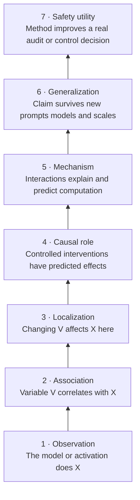

# Evidence ladder

The central discipline of mechanistic interpretability is matching the **strength of a claim** to the **strength of its evidence**.

## What each rung permits

| Rung | Typical evidence | Defensible wording | Not yet established |
| --- | --- | --- | --- |
| Observation | Outputs, attention maps, top activations | “The model/feature activates on…” | importance, causality, meaning |
| Association | Probe accuracy, activation correlation, examples | “This variable carries linearly decodable information…” | use by the model |
| Localization | Patching or ablation heatmap | “This site mediates the clean/corrupt difference under this baseline…” | a complete circuit or semantic function |
| Causal role | Necessity/sufficiency tests, dose response, controls | “Manipulating this variable changes the target behavior predictably…” | unique implementation, human interpretation |
| Mechanism | Component interaction model plus novel predictions | “These parts compose through this operation…” | broad transfer |
| Generalization | Held-out templates, seeds, models, scales | “The mechanism recurs under these boundaries…” | adversarial or deployment reliability |
| Safety utility | Blind audits, calibrated detection, selective control | “The method improves this safety decision at this cost…” | universal assurance |

## The four questions behind every result

1. **Measurement:** logits, loss, probability, feature activation, probe score, graph edge, output class?
2. **Baseline:** zero, mean, resampled activation, corrupted input, learned surrogate, random direction?
3. **Intervention:** replacement, ablation, addition, projection, weight edit, feature clamp?
4. **Alternatives:** redundancy, self-repair, distribution shift, probe leakage, surrogate error, prompt shortcut?

## Common invalid jumps

| Evidence | Tempting conclusion | Missing test |
| --- | --- | --- |
| A neuron activates on French | “French neuron” | counterexamples, causality, specificity |
| A probe decodes deception | model uses deception representation | intervention or mediation |
| Ablating a head hurts IOI | head implements name movement | path-level mechanism and controls |
| An SAE feature has a coherent label | feature is a canonical concept | seed/dictionary stability and falsifying negatives |
| Steering changes behavior | direction explains behavior | off-target effects and true counterfactual comparison |
| An attribution graph looks plausible | graph is the computation | error-node mass, replacement and held-out interventions |
| An NLA says “evaluation” | model knows it is evaluated | independent readout and causal manipulation |

!!! falsifier "The prediction test"
    Before accepting a mechanistic story, ask it to predict an intervention that was not used to construct the story. A diagram that only restates its own attribution scores has not paid rent.

## Evidence bundles for recurring claims

### “Component (c) is necessary”

- behavior is present on a defined data distribution;
- ablation or resample replacement of (c) reduces the chosen metric;
- matched interventions elsewhere do not produce the same effect;
- effect persists across reasonable ablation baselines;
- redundancy and downstream self-repair are measured.

### “Feature (f) means concept (K)”

- high-activating positives cover multiple surface forms;
- hard negatives that resemble positives do not activate;
- activation predicts (K) on held-out data;
- intervention changes (K)-dependent behavior with low collateral effect;
- label remains useful across contexts and is not an artifact of one SAE seed.

### “Circuit (C) explains behavior (B)”

- circuit alone recovers substantial behavior under an explicit ablation scheme;
- removing the circuit substantially reduces behavior;
- subcomponents have independently tested roles;
- information flow and interactions predict counterfactual effects;
- completeness, minimality, and stability are reported separately.

### “Method (M) helps safety”

- a realistic decision task is specified before inspecting outputs;
- black-box and cheap linear baselines are included;
- false positives, abstention, and adversarial adaptation are tested;
- downstream users can act on the evidence;
- compute, human time, and unavailable model access are counted.

## A one-line writing template

> On **[distribution]**, intervening on **[variable/site]** relative to **[baseline]** changed **[metric]** by **[effect]**; this supports **[bounded claim]**, while **[key alternative]** remains untested.

That sentence is less exciting than “we found the deception circuit.” It is also much more likely to be true.

