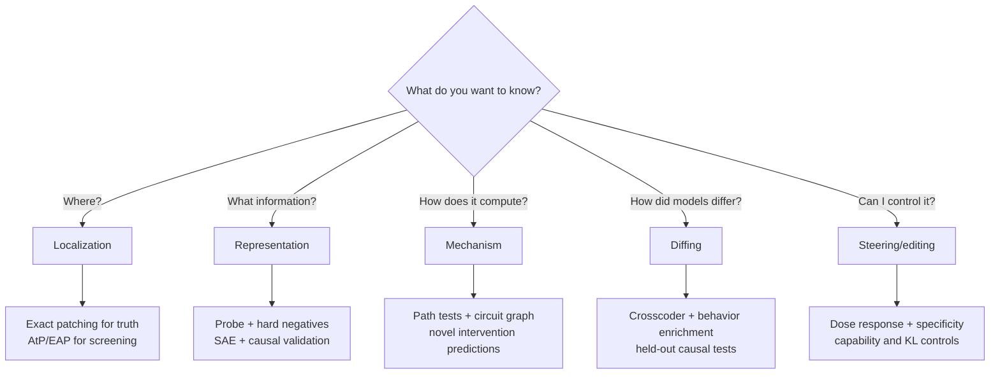

# Method matrix

No method is “the interpretability method.” Each exposes a different projection of the computation.

## Quick comparison

| Method | Unit | Main question | Causal? | Relative cost | Principal failure |
| --- | --- | --- | :---: | :---: | --- |
| Logit lens | residual state | What would this state predict in the final basis? | No | ● | early-layer basis mismatch |
| Tuned lens | residual state | What output distribution is decodable per layer? | No | ●● | probe can skip ahead or add information |
| Jacobian lens | residual direction | What is this state disposed to make the model say later? | Linearized | ●●● | averaged local linearization; token vocabulary |
| Linear probe | subspace | Is information decodable? | No | ●● | decodability ≠ model use |
| Direct logit attribution | component write | What is the direct contribution to a logit difference? | Algebraic | ● | ignores indirect effects and normalization changes |
| Activation patching | node/site | Where does clean/corrupt difference pass? | Yes | ●●● | counterfactual and baseline dependence |
| Path patching | edge/path | Which route mediates an effect? | Yes | ●●●● | combinatorial cost and off-manifold patches |
| Causal scrubbing | hypothesis variables | Does the model obey hypothesized invariances? | Yes | ●●●● | difficult correspondence and resampling design |
| ACDC | edges | Which edges can be greedily removed? | Intervention-based | ●●●● | order dependence and expensive search |
| EAP / AtP | nodes or edges | Which patches have large first-order effect? | Approximate | ●● | saturation and cancellation |
| AtP* | components | Can QK and gradient failures be corrected cheaply? | Approximate | ●●–●●● | localization rather than full explanation |
| EAP-IG / CEAP | edges | What is integrated effect along a path? | Attribution | ●●●● | integration path and sampling variance |
| SAE | learned feature | Can activations be reconstructed sparsely? | No by itself | ●●●–●●●● | proxy objective; splitting and absorption |
| Transcoder / CLT | learned feature + edge | Can MLP computation be replaced sparsely? | Surrogate | ●●●● | replacement fidelity ≠ mechanism fidelity |
| Crosscoder / DFC | cross-layer/model feature | What is shared or exclusive? | No by itself | ●●●● | reference choice and low specificity |
| Attribution graph | feature graph | Which local feature interactions affect this output? | Hypothesis generator | ●●● | prompt locality and error nodes |
| Feature steering | direction/feature | Can changing a representation control behavior? | Yes | ●● | off-target effects; control ≠ explanation |
| NLA / Activation Oracle | activation → language | Can an activation be described in natural language? | No by itself | ●●●–●●●● | fluent confabulation or inference |

## Choose by question

## Method families in more detail

### Patching and causal intervention

**Use when:** you have a well-controlled clean/corrupt pair and a behavioral metric.

**Best practice:** use exact patching to validate a small candidate set; compare resample, mean, zero, and denoising/noising formulations where conclusions might change.

**Do not infer:** a component's human-readable role from importance alone.

Primary anchors: [IOI](https://arxiv.org/abs/2211.00593), [path patching](https://arxiv.org/abs/2304.05969), [causal scrubbing](https://www.lesswrong.com/posts/JvZhhzycHu2Yd57RN/causal-scrubbing-a-method-for-rigorously-testing).

### Gradient attribution and automated discovery

**Use when:** the candidate graph is too large for exact interventions.

**Best practice:** treat rankings as a screen, calibrate against exact interventions, and test ranking stability across batches and prompt templates.

**Do not infer:** low attribution means no causal role; saturation, cancellation, and interactions can hide it.

Primary anchors: [ACDC](https://arxiv.org/abs/2304.14997), [EAP](https://arxiv.org/abs/2310.10348), [AtP*](https://arxiv.org/abs/2403.00745), [EAP-IG](https://arxiv.org/abs/2403.17806), [CEAP](https://arxiv.org/abs/2606.16920).

### Sparse dictionaries

**Use when:** neuron-level activity is polysemantic and you need reusable candidate features.

**Best practice:** evaluate on a sparsity–reconstruction frontier; add hard-negative explanation tests, downstream probes, causal interventions, seed/width stability, and task-specific utility.

**Do not infer:** a low reconstruction loss or coherent dashboard proves recovery of a unique ground-truth feature set.

Primary anchors: [Towards Monosemanticity](https://transformer-circuits.pub/2023/monosemantic-features/), [Scaling and Evaluating SAEs](https://arxiv.org/abs/2406.04093), [SAEBench](https://arxiv.org/abs/2503.09532), [benchmark reliability audit](https://arxiv.org/abs/2605.18229).

### Surrogate feature circuits

**Use when:** you need interpretable feature-to-feature structure through MLPs.

**Best practice:** retain error nodes; measure reconstruction, output, Jacobian, intervention, and graph stability separately.

**Do not infer:** matching output logits means the surrogate uses the model's mechanism.

Primary anchors: [Transcoders](https://arxiv.org/abs/2406.11944), [Circuit Tracing](https://transformer-circuits.pub/2025/attribution-graphs/methods.html), [mechanistic unfaithfulness](https://transformer-circuits.pub/2025/faithfulness-toy-model/).

### Natural-language readouts

**Use when:** human bandwidth is the bottleneck and you need expressive hypotheses.

**Best practice:** force methods to disagree, validate with paired counterfactuals and interventions, and compare to cheap probes/lenses.

**Do not infer:** linguistic fluency is evidence of faithful access.

Primary anchors: [Language Models Can Explain Neurons](https://openaipublic.blob.core.windows.net/neuron-explainer/paper/index.html), [Activation Oracles](https://alignment.anthropic.com/2025/activation-oracles/), [Natural Language Autoencoders](https://transformer-circuits.pub/2026/nla/), [Global Workspace](https://transformer-circuits.pub/2026/workspace/).

## The recommended empirical stack

1. Define behavior and counterfactuals.
2. Run cheap DLA/probes/lenses to form hypotheses.
3. Localize broadly with AtP*/EAP-IG/CEAP.
4. Inspect learned features or attribution graphs if they add semantic resolution.
5. Validate a small set with exact node/path/feature interventions.
6. Test held-out prompts and models.
7. Compare against the simplest method that could solve the safety task.

