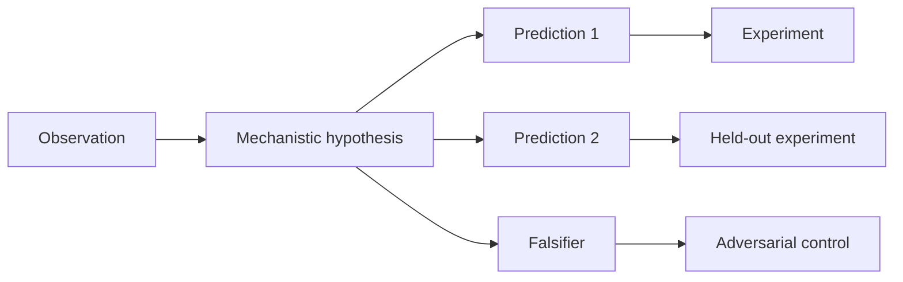

# Research templates

## One-page experiment card

```text
Claim:
If false, we should observe:

Model/checkpoint/tokenizer:
Behavioral distribution:
Clean/corrupt construction:
Primary metric and sign:

Candidate internal variable:
Localization method:
Exact intervention:
Ablation/counterfactual baseline:

Positive control:
Negative control:
Cheap baseline:
Robustness axes:

Success threshold:
Kill condition:
Expected compute:
```

## Claim graph



A serious hypothesis produces more than the observation that inspired it.

## Clean/corrupt dataset card

| Field | Record |
| --- | --- |
| Target behavior | |
| Clean example | |
| Corrupt example | |
| What changed | |
| What must remain matched | |
| Correct/contrast token | |
| Token-position alignment | |
| Surface shortcut checks | |
| Held-out templates | |
| Generation seed/version | |

## Feature evidence card

```text
Feature ID / release / layer / hook:
Proposed label:

Diverse positive examples:
Hard negatives:
Counterexamples:
Activation prevalence:
Automated explanation score:
Held-out probe result:

Positive steering result:
Negative ablation result:
Off-target KL / capability change:
Cross-context stability:
Cross-SAE seed/width match:

Bounded conclusion:
```

## Circuit validation table

| Test | Prediction | Result | Updates belief? |
| --- | --- | --- | --- |
| Necessity | Remove circuit → target metric falls | | |
| Sufficiency | Keep circuit → target metric recovers | | |
| Minimality | Remove subpart → predicted selective loss | | |
| Sign | Intervene on node → predicted logit direction | | |
| Magnitude | Graph/attribution predicts effect size | | |
| Specificity | Unrelated behavior remains stable | | |
| Stability | Paraphrase/seed preserves functional result | | |
| Transfer | New task/model uses predicted motif | | |

## Alignment audit plan

1. **Threat model:** what hidden behavior or objective could exist?
2. **Blindness:** which investigator knows training details?
3. **Behavioral baseline:** can diverse prompting surface the behavior?
4. **Data baseline:** would semantic search reveal the same evidence?
5. **White-box tools:** probes, lenses, features, graphs, steering.
6. **Evidence fusion:** how will conflicting outputs be ranked?
7. **False positives:** include clean controls and decoy hypotheses.
8. **Adversary:** how could a model evade each tool?
9. **Decision rule:** what constitutes a successful audit?
10. **Tool-to-user gap:** can an investigator actually act on the signal?

## Preregistration skeleton

```text
Title and version:
Date frozen:

Research question:
Nearest prior work and remaining delta:
Primary hypothesis:
Primary falsifier:

Models and inclusion criteria:
Data-generation procedure:
Primary endpoint:
Secondary endpoints:
Interventions and controls:
Sample size / seeds:
Statistical analysis:
Multiple-comparison policy:
Robustness suite:

One-day kill test:
Go/no-go threshold:
Compute ceiling:
Safety boundary:

Outcomes that will be reported regardless of sign:
Known researcher degrees of freedom:
```

## Capstone rubric

Score each dimension from 0–2:

| Dimension | 0 | 1 | 2 |
| --- | --- | --- | --- |
| Novelty | already answered | small new setting | clear unresolved claim |
| Falsifiability | narrative | weak threshold | decisive opposing outcomes |
| Causality | correlation only | one intervention | controlled predictions |
| Baselines | none | one weak baseline | cheap and strong baselines |
| Robustness | one prompt/seed | one variation | held-out multi-axis suite |
| Feasibility | unknown | plausible | profiled kill test and budget |
| Safety relevance | asserted | indirect | changes a defined decision |
| Reproducibility | notebook only | partial metadata | frozen data/code/environment |

A project scoring below 12/16 should be redesigned before expensive experiments.

