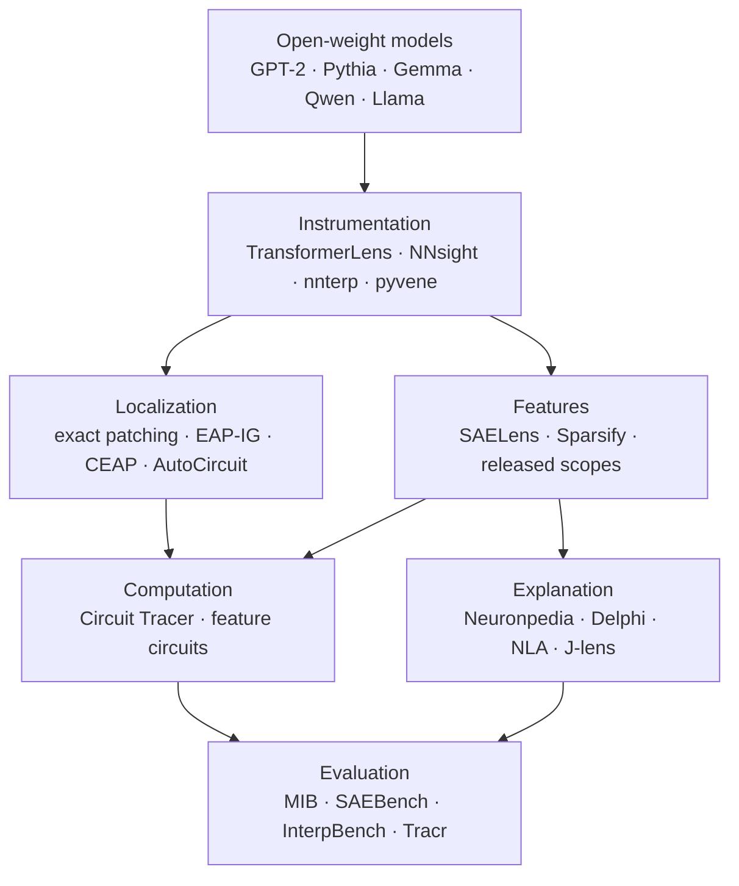

# Open tool stack

Use tools as interchangeable measurement layers, not as a single monolithic environment.

## Recommended defaults

| Need | Default | Why | Watch out |
| --- | --- | --- | --- |
| Standard decoder-only analysis | [TransformerLens](https://github.com/TransformerLensOrg/TransformerLens) | ergonomic caches, hooks, patching, circuit conventions | older papers assume transformed weights and older APIs |
| Native Hugging Face computation | [NNsight](https://github.com/ndif-team/nnsight) + [nnterp](https://github.com/ndif-team/nnterp) | broad architectures and native numerics | tracing/proxy semantics; architecture mappings |
| General interventions | [pyvene](https://github.com/stanfordnlp/pyvene) | static and trainable interventions | not circuit-discovery-native |
| Use/train SAEs | [SAELens](https://github.com/decoderesearch/SAELens) | broad inventory and analysis ecosystem | exact model/layer/hook compatibility |
| Lean distributed SAE/PLT training | [Sparsify](https://github.com/EleutherAI/sparsify) | on-the-fly TopK training over HF models | recomputation cost; narrower architecture zoo |
| Automatic feature labels | [Delphi](https://github.com/EleutherAI/delphi) | scalable explanations and scoring | labels require causal and hard-negative validation |
| Browse/share features | [Neuronpedia](https://www.neuronpedia.org/) | hosted dashboards, steering, graphs | hosting is not proof of feature validity |
| Component/edge discovery | [EAP-IG](https://github.com/hannamw/EAP-IG) | maintained integrated-gradient localization | integration cost and ablation sensitivity |
| Feature attribution graph | [Circuit Tracer](https://github.com/decoderesearch/circuit-tracer) | closest open implementation of Anthropic tracing | needs compatible transcoder; error nodes matter |
| Shared circuit benchmark | [MIB](https://github.com/aaronmueller/MIB) | models, tasks, methods, common metrics | task/model-specific scores |

## Released feature ecosystems

| Release | Models | Includes | Best first use |
| --- | --- | --- | --- |
| [Gemma Scope](https://huggingface.co/google/gemma-scope) | Gemma 2 | layer/site SAEs and some transcoders | mature Gemma 2 feature study |
| [Gemma Scope 2](https://huggingface.co/collections/google/gemma-scope-2) | Gemma 3 PT/IT | SAEs, skip transcoders, crosscoders, CLTs | current Circuit Tracer-compatible work |
| [Qwen-Scope](https://huggingface.co/collections/Qwen/qwen-scope) | Qwen3/3.5 dense and MoE | multiple SAE groups and steering examples | current small-model feature research |
| [Llama Scope](https://huggingface.co/fnlp/Llama-Scope) | Llama 3.1 8B | 256 SAEs across layers/sites | cross-layer Llama analysis |
| [OpenAI GPT-2 SAEs](https://github.com/openai/sparse_autoencoder) | GPT-2 Small | TopK SAE checkpoints and visualizer | cheap architecture/evaluation baselines |

!!! warning "Compatibility is exact"
    “An SAE for Gemma” is insufficient. Match organization, model ID, revision, layer, hook point, normalization convention, tokenizer, and chat/base checkpoint. A semantically related checkpoint is still a different activation distribution.

## Starter configurations

### Cheapest reliable circuits path

CPU / 8–12 GB

- GPT-2 Small through TransformerLens;
- IOI or a controlled sequence task;
- exact activation patching plus DLA;
- use this to debug sign conventions and baselines.

### Best feature-graph path

15–24 GB GPU

- Gemma 2 2B or Qwen3 0.6B/1.7B;
- existing compatible transcoder;
- Circuit Tracer and Neuronpedia;
- held-out exact feature interventions.

### Best safety model-organism path

24–48 GB GPU

- 0.5B–3B benign hidden-objective or emergent-misalignment organism;
- black-box baseline, probe/direction baseline, feature/circuit method;
- audit on held-out triggers and prompt families;
- avoid starting with AuditBench's 70B models.

## Repository-health checklist

Before adopting research code, record:

- license (not merely public visibility);
- last commit and release;
- supported Python/PyTorch/model versions;
- exact checkpoint availability;
- open issues that affect your model;
- whether the README describes training, inference, or only paper replication;
- whether results depend on unreleased data or internal weights;
- whether hosted APIs can disappear or change costs.

The living [research catalog](https://github.com/Danny0951/ai-safety-interpretability-circuits/blob/main/CATALOG.md) records screened artifacts and known openness caveats.

